利用説明書
========

目次
--------

-   [はじめに](#はじめに)
    -   [動作環境とインストール](#動作環境とインストール)
-   [アプリケーションの展開方法](#アプリケーションの展開方法)
-   [アプリケーションのインストール方法](#アプリケーションのインストール方法)
    -   [インストール](#インストール)
    -   [インストールスクリプトの実行](#インストールスクリプトの実行)
-   [アプリケーションの起動方法](#アプリケーションの起動方法)
    -   [Mac/Linuxの場合](#maclinuxの場合-1)
    -   [Windowsの場合](#windowsの場合-1)
    -   [起動確認](#起動確認)
    -   [コントローラへアクセス](#コントローラへアクセス)
-   [アプリケーションの終了方法](#アプリケーションの終了方法)
    -   [サーバープログラムの終了](#サーバープログラムの終了)
    -   [redisの終了](#redisの終了)
-   [ChOWDERのホーム画面](#chowderのホーム画面)
    -   [ホーム画面説明](#ホーム画面説明)
-   [コントローラ画面の操作](#コントローラ画面の操作)
    -   [概要](#概要)
    -   [接続状態について](#接続状態について)
    -   [コントローラの操作 : Virtual Display Screenについて](#コントローラの操作-virtual-display-screenについて)
    -   [コントローラの操作 : Displayタブ](#コントローラの操作-displayタブ)
    -   [Virtual Displayの設定](#virtual-displayの設定)
    -   [コントローラの操作 : Contentタブ](#コントローラの操作-contentタブ)
    -   [コントローラの操作 : Searchタブ](#コントローラの操作-searchタブ)
-   [コントローラの操作 : Propertyウィンドウ ](#コントローラの操作-propertyウィンドウ)
-   [コントローラの操作 : 上部表示領域](#コントローラの操作-上部表示領域)
    -   [上部に配置されたメニュー](#上部に配置されたメニュー)
    -   [Displayボタン](#displayボタン)
    -   [Addメニュー](#addメニュー)
    -   [Settingメニュー](#settingメニュー)
    -   [ホームに戻る](#ホームに戻る)
-   [ディスプレイ画面の操作](#ディスプレイ画面の操作)
    -   [概要](#概要-1)
    -   [ディスプレイの操作：メニュー](#ディスプレイの操作メニュー)
-   [HIVEとの連携](#hiveとの連携)
    -   [インタラクティブレンダリング](#インタラクティブレンダリング)
    -   [SceneNodeEditor](#scenenodeeditor)
    -   [Module System](#module-system)
-   [Google Chrome Extensionの利用](#google-chrome-extensionの利用)
    -   [概要](#概要-2)
    -   [Extensionのインストール](#extensionのインストール)
    -   [Extensionでキャプチャする](#extensionでキャプチャする)

はじめに
========

本書ではChOWDERの操作方法について解説します.

動作環境とインストール
----------------------

以下の環境で動作確認を行っております.

* OS
    * Linux(CentOS6)
    * Windows7
    * MacOSX 10.10
* Webブラウザ
    * Apple Safari 9.x
    * Firefox 48.0
    * Chrome 53
    * Internet Explorer 11

アプリケーションの展開方法
==========================

アーカイブファイルの解凍を行ってください.
解凍すると、以下の構成でファイルが作成されます.

* bin : 実行スクリプトフォルダ
* client : クライアントアプリケーションフォルダ
* doc : ドキュメントフォルダ
* redis : redisアプリケーションフォルダ
* server : サーバアプリケーションフォルダ
* chrome\_extension : Google Chrome 拡張機能フォルダ
* package.json

協調ワークスペースドライバの起動にはbinフォルダに格納されているスクリプトを使用します.

アプリケーションのインストール方法
==================================

インストール
------------

### Node.jsのインストール

ポータルGUIの動作にはNode.jsのインストールが必要です.
Node.jsの公式サイト(`http://nodejs.org/`)からNode.js本体をダウンロードし,インストールします.(下図)

*node.jsのinstall画面*

### Node.jsサブモジュールのインストール

アプリケーションを展開したディレクトリに, ChOWDERで利用しているNode.jsの必要なサードパーティモジュールのインストールを行います.

インストールスクリプトの実行
----------------------------

### Mac/Linuxの場合

bin配下の以下のシェルスクリプトを実行します.

       $cd bin
       $sh install.sh

### Windowsの場合

bin配下の以下のファイルを実行します.

       >cd bin
       >install.bat

アプリケーションの起動方法
==========================

### Mac/Linuxの場合

bin配下の以下のシェルスクリプトを実行します.

       ./run.sh

### Windowsの場合

bin配下の以下のファイルを実行します.

       >cd bin
       >run.bat

※ Windowsの場合、仮想メモリを0KByteにしていると、 redisが正常に起動しない場合があります.
その場合は一時的に仮想メモリを有効にしてご利用ください.

起動確認
--------

起動スクリプトを実行するとChOWDERサーバーが起動します.

       $sh run.sh
       (Windows版は run.bat)

コントローラへアクセス
----------------------

ChOWDERへのアクセスは、Webブラウザのアドレス欄に「 http://localhost:8080 」と入力することでアクセス出来ます.
アクセスし、下図の画面が表示されたらインストールは完了となります。.

*install終了後ホーム画面*

アプリケーションの終了方法
==========================

以下2点の操作にて終了させます.

### サーバープログラムの終了

run.sh(bat)を起動したterminalをCTRL+Cで終了するか、 serverプログラムをkillします.

### redisの終了

redisが起動しているterminalを終了させます.
また、プロセスとして起動している場合は、プロセスをpsコマンドにて見つけて killコマンドにて終了させます.

ChOWDERのホーム画面
===================

ホーム画面説明
--------------

ChOWDERは、以下の2つのコントローラ(Display, Controller制御)側か、Display側かを決定します.
ChOWDERへのアクセスは、前述のアプリケーション起動を行った後、Webブラウザのアドレス欄に「 http://localhost:8080 」と入力することでアクセス出来ます.
アクセスすると上述のホーム画面が表示されます.

-   Controller: コントローラ画面へと遷移します.

-   Display : ディスプレイ画面へと遷移します.

上記の通り、アクセスしたPCを「コントローラ」として使用するか、 「ディスプレイ」として使用するかを選択することができます.

コントローラ画面の操作
======================

概要
----

コントローラは下図の通りとなっております.

*コントローラ画面概要*

接続状態について
----------------

画面右上部分には、サーバーとの接続状態がアイコンで表示されます.

*サーバーとの接続ありの状態*

*サーバーとの接続が無い状態*

コントローラの操作 : Virtual Display Screenについて
---------------------------------------------------

中央はVirtual Display Screenと呼ばれ、ChOWDERに接続された ディスプレイの操作、Contentsの移動、操作、削除等を行う 汎用スペースとなっております.

*VirtualDisplayScreenの凡例*

コントローラの操作 : Displayタブ
--------------------------------

*Displayタブ*

VirtualDisplayと、ChOWDERサーバーに接続されているDisplayの一覧を表示します.
コントローラは、このDisplayをVirtualDisplay上に配置することができます.
配置したDisplay上にContentsを追加することによってContentsを共有するワークスペースを実現します.
Displayはマウスドラッグドロップにより、VirtualDisplaySpaceに配置することができます.
上図は、クライアントが接続された環境の例となります.

Virtual Displayの設定
---------------------

*Virtual Displayの設定*

### 分割数の設定

Displayタブにて, Virtual Display を選択すると, Property ウィンドウにて, Virtual Display の設定が行えます. 上図では, 幅1500ピクセル, 高さ1500ピクセル, 横方向分割数2, 縦方向分割数2, をVirtual Displayに設定しています.

### snap機能

Displayを正確に区画に配置するための機能として「snap機能」があります.
下図のドロップダウンリストからモードの変更が行えます.

*Snap機能の設定プルダウンボタン*

* Free : 自由配置となります.
* Display : 配置したDisplayに対してDisplay及びContentsがスナップするようになります.
* Grid : VirtualDisplaySettingにより分割した区画に沿ってDisplay及びContentsがスナップするようになります.

下図にsnap機能を用いて配置する凡例を示します.

*Snap機能ドラッグ時凡例*

またVirtualDisplaySpaceの拡大縮小オプションとして、Scale機能があります.
画面内でマウスの右ボタンを押しながらドラッグ操作することで、画面全体を拡大縮小することができます.

*scale後の例（コンテンツが小さく表示されている）*

### ディスプレイとID

接続されたDisplayのIDを各接続されたDisplay上に表示し、識別できるようにします.
尚、IDは、接続された端末固有であり、1端末につき1IDが割り当てられます.

*Display ID*

### 削除ボタン

選択したDisplayを削除(ChOWDERサーバーから切断)します.

*削除ボタン*

※尚、VirtualDisplayは削除することはできません.

### 全選択ボタン

接続されているDisplayすべてを選択状態にします.

*全選択ボタン*

コントローラの操作 : Contentタブ
--------------------------------

本アプリケーションでは, ディスプレイへのContentsの表示は, 画面下側のContentsタブからディスプレイにContentsをドラッグアンドドロップすることにより行います.

### Contentsの表示

Contents一覧から, 中央のVirtualScreenの領域へ, ドラッグアンドドロップすることで, 表示させることができます.

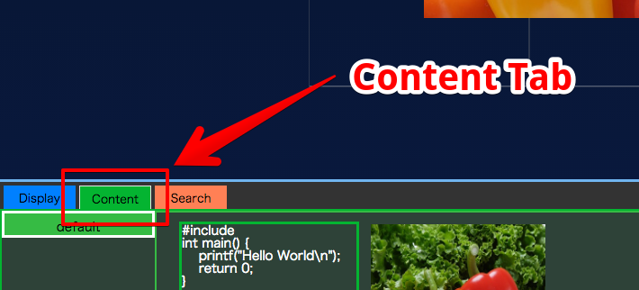
*Contentsの表示*

### Contents一覧への追加

Contentsの追加を行います.
タブ領域右下のメニューボタンを押下することで、各種操作が行えます.

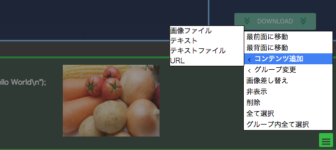
*Contentsの追加*

### テキストファイルの追加

メニューボタンからテキストファイルをContentsに追加します.
以下追加例となります.

*テキストファイルを選択*

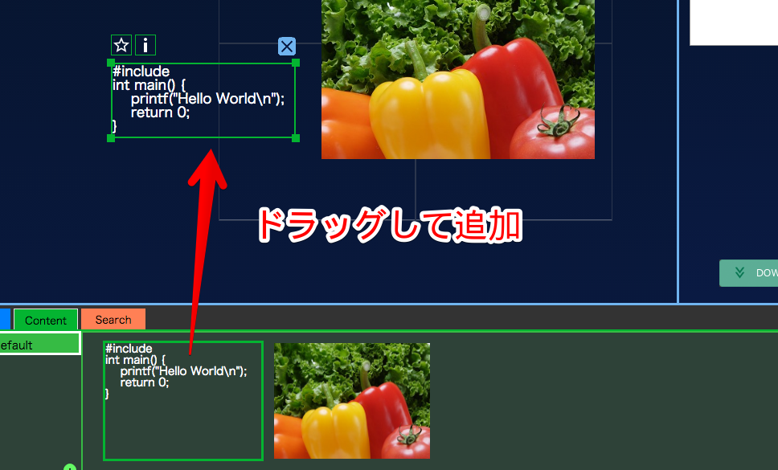
*テキストファイルのVirtualScreenへの追加*

### URLの追加

右下のメニューから、指定されたURLのサイトの画像をContentsに追加します.
以下例となります.

*URL送信ボタン*

追加すると以下の通りとなります.

*URL追加後の様子*

### 画像の送信

右下のメニューから任意の画像ファイルをContentsに追加します.
対応している画像フォーマットは以下の通りです.

-   PNGフォーマット形式.
-   JPEGフォーマット形式.
-   GIFフォーマット形式.
-   BMPフォーマット形式.

以下は、画像をContentsとして追加したあとの表示例となります.

*画像の追加例*

### 画像の差し替え

Contentsタブにて選択している画像の差し替えを行います.
差し替え例を以下に示します.

*画像の差し替えボタン*

下図の通り指定すると、Contentsタブに存在するContentsが差し替わります。

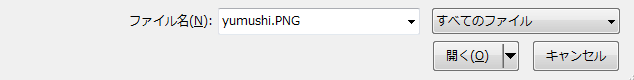
*画像の差し替え指定*

*画像の差し替え結果*

### コンテンツの操作

追加されたContentは, マウス左クリックにより選択, または, Ctrl + マウス左クリックにより複数選択することができます.
選択すると, 操作用マニピュレータ, 及び操作用ボタンが表示されます(下図)

-   選択時の操作用ボタン
    -   強調表示ボタン … 選択中のコンテンツを, 強調表示します.
        強調表示されたコンテンツは, Displayでグループ色の太い枠が付いた状態で表示されます
    -   メタ情報表示ボタン … コンテンツに設定されているメタ情報をDisplay側で表示させます.
    -   非表示ボタン … VirtualDisplaySpaceからコンテンツを非表示にします
        非表示にしたコンテンツは, コンテンツ一覧からドラッグすることで再び表示できます.

*コンテンツ操作用マニピュレータ*

### Groupの設定

Contentタブでは, コンテンツに割り当てるGroupの設定が行えます.
ボタンにより, グループの追加, 及び, 作成したグループの順序入れ替えを行います.
また, 設定メニューにより, グループの名前変更, グループ色変更, 削除を行います.

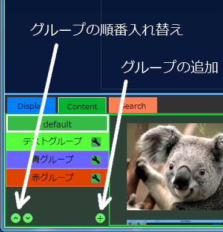
*Groupの追加, 順序変更*

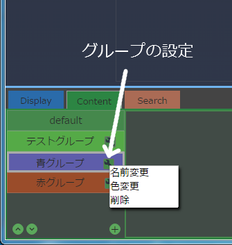
*Groupの設定*

### Groupの割り当て

コンテンツの右クリックメニュー, または, 画面右下のメニューから, コンテンツへ割り当てられたグループを, 変更することができます.

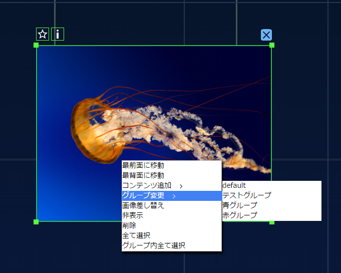
*Groupの変更*

コントローラの操作 : Searchタブ
-------------------------------

Searchタブでは、追加したコンテンツのサーチが行えます.

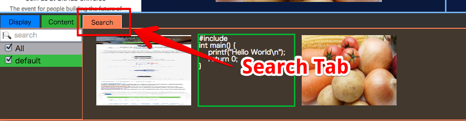
*Contentsの検索が可能*

### メタデータの検索

Searchタブにあるテキストボックスからは、メタデータの検索が行えます. 検索は、チェックボックスにチェックが入っているグループに対して行われます.

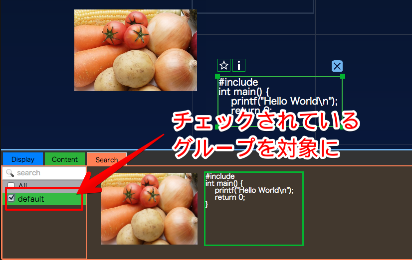
*対象となるグループの選択*

コントローラの操作 : Propertyウィンドウ
========================================

Propertyウィンドウは選択されたContents、Display、ContentsID、 およびそれぞれのPropertyを表示します.
Propertyは以下の通りID以外を編集し、座標、表示の優先順位( Zindex )を 指定することができます.
また、選択されたContentsはPropertyウィンドウ下部のダウンロードボタンから ダウンロードすることができます.

コントローラの操作 : 上部表示領域
=================================

### 上部に配置されたメニュー

画面上部に配置されたメニューから各種操作が行えます.

*画面上部領域*

### Displayボタン

下図に示すとおり、Displayボタンを押下すると、 Displayウィンドウを開くことができます.

*Displayボタン押下時*

### Addメニュー

Addメニューからは各種コンテンツを追加することができます.
操作方法の詳細については [コントローラの操作 : Contentタブ](#コントローラの操作-contentタブ) を参照してください.

*Addメニュー展開時*

### Settingメニュー

Settingメニューからはリモートカーソルの表示状態切替が行えます.

*Settingメニュー展開時*

リモートカーソルは以下のように表示されます。

*リモートカーソル*

### ホームに戻る

下図のように、ChOWDERと書かれた部分をクリックすると、 ホームに戻ることができます.

*タイトル名のクリックでホームに戻る*

ディスプレイ画面の操作
======================

概要
----

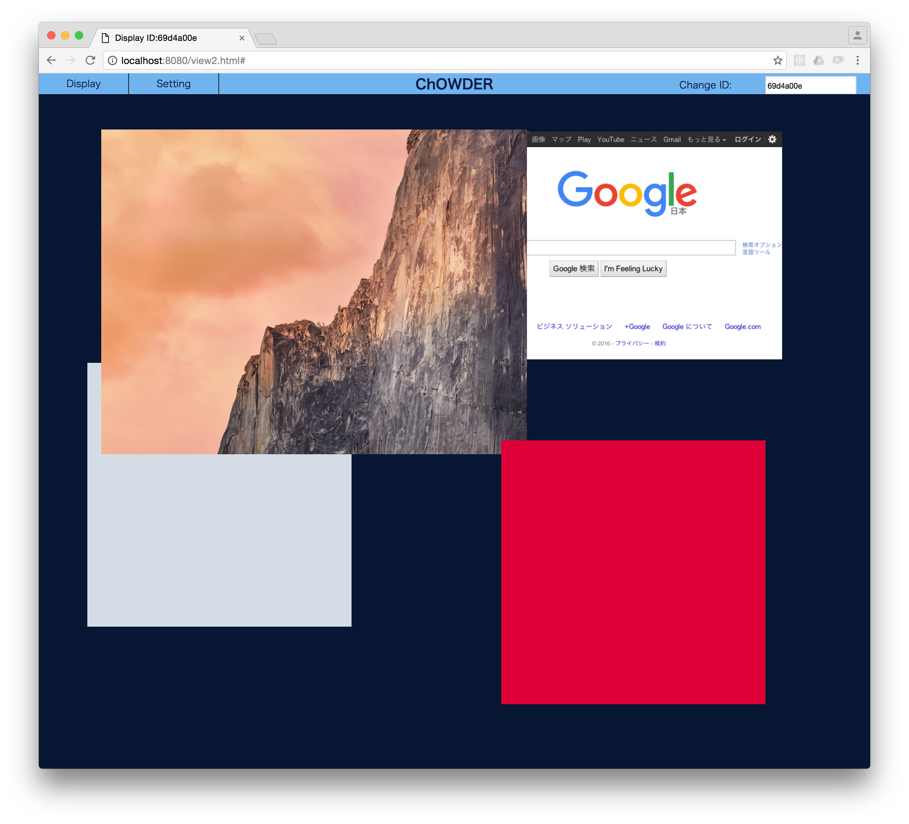

ディスプレイの操作方法について解説します。 それぞれのタブ、ウィンドウ等、機能について解説します.

ディスプレイの操作：メニュー
----------------------------

ディスプレイでは、マウスもしくはタブレットの場合は画面へのタッチを行うと、メニューが表示されます。 メニューではいくつかの操作を行うことができます。

### コントローラ画面への切り替え

ディスプレイモードからコントローラモードへ切り替えることができます。

*コントローラ画面への切り替え*

### フルスクリーンへの切り替え

ウインドウモードとウインドウモードの切り替えが可能です。 フルスリーンからウインドウモードに戻る場合は、同じメニューを再度選択またはESCキーを押すことで 戻ることができます。

*フルスリーンへの切り替え*

### Display IDの設定

コントローラで認識可能なディスプレイのIDを設定することができます。 任意の文字列を入力後、エンターキーを押すことで、設定することができます。

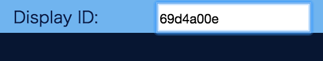
*ディスプレイIDの設定*

HIVEとの連携
============

インタラクティブレンダリング
----------------------------

HIVEのインタラクティブレンダリング時に, グラフィクス画面をChOWDERに送信し, 表示させることができます (下図)

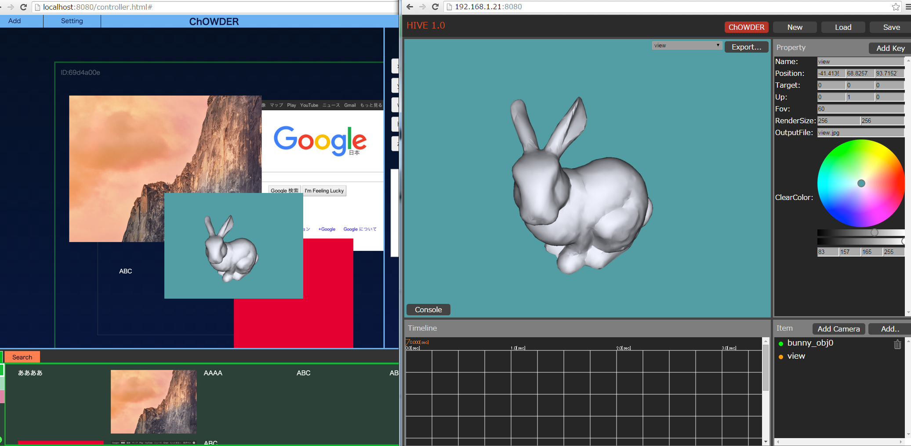
*HIVEインタラクティブレンダリングの送信例*

送信するには, HIVEの上部メニューにあるChOWDERボタンを押し, ChOWDERのURLを設定します.URLは, 初期状態では ws://localhost:8081/v2/ となっています. localhostの部分をChOWDERが動作しているPCのIPアドレスに変更して接続します. 接続中は, 上手のようにChOWDERボタンの色が変わります.

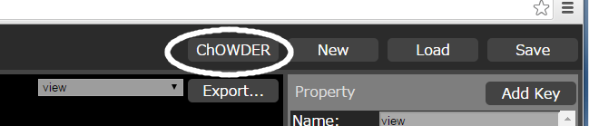
*ChOWDER接続用メニュー項目*

*URL設定*

SceneNodeEditor
---------------

HIVEのSceneNodeEditorで, RenderForSIPノードを使用することで, レンダリング画像をChOWDERに送信し, 表示させることができます. プロパティのSEND先のURLは初期状態では ws://localhost:8081/v2/ となっています.

*SceneNodeEditorでの送信例*

Module System
-------------

HIVEのModuleSystemで, ChOWDERノードを使用することで, レンダリング画像をChOWDERに送信し, 表示させることができます. ChOWDERノードはBufferImageData形式の出力をもつノードと接続できるため、 接続可能な様々なノードの情報をChOWDERに送信することができます。

ChOWDERノードのプロパティでは、ChOWDERのコンテンツ送信先アドレス指定します。 デフォルトでは、 ws://localhost:8081/v2/ です。ここでは、ChOWDERサーバーのアドレスを指定してください。

*ModuleSystemでの送信例*

Google Chrome Extensionの利用
=============================

概要
----

Google ChromeにはExtensionと呼ばれる機能を拡張する仕組みがあります。 Google Chromeに専用のChOWDER用Extensionを追加することで、ウェブブラウザの画面をリアルタイムにキャプチャし、コンテンツとして追加することができます。

Extensionのインストール
-----------------------

プロジェクトルートにあるbinディレクトリのなかにchrome\_extention.crxという名前のファイルがあり、これがGoogle Chrome用のExtensionファイルです.

Chromeに拡張機能をインストールし追加するには、下図に示したようにブラウザの拡張機能のページを開きます.

そこにExtensionファイルをドラッグアンドドロップし、インストールします.

*拡張機能ページを開くメニュー*

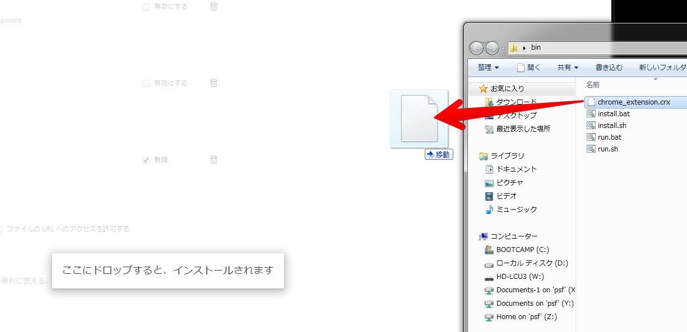
*Extensionファイルのドラッグアンドドロップ*

Extensionでキャプチャする
-------------------------

Extensionを追加したら、アイコンをクリックしてキャプチャを開始できます。

-   Extensionのメニュー

    -   Capture … 現在表示しているウェブページをキャプチャして, ChOWDERへ送信します.

    -   AutoCapture … 設定された時間間隔ごとに, 現在表示しているウェブページをキャプチャして, ChOWDERへ連続送信します.

    -   Setting … 設定メニューを開きます.

*Extensionのメニュー*

*AutoCapture開始後*

-   Extensionの設定

    -   URL … ChOWDERへ接続するためのURLを設定します.

    -   Interval … AutoCaptureで使用される, キャプチャ間隔を設定します.

*Extensionの設定*
