User Guide
=============================================================

Table of Contents
---------------------------------------------------

- [Getting Started](#getting-started)
  - [System Requirements and Installation](#system-requirements-and-installation)
- [Extracting the Application](#extracting-the-application)
- [Installing the Application](#installing-the-application)
  - [Installation](#installation)
  - [Run Install Script](#run-install-script)
- [Launching the Application](#launching-the-application)
  - [For Mac/Linux](#for-maclinux)
  - [For Windows](#for-windows)
  - [Launch Confirmation](#launch-confirmation)
  - [Accessing Controller(s)](#accessing-controllers)
- [How to Quit the Application](#how-to-quit-the-application)
  - [Shut Down the Server Program](#shut-down-the-server-program)
  - [Shut Down Redis](#shut-down-redis)
- [Server Setup](#server-setup)
  - [Basic Setup for Server](#basic-setup-for-server)
- [Initial Setup for Administrator](#initial-setup-for-administrator)
  - [Administrator Setup File](#administrator-setup-file)
- [The Home Screen of ChOWDER](#the-home-screen-of-chowder)
  - [What’s On Your Home Screen](#whats-on-your-home-screen)
- [Navigating the Controller Screen](#navigating-the-controller-screen)
  - [Overview](#overview)
  - [Connection Status](#connection-status)
  - [The Virtual Display Screen](#the-virtual-display-screen)
  - [Main Menu](#main-menu)
  - [Adding Contents](#adding-contents)
  - [Display Tab](#display-tab)
  - [Virtual Display Setup](#virtual-display-setup)
  - [Content Tab](#content-tab)
  - [Search Tab](#search-tab)
  - [Layout Tab](#layout-tab)
  - [Property Window](#property-window)
  - [Working with Video Content](#working-with-video-content)
- [User Permissions and Administrator Screen](#user-permissions-and-administrator-screen)
  - [User Permissions](#user-permissions)
  - [Administrator Screen](#administrator-screen)
- [Working with Display Screen](#working-with-display-screen)
  - [Overview](#overview-1)
  - [Working with Display: Menu](#working-with-display-menu)
- [Coordinating with HIVE](#coordinating-with-hive)
  - [Interactive Rendering](#interactive-rendering)
  - [SceneNodeEditor](#scenenodeeditor)
  - [Module System](#module-system)
- [Using Google Chrome Extension](#using-google-chrome-extension)
  - [Overview](#overview-2)
  - [Installing Extension](#installing-extension)
  - [Use Extension to Capture](#use-extension-to-capture)
- [Using Desktop Capture on ChOWDER](#using-desktop-capture-on-chowder)
  - [Overview](#overview-3)
  - [How to Use ChOWDER Desktop Capture](#how-to-use-chowder-desktop-capture)
- [Using Google Chrome Extension for WebRTC](#using-google-chrome-extension-for-webrtc)
  - [Overview](#overview-4)
  - [Installing Extension](#installing-extension-1)
  - [In case of ChOWDER server is running on the other PC](#in-case-of-chowder-server-is-running-on-the-other-pc)
  - [Capture Using Extension](#capture-using-extension)
- [Using the Large Scale Image Data Transmission Application](#using-the-large-scale-image-data-transmission-application)
  - [Overview](#overview-5)
  - [Application Setup](#application-setup)
  - [Using the Application](#using-the-application)
- [Displaying and Managing Large Scale Image Data](#displaying-and-managing-large-scale-image-data)
- [Using the Display Application for the Electron version of ChOWDER](#using-the-display-application-for-the-electron-version-of-chowder)
  - [Overview](#overview-6)
  - [Application Setup](#application-setup-1)
  - [Launching the Application](#launching-the-application-1)
- [Using HTTPS](#using-https)
  - [Overview](#overview-7)

Getting Started
==================================================================

This user guide contains information on how to operate ChOWDER. 

System Requirements and Installation
---------------------------------------------------

The following operating systems and web browsers are supported by ChOWDER.

- OS
  - Linux(CentOS6)
  - Windows7
  - MacOSX 10.10

- Web Browsers
  - Apple Safari 9.x
  - Firefox 48.0
  - Chrome 53
  - Internet Explorer 11

Extracting the Application
==================================================================

Extract the archive files.
The extracted files will be organized as follows

- bin : Run Script Folder
- client : Client Application Folder
- doc : Document Folder
- redis : Redis Application Folder
- server : Server Application Folder
- chrome_extension : Google Chrome Extensions Folder
- package.json

Use the script located in the bin folder to start the Collaborative workspace driver. 

Installing the Application
==================================================================

Installation
---------------------------------------------------

### Installing Node.js

The GUI Portal requires the installation of Node.js. Download the latest version from the official website (`http://nodejs.org/`). (See image below)


*Screenshot of Node.js*

### Installing the Submodule for Node.js 

Install the third-party modules for Node.js required to run ChOWDER in the application’s directory. 

Run Install Script
---------------------------------------------------

### For Mac/Linux

Run the shell script located in the bin folder.

       $cd bin
       $sh install.sh

### For Windows

Run the following batch file located in the bin directory. 

        >cd bin
        >install.bat

Launching the Application
==================================================================

For Mac/Linux
---------------------------------------------------

Run the shell script located in the bin folder.

       ./run.sh

For Windows
---------------------------------------------------

Run the following batch file located in the bin directory. 

        >cd bin
        >run.bat

- Redis may not run properly in Windows if the Virtual Memory is set to 0 Kbyte. To avoid this issue, temporarily enable Virtual Memory. 

Launch Confirmation
---------------------------------------------------

Run the startup script to launch the ChOWDER server.

       $sh run.sh
       (run.bat for Windows)

Accessing Controller(s)
---------------------------------------------------

Type http://localhost:8080 in the address bar of the web browser to access ChOWDER.
Once you access ChOWDER and see the image below, the installation is complete.


*Screenshot of Home Screen after Installation is Complete*

How to Quit the Application
==================================================================

There are two steps to quit.

Shut Down the Server Program
---------------------------------------------------

Use CTRL+C to close the terminal launched by `run.sh(bat)` or kill the server program.

Shut Down Redis
---------------------------------------------------

Close the terminal that redis is running on. 
If redis server is running a process, locate the process using the ps command and then kill. 


Server Setup
========================================================================================

Basic Setup for Server
---------------------------------------------------
The server program reads the `server/setting.json` file while launching to configure various settings. 


    {
        "wsMaxMessageSize": 67108864,
        "reductionResolution" : 1920
    }

-   wsMaxMessageSize sets the maximum size of a single message that the server transmits. 
-   reductionResolution sets the size of the reduced image of large scale image data. When large scale image data that exceed this size is registered, a reduced image is generated which may be used to display depending on the resolution. 


Initial Setup for Administrator
---------------------------------------------------

You can add an administrator user during start-up. 
Default password for the administrator is “admin”.

Administrator Setup File
---------------------------------------------------
To add or remove an administrator during start-up, create an admin.json file in the first folder of ChOWDER (the same folder that README.md is located in.) The admin.json format is as follows (you can also find this inside the admin.json.org file).

    {
        "administrator" : {
            "command" : "add",
            "password" : "admin"
        },
        "administrator2" : {
            "command" : "delete",
            "password" : "admin2"
        }
    }

In this example, the “administrator” user is added (by overwriting/saving) and “administrator2” user is deleted. 

Set the administrator’s name as key followed by “command” : “add” to add and “command” : “delete” to remove an administrator. You will need a password when adding an administrator.
This json file will be read when launching ChOWDER and the administrator will be added or removed at that time. 
Once ChOWDER is launched and registered with the DB, there is no longer a need for the admin.json file. 

The Home Screen of ChOWDER
==================================================================

What’s On Your Home Screen
---------------------------------------------------

Once the application is launched per above, type http://localhost:8080 in the address bar of the web browser to access ChOWDER. When you establish access, you will see the Home Screen mentioned above. ChOWDER has two modes (Display, Controller) whereby you decide which one to use from the Home Screen. 

- Controller:  You will be directed to the controller screen.

- Display : You will be directed to the display screen.

You have a choice to use the computer you are accessing between “controller” and “display” modes.

Navigating the Controller Screen
=================================================================

Overview
---------------------------------------------------

The controller is set up per below.

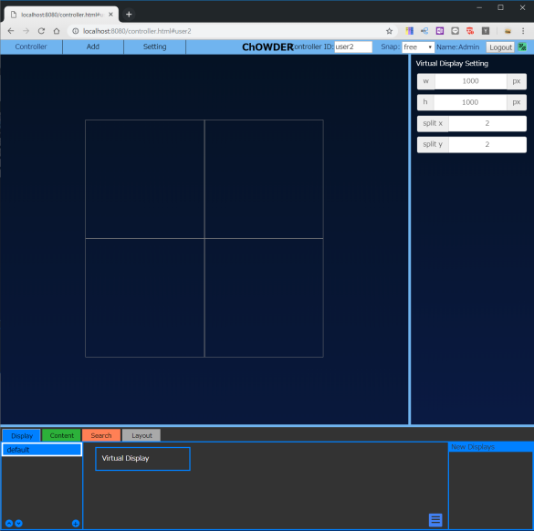
*Screenshot of Controller Screen*

Connection Status
---------------------------------------------------

The icon on the upper right hand of the screen indicates the connection status with the server.


*Connected to the Server*
<br>

*Not Connected to the Server*

The Virtual Display Screen
---------------------------------------------------

The Virtual Display Screen is located in the center of the page and is used for general purposes to manage the display connected to ChOWDER as well as moving, managing and deleting Contents. 

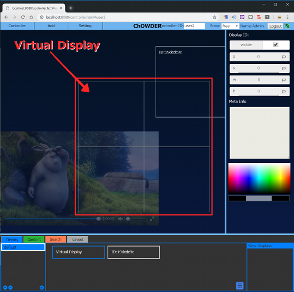
*Example of the Virtual Display Screen*

Main Menu
---------------------------------------------------

### Menu at Top of the Page

The menu at the top of the page contains various commands.

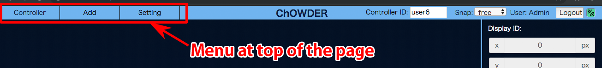
*Area at the Top of the Page*

### The Display Button

You can open the Display window by clicking on the Display button, as shown below. 

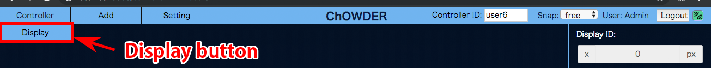
*Menu when Display Button is Selected*

### Add Menu

You can add various contents using the Add menu.
For details, refer to [Adding Contents](#Adding-Contents).


*Menu when Add is Selected*

### Setting Menu

Under the Setting menu, you can turn the remote cursor on or off, change languages, and pull up the Administrator Screen. The Administrator Screen is accessible only to the Administrator.
For information on the Administrator Screen, please refer to [User Permissions and Administrator Screen](#UserPermissionsandAdministratorScreen)

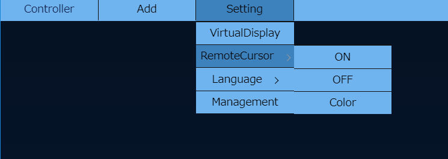
*Menu when Setting is Selected*

The Remote Cursor appears as below.

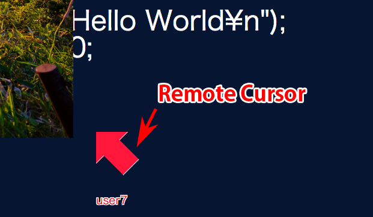
*Remote Cursor*

You can change languages in the menu below.

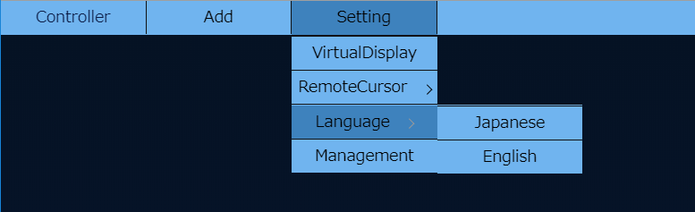
*Change Language*

### Return Home

You can return Home by clicking on the ChOWDER link as shown below.

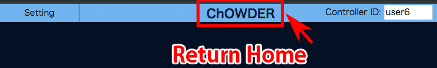
*Click on Title to Return Home*

### Controller ID Setup

You can set up the Controller ID in the section shown in the image below.
You may be prompted for a password when changing the Controller ID as it is recognized as a different Controller. 

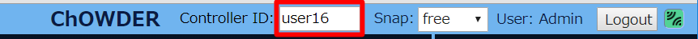
*Controller ID Setup*


Adding Contents
---------------------------------------------------

You can add various contents by selecting Add in the Main Menu or using the Menu located on the lower right part of the Content Tab. 

### Adding an Image File

Add an image file of your choice to Contents by any of the following methods. 

- Main Menu -> Add -> Image
- Content Tab (lower right menu) -> Add Content -> Image File
- Right-click within the Content Tab -> Add Content -> Image File

The following image formats are accepted.

- PNG format
- JPEG format
- GIF format
- BMP format

The example below shows the screen after adding an image as a Content.

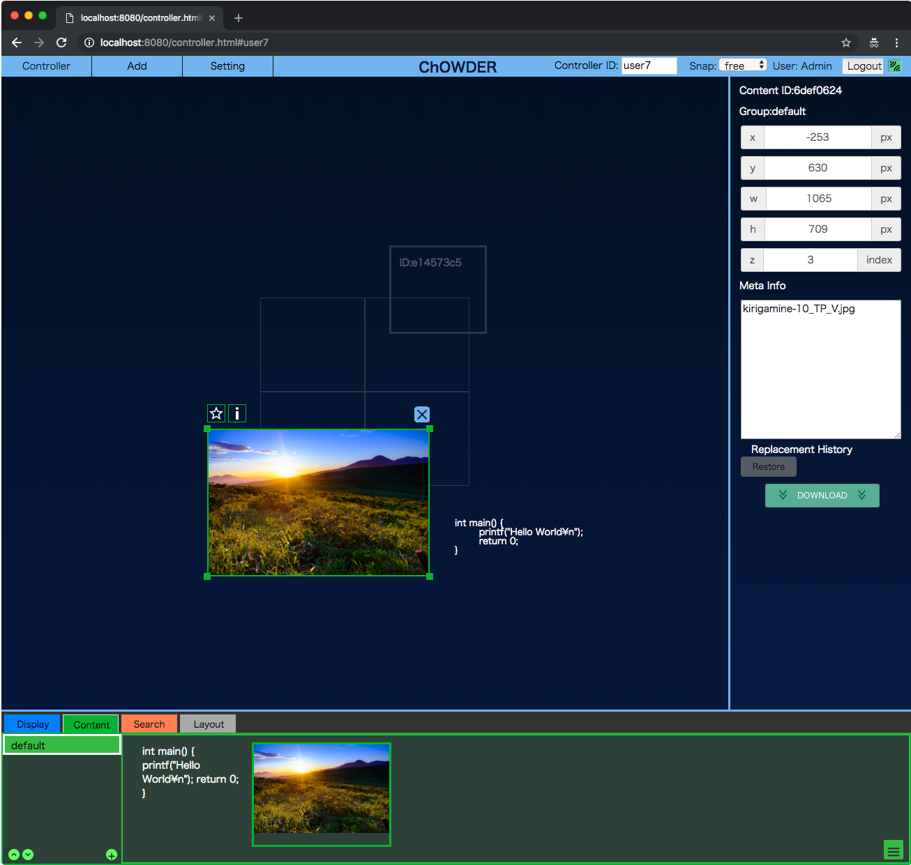
*Example of an Added Image File*

### Adding Video Files

Add a video file of your choice to Contents by any of the following methods. 

- Main Menu -> Add -> Movie
- Content Tab (lower right menu) -> Add Content -> Video File
- Right-click within the Content Tab -> Add Content -> Video File

MP4 file formats are accepted.
Once video files are imported, they are streamed via WebRTC. For details on WebRTC, refer to [Working with Video Content](#Working-with-Video-Content).

The example below shows the screen after adding a video as a Content.

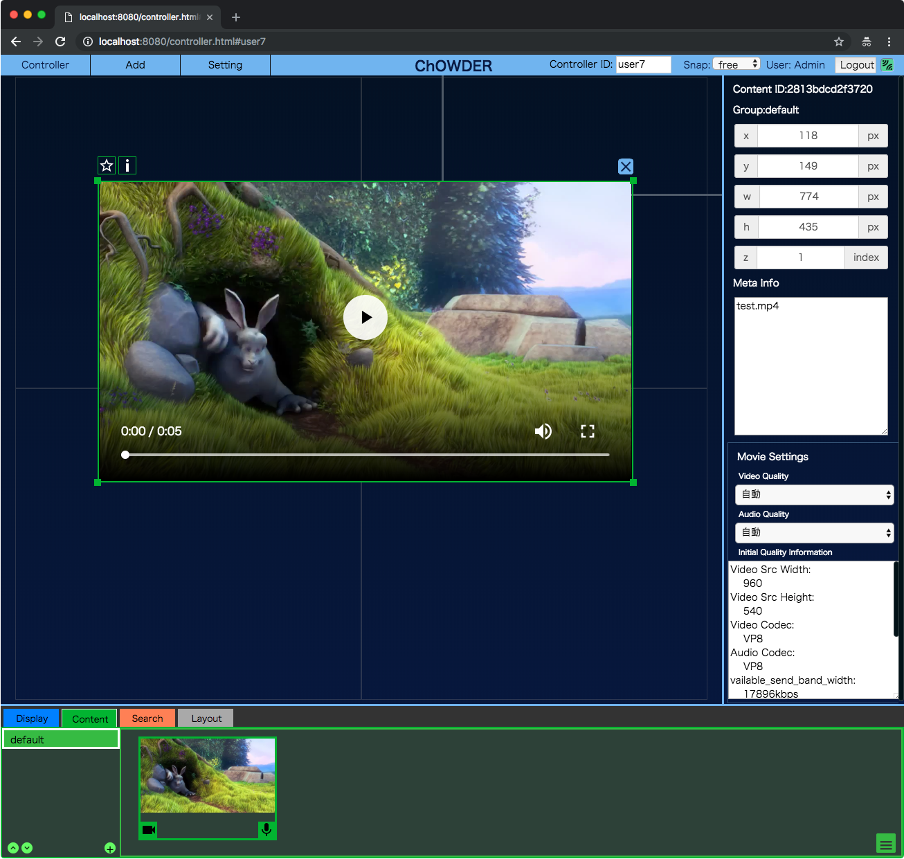
*Example of an Added Video File*

### Adding Text

Add text of your choice to Contents by any of the following methods. 

- Main Menu -> Add -> Text
- Content Tab (lower right menu) -> Add Content -> Text
- Right-click within the Content Tab -> Add Content -> Text

### Adding Text Files

Add a text file of your choice to Contents by any of the following methods. 

- Main Menu -> Add -> TextFile
- Content Tab (lower right menu) -> Add Content -> TextFile
- Right-click within the Content Tab -> Add Content -> TextFile

The example below shows adding a text file

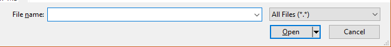
*Select TextFile*
<br>
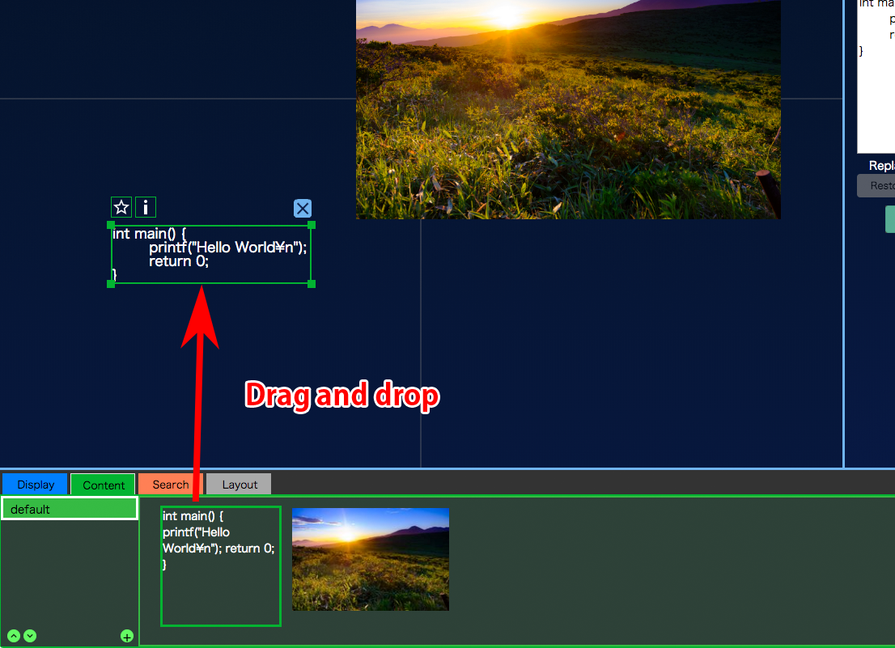
Add Textfile to VirtualScreen

### Adding URL

Add an image from the specified URL to Contents by any of the following methods. 

- Main Menu -> Add -> URL
- Content Tab (lower right menu) -> Add Content -> URL
- Right-click within the Content Tab -> Add Content -> URL

See example below.

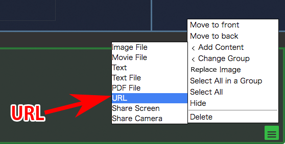
*Submit URL Button*

Adding an URL looks like below.

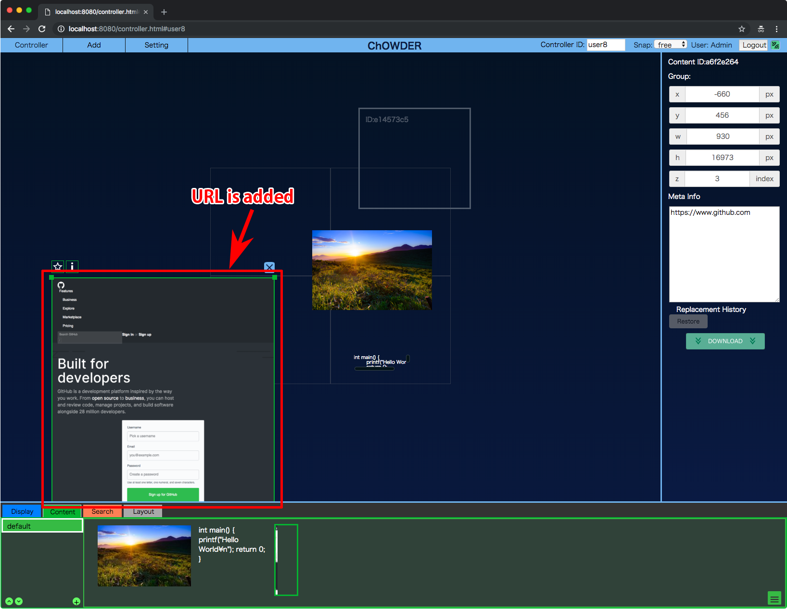
*Screen after Adding URL*

### Adding PDF

You can add PDF documents to Contents by any of the following methods. 

-   Main Menu → Add → PDF
-   Menu on the lower right side of Content Tab → Add Content → PDF File
-   Right-click within the Content Tab → Add Content → PDF File

The example below shows the screen adding a PDF as a Content.


*Example of an Added PDF File*

### Adding a Shared Screen

Add a shared screen to Contents by any of the following methods. 

-   Main Menu -> Add -> ScreenShare
-   Content Tab (lower right menu) -> Add Content -> ScreenShare
-   Right-click within the Content Tab -> Add Content -> ScreenShare

Captured videos are streamed via WebRTC.
For instructions on working with video contents, refer to [Working with Video Contents](#Working-with-Video-Contents).

The example below shows the screen after adding a shared screen.


*Example of an Added Shared Screen*

### Shared Camera

Add a shared camera to Contents by any of the following methods. 

-   Main Menu -> Add -> CameraShare
-   Content Tab (lower right menu) -> Add Content -> CameraShare
-   Right-click within the Content Tab -> Add Content -> CameraShare

Captured videos are streamed via WebRTC.
For instructions on working with video contents, refer to [Working with Video Contents](#Working-with-Video-Contents).

The example below shows the screen after adding a shared camera to contents.

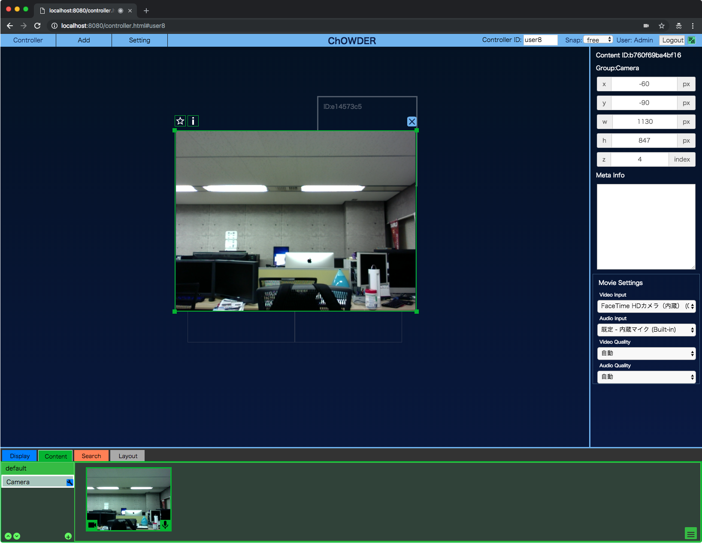
*Example of an Added Shared Camera*

Display Tab
---------------------------------------------------

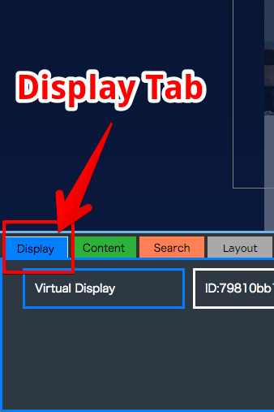
*Display Tab*

The Display tab shows the VirtualDisplay and all Display connected to the ChOWDER server. The Controller allows you to move Display within VirtualDisplay. Adding Contents to the arranged Display enables a shared workspace. Use the mouse to drag and drop Display into the VirtualDisplaySpace.
The example above shows the environment when a client is connected. 

Virtual Display Setup
---------------------

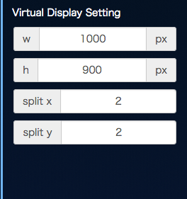
*Virtual Display Setup*

### Splits (Sub-Divisions) Setup

Go to the Display tab and select Virtual Display to set up Virtual Display in the Property window. In the example above, the Virtual Display settings are 1500 pixels for width, 1500 pixels for height, horizontal split (sub-division) 2, and vertical split (sub-division) 2. 

### Snap Function

The Snap function helps you accurately align your display with the selected area.
You can switch between modes using the dropdown list seen below. 

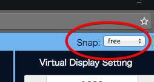
*Pulldown Button for the Snap Function*

- Free: No restrictions
- Display: Display and Contents snap in alignment with the laid out Display
- Grid: Display and Contents snap in alignment with the split (sub-division) specified by VirtualDisplaySetting

The example below demonstrates using the snap function for layout purposes.

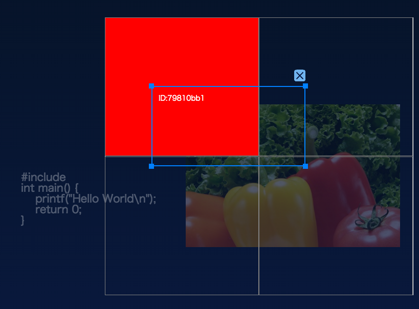
*Example of Drag Function with Snap*

You can enlarge and reduce the VirtualDisplaySpace using the Scale function.
Place the mouse inside the screen to right-click and drag to enlarge or reduce the screen.

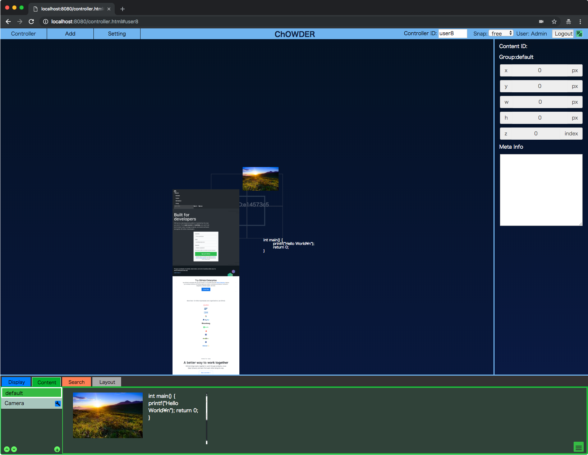
*Example of Scale Function (Contents are reduced in size)*

### Display and ID

You can differentiate between all connected Display by the Display ID shown above each Display. 
IDs are specific to the connected terminal whereby each terminal is assigned one ID. 

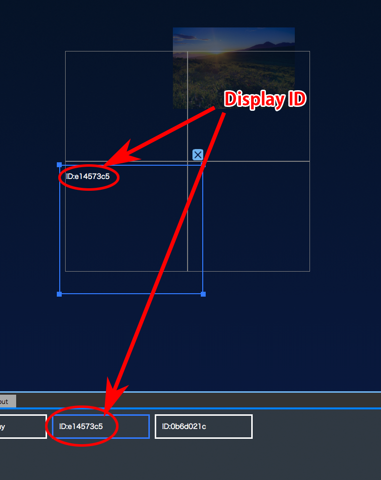
*Display ID*

### Delete Button

The Delete button deletes the selected Display (by disconnecting from the ChOWDER server).

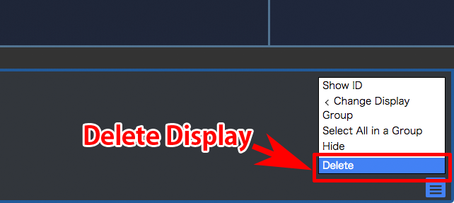
*Delete Button*

Note you will not be able to delete VirtualDisplay

### Select All Button

The Select All button selects all connected Display.

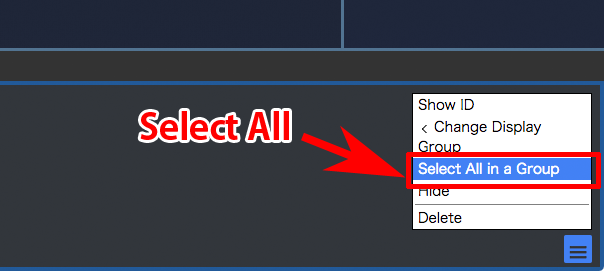
*Select All Button*

### DisplayGroup Setup

You can set the DisplayGroup assigned to the display within the Display tab.
You can set one Virtual Display per DisplayGroup.

You can add a group or change the order of a created group by using the button.
In the settings menu, you can change the name of the group, the color of the group, and delete the group. 

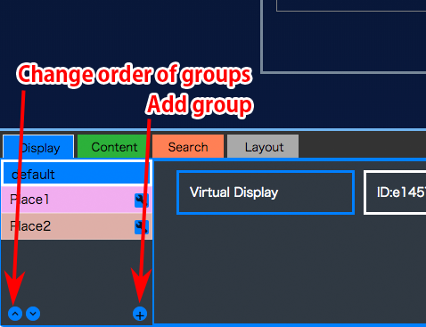
*Adding and Changing the Order of the DisplayGroup*
<br>
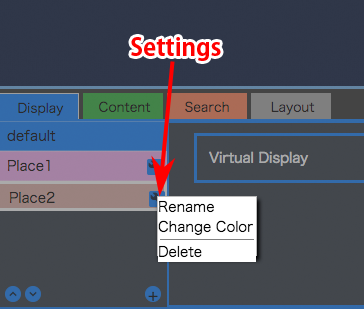
*DisplayGroup Setup*

### Assigning the DisplayGroup

You can make changes to the group assigned to Display by right-clicking menu in Display or through the menu on the lower right of the screen. Changes cannot be made to Groups in VirtualDisplay. 

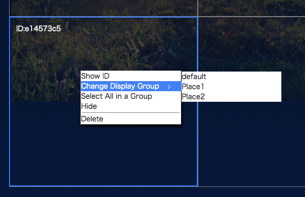
*Make Changes to DisplayGroup*
 


Content Tab
--------------------------------
To view Contents in Display, go to the Contents tab on the bottom of the page and drag and drop Contents into Display.

### View Contents 

Select Content from the list and drag and drop to the VirtualScreen area in the middle of view Content.

*View Content(s)*

### Working with Content(s)

Once added, you can select Content by left-clicking the mouse, or by pressing Ctrl and left-clicking the mouse to select multiple Contents. 
After selecting, you will see the Content Manipulator and editing buttons (see image below). 

- Editing buttons
  - Highlight button — highlights selected contents
                       Highlighted contents appear in Display with thick borders according to Group color.
  - Metadata button — Metadata of Contents appear in Display
  - Hide button — Hides Contents from VirtualDisplaySpace
                  Hidden contents can be viewed again by going to Contents and dragging and dropping.

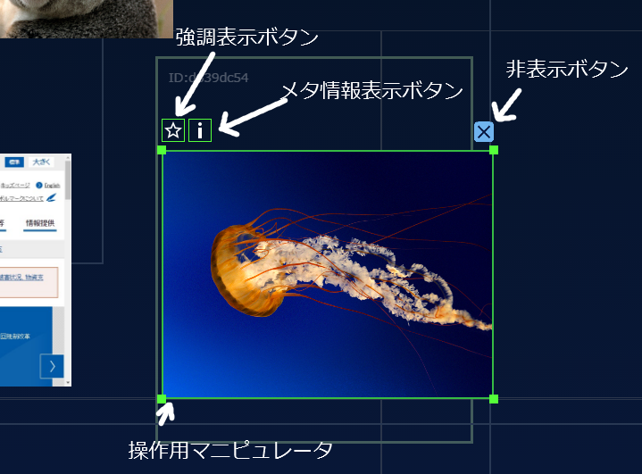
*Contents Manipulator*

### Content Tab Menu

You will find various editing tools in the dropdown list by selecting the menu button located in the bottom right section of tab area.

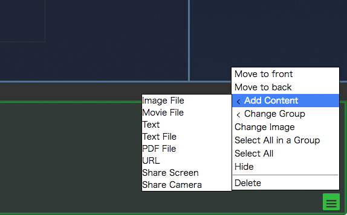
*Adding Contents*	

### Replacing Images

You can replace the image selected in Contents tab.
The example below shows how to replace images selected within the Contents tab.

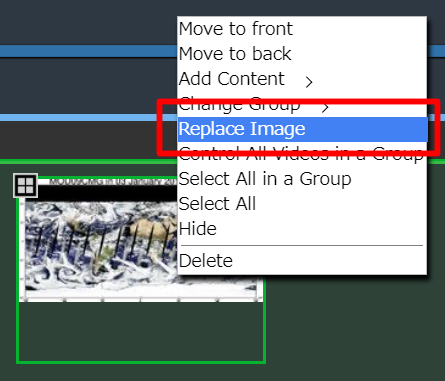
*Image Replacement Button*

Follow the example below to replace the Contents in the Contents tab.

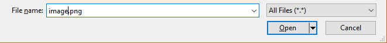
*Select Replacement Image*
<br>
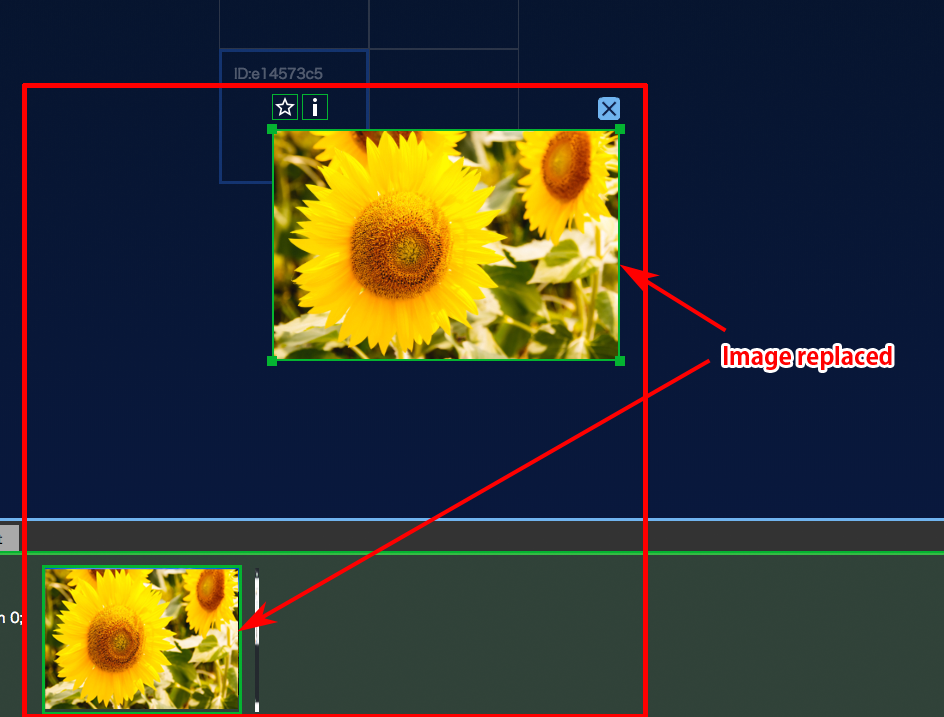
*Image Replaced*

### Group Setup

You can make changes to the settings of the Group assigned to Contents in the Content tab. You can add a group or change the order of groups by using the designated command buttons. In the settings menu, you can change the name of the group, the color of the group and delete the group.  

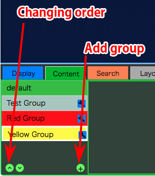
*Adding Groups, Changing Order of Groups*

<br>
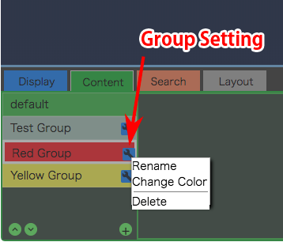
*Group Setup*

### Assigning Groups

You can make changes to the Group assigned to Contents by right-clicking Contents or through the menu on the lower right side of the screen. 

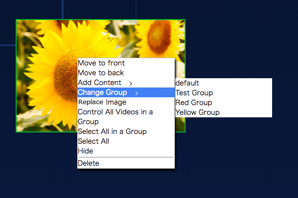
*Make Changes to Groups*

Search Tab
-------------------------------

You can search through added Contents using the Search tab.

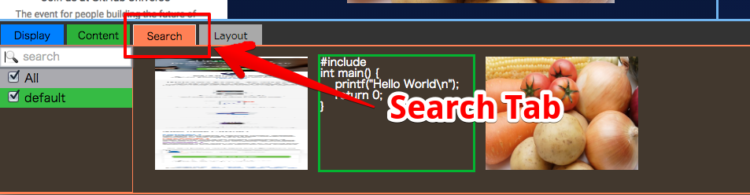
*Option to Search Contents*

### Search Metadata

You can search Metadata by using the text box in the Search tab. The search will be for Groups that have a check mark in the check box. 

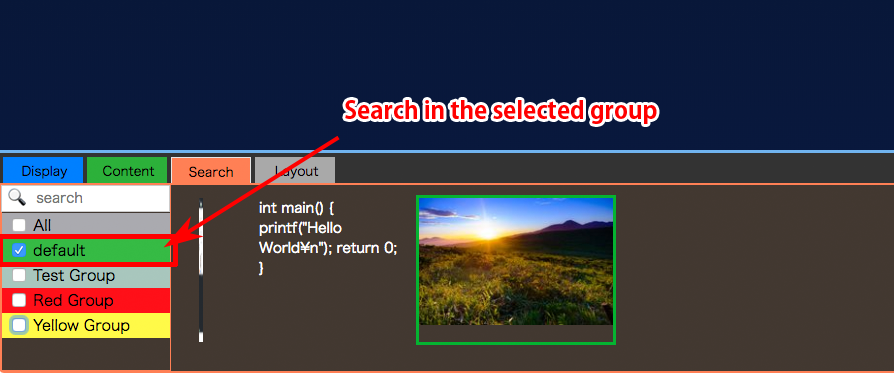
*Selecting Groups to Search*

Layout Tab
-------------------------------

The Layout tab allows you to save the current view of Contents as a Layout.

### Adding Layout

You can add a Layout by right-clicking the Layout list on the bottom of the screen or through the menu on the lower right side of the screen. Adding to Layout will apply to Groups that have a check mark in the check box. 

### Saving Layout

You can overwrite/save the current view of Contents in the selected Layout.


*Layout Tab*

### Make Changes to Group

Change the Group composition of the Layout

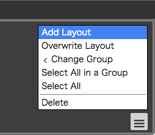
*Layout Menu*

### Applying Layout

To apply a Layout, select Layout Contents from the Layout list on the bottom of the screen and drag and drop to the screen. 

Property Window
-------------------------------

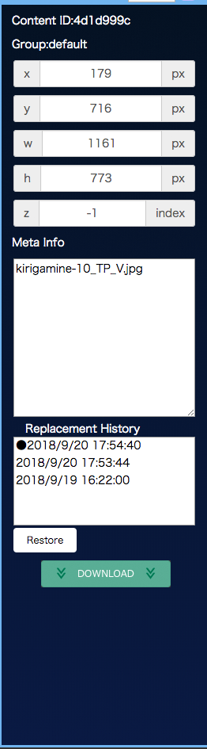

The Property Window shows selected Contents, Display, ContentsID and other properties. Property allows you to edit items other than ID and set coordinates as well as the stacking order (Z-index). You can also download the selected Contents from the Download Button located on the bottom of the Property Window. 

Working with Video Content
-------------------------------

In addition to regular content control, by selecting video content while using a Controller connected to video data, you can view control (commands) pertaining to motion.  

### Video Control

The controls for video contents using the Controller connected to video can be seen below.


*Video Control Using Controller*

The function of each control is as follows:  

1. Play or Pause Video
2. Seekbar for Video
3. Volume control for the Controller
4. ON/OFF switch for transmitting video
5. ON/OFF switch for transmitting sound

### Video Setup

While using the Controller connected to video, you can select video content and switch between capture devices and change streaming settings in the Property Window. 

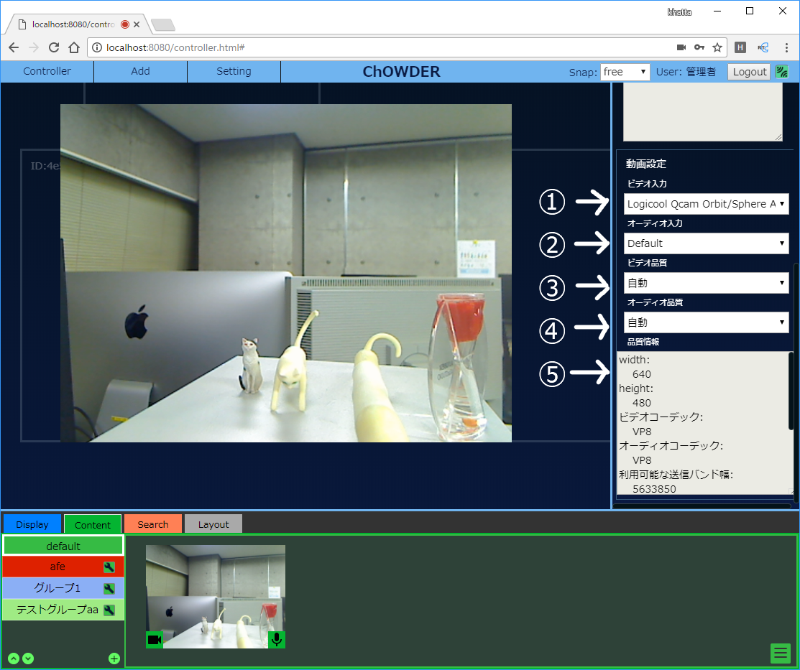
*Video Setup*

You can configure the settings per below:

1. Change video input device (only video contents from the camera can be set up)
2. Change audio input device (only video contents from the camera can be set up)
3. Set video quality. You can set the bitrate of the video streamed via WebRTC.
4. Set audio quality. You can set the bitrate of the audio streamed via WebRTC.
5. You can look up information on WebRTC quality saved in the metadata of Contents.

### Bulk Operation of Video

Video content in the same group can be bulk processed for playing, pausing and cueing. 
The operation is as follows.

1. Right-click within the Content tab → Control All Videos in a group
2. Use the Video Bulk Controller on the bottom of the screen

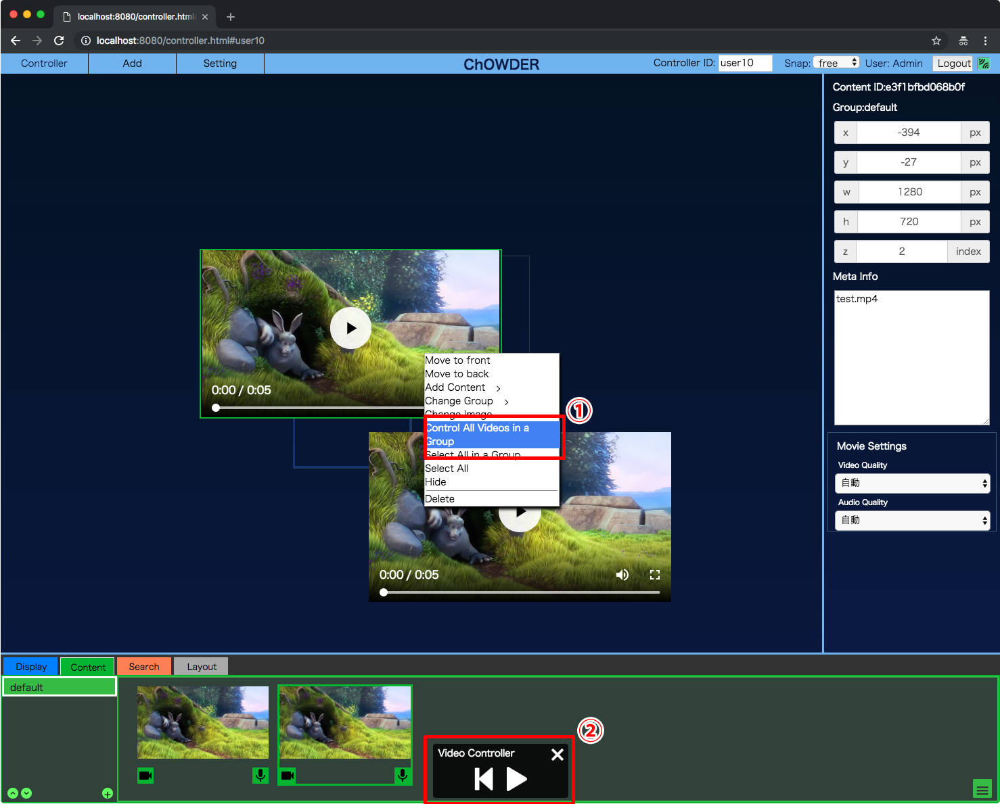
*Bulk operation of video*


User Permissions and Administrator Screen
==================================================================

User Permissions 
---------------------------------------------------
There are different categories of users as described below. You can set passwords and level of access per user. 

|User| Overview |Access Level|
| ---- | ---- | ---- |
|Administrator| Administrator can access all functions | All functions including Administrator Screen |
|Group User| User per Group | Default setting of access restrictions of the Administrator Screen permits editing and viewing for own group and default setting|
|Display| User Connected to Display | Default setting of access restrictions of the Administrator Screen permits editing and viewing for all groups |
|Guest| Guest User without Password | Default setting of access restrictions of the Administrator Screen permits editing and viewing for default setting only |

Administrator Screen
---------------------------------------------------
Log into Controller as an Administrator to access the Administrator Screen via Management Menu. You can set user permissions and various other settings in the Administrator Screen.

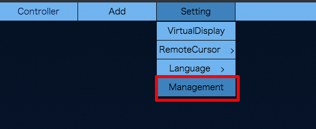
*Menu for Administrator Login*
<br>
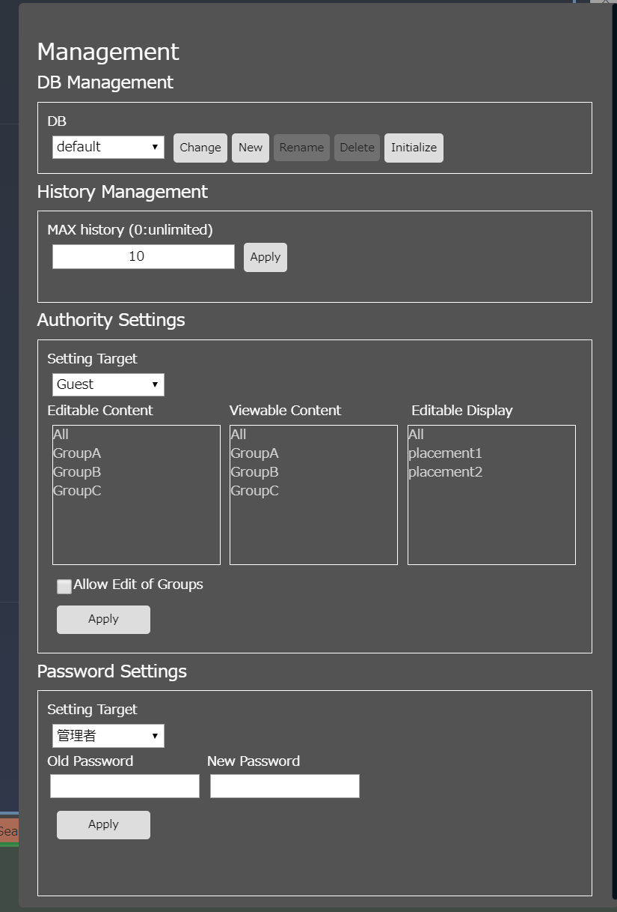
*Administrator Screen*

### DB Administration

You can create, switch, rename, delete and initialize storage space within DB Administration. Note you will not be able to rename or delete the default storage area that is automatically created in the beginning. 

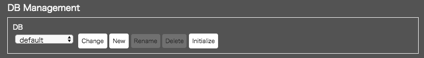
*DB Administration*

### Change History Administration

You can set the maximum number of historical changes to contents in Change History Administration. Historical changes per content will be saved up to the maximum number you designate here. This is a globally set value where the same value will be applied even when changing DB.  

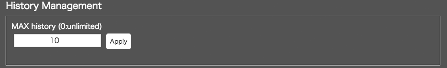
*Change History Administration*

### Viewing/Editing Permission Setup

You can set up each user’s permission in Viewing/Editing Rights Settings.

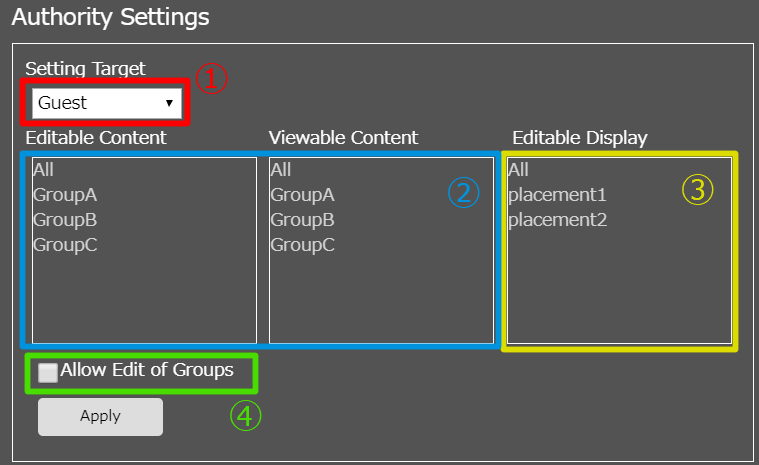
*Viewing/Editing Permission Setup*

1. Select user to set up.
2. Select the content group the user has permission to edit and the content group the user has permission to view. Users with permission for “all” are able to edit/view newly created groups as well. 
3. Select the display group the user has permission to edit. Users with permission for “all” are able to edit/view newly created groups as well.
4. Set up selected user with permission levels for editing groups and working with Display.


### Password Setup

You can change a user’s password in Password Setup
The previous password will be required only for changing the Administrator’s password. 

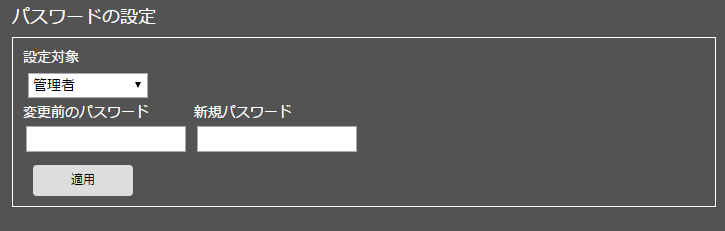
*Password Setup*


Working with Display Screen
==================================================================

Overview
---------------------------------------------------


We describe how to work with Display including its tabs, windows and functions. 

Working with Display: Menu
---------------------------------------------------

Menu will appear by using a mouse or by touching the screen of a tablet in Display. There are a number of things you can do in Menu.

### Switch to Controller Screen

You can switch from Display mode to Controller mode.

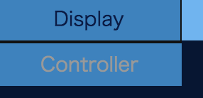
*Switching to Controller Screen*

### Switch to Full Screen

You can switch between full screen and window mode.  You can return from full screen to window mode by selecting the same menu or by pressing the ESC key. 

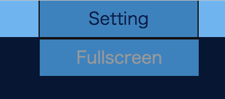
*Switch to Full Screen*

### Display ID Setup

You can set up a recognizable Display ID in Controller. Type out the word (or letter combination) of your choice and press enter to set the ID. 


*Display ID Setup*

Coordinating with HIVE
==================================================================

Interactive Rendering
---------------------------------------------------

You can transmit the graphics screen during HIVE’s interactive rendering to view in ChOWDER (see image below).


*Example of Transmission from HIVE Interactive Rendering*

Select the ChOWDER button in the menu located at the top of HIVE and designate ChOWDER’s URL to transmit. The URL’s initial setting is ws://localhost:8081/v2/. To connect, replace localhost with the IP address of the computer ChOWDER is running on. The ChOWDER button changes colors when connected. 


*Menu Item to Connect to ChOWDER *
<br>

*URL Setting*

SceneNodeEditor
---------------------------------------------------

You can transmit a rendered image using the RenderForSIP node in HIVE’s SceneNodeEditor to view in ChOWDER. The URL’s initial setting for SEND in Property is ws://localhost:8081/v2/.

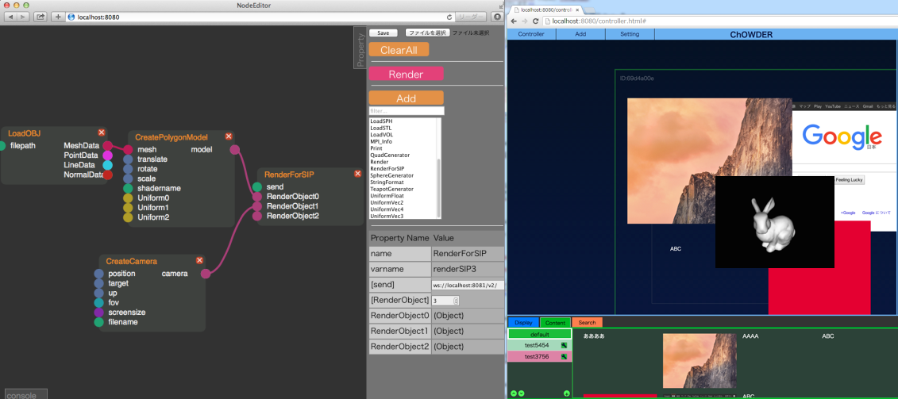
*Example of Transmission from SceneNodeEditor*

Module System
---------------------------------------------------

You can transmit a rendered image using the ChOWDER node in HIVE’s ModuleSystem to view in ChOWDER. Since the ChOWDER node is able to connect with nodes that output BufferImageData format, you can send information of a variety of connectable nodes to ChOWDER.  

You can designate the address ChOWDER contents are transmitted to in Property of ChOWDER’s node. Default address is ws://localhost:8081/v2/. Use the ChOWDER server address instead. 

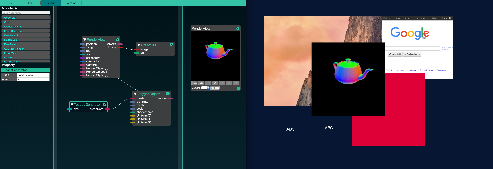
*Example of Transmission Using ModuleSystem *

Using Google Chrome Extension
==================================================================

Overview
---------------------------------------------------

Google Chrome allows adding functions and features in what is called Extension. By adding the specific ChOWDER Extension to Google Chrome, you can capture a web browser screen in real-time and add to Contents. 

Installing Extension
---------------------------------------------------

To install the Extension for Chrome, open the browser page for Extension and turn Developer mode on.

1. Open the browser page for Extension per below.
2. Turn on Developer mode toggle switch to enter Developer mode.
3. Reboot Chrome and open the browser page for Extension again.
4. Click `Load unpacked` and select `ChOWDER/chrome_extension` directory, then the Extension is going to be installed.

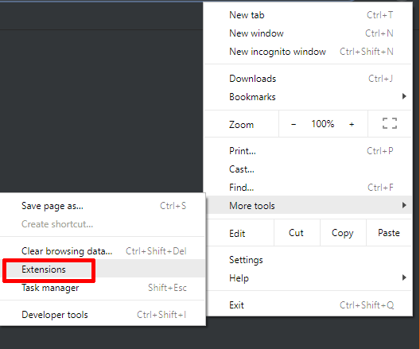
*Menu to Open Extension Page*
<br>
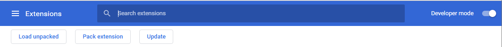
*Turn Developer mode on and load unpacked extension*

Use Extension to Capture
---------------------------------------------------

Once Extension is added, you can click the icon to begin Capture.

- Extension Menu
  - Capture — Captures web page currently in view and transmits to ChOWDER

  - AutoCapture — Captures web page currently in view at pre-set intervals and continuously transmits to ChOWDER

  - Setting — Opens Setup Menu


*Extension Menu*
<br>
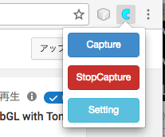
*After Starting AutoCapture*

- Extension Setup

    - URL — Sets URL to connect to ChOWDER

    - Interval — Sets interval used in AutoCapture


*Extension Setup*

Using Desktop Capture on ChOWDER
==================================================================

Overview
---------------------------------------------------
You can use ChOWDER Desktop Capture to select an entire desktop, an active application window, or any selected area to add as an image content to ChOWDER.

Installing and Operating Environment
---------------------------------------------------

### Running the Install Script

For Mac  
Run the shell script below located in desktop capture.

       $cd desktop_capture
       $sh make$app.sh

For Windows  
Run the file below located in desktop capture.

        >cd desktop_capture
        >make$_app.bat

### Operating Environment

OS: Windows7, MacOSX 10.10

How to Use ChOWDER Desktop Capture
---------------------------------------------------

You can do the following things using ChOWDER Desktop Capture:

- Select capture target/area and transmit
- Set interval for transmission of captured image
- Set destination URL of captured image
- Set group captured image is transmitted to

### Select Capture Target/Area

#### Select Capture Target

During launch, ChOWDER Desktop Capture creates thumbnails of the following items that appear on the bottom of the page:
- Entire desktop
- Active window(s)


Click on the thumbnail to change the capture target. The clicked target appears on the top of the screen in preview mode waiting to be captured. 

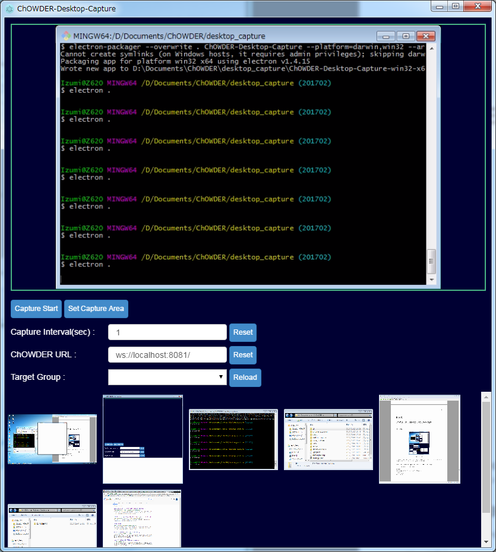
*Preview of Capture Target*

Once the capture target is selected, press the “Capture Start” button to begin transmission to ChOWDER. 


*Capture Start Button*
<br>

*Pressing the Capture Start Button*

#### Selecting Capture Area
You can transmit a portion of the screen as an image to ChOWDER by selecting the capture area using ChOWDER Desktop Capture.

Pressing the “Set Capture Area” minimizes ChOWDER Desktop Capture and switches the mouse from cursor to indicator to select an area. In this state, you can select an area by pressing the mouse, so click and drag the mouse to the end of the area you want to capture and then release the mouse to complete the capture.

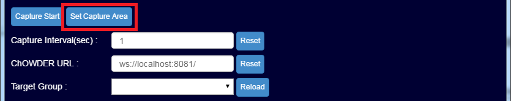
*Set Capture Area Button*
<br>
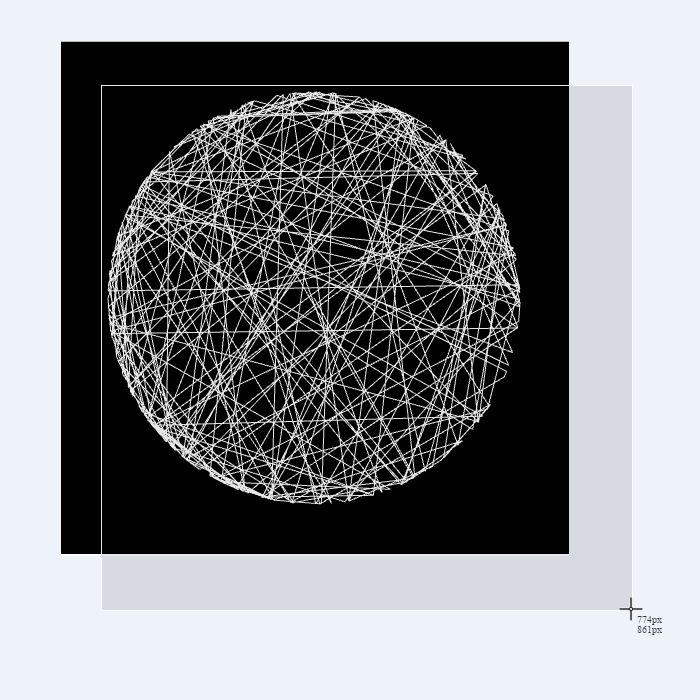
*Area Selection State*
<br>

*Preview of Selected Area*

Similar to “Select Capture Target,” you can begin transmission of images by pressing the “Capture Start” button.

### Set Capture Interval

You can set the interval for image transmission using ChOWDER Desktop Capture. You can input a numerical value for Capture Interval(sec) on the form on the right or use the up and down arrows. The minimum interval is 0.05 seconds. When you press the “Reset” button, the value goes back to its initial value of 1 second.


*Form to Set Capture Interval*

Values for Capture Interval, ChOWDER URL and Target Group are kept even after quitting the application for the next time the application is launched. 

### Setting the URL Destination of Captured Image

You can set the URL destination (ChOWDER) an image is transmitted to using ChOWDER Desktop Capture. You can overwrite the form on the right of ChOWDER URL with the URL destination. Pressing the “Reset” button returns it to its initial value. 

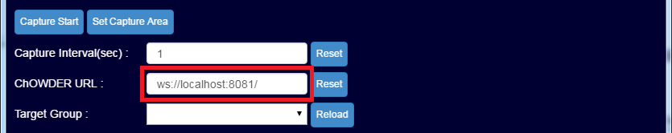
*Form to Set URL Destination*

### Set Up Capture Image Group

You can set the group the captured image is transmitted to by using ChOWDER Desktop Capture. Select from dropdown list on the right side of Target Group. Pressing the “Reload” button returns it to its initial value.
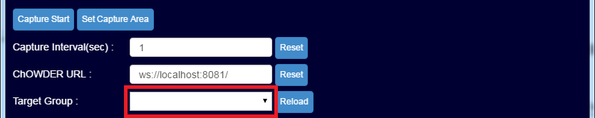
*Form to Set Group for Image Transmission*


Using Google Chrome Extension for WebRTC
==================================================================

Overview
---------------------------------------------------

You can stream video content from screen sharing by using HTML5’s WebRTC function.
While screen sharing is usually not possible in Google Chrome due to security restrictions, installing Chrome Extension allows you to stream video.

Installing Extension
---------------------------------------------------


To install the Extension for Chrome, open the browser page for Extension and turn Developer mode on.

1. Open the browser page for Extension per below as shown in [Installing Extension](#installing-extension).
2. Turn on Developer mode toggle switch to enter Developer mode.
3. Reboot Chrome and open the browser page for Extension again.
4. Click `Load unpacked` and select `ChOWDER/chrome_extension_for_webrtc` directory, then the Extension is going to be installed.

In case of ChOWDER server is running on the other PC
---------------------------------------------------

You need to add the URL of ChOWDER server to value of "matches" in `chrome_extension_for_webrtc/manifest.json` file.
If you modify the URL, you need to re-install the extension.

```
[before]
  "externally_connectable": {
    "matches": ["*://127.0.0.1/*", "*://localhost/*"]
  },
```

```
[after]
  "externally_connectable": {
    "matches": ["*://127.0.0.1/*", "*://localhost/*", "*://any.somedomain.co.jp/*"]
  },
```

Capture Using Extension
---------------------------------------------------

Once you add Extension, run Add -> ScreenShare and input ExtensionID in the dialogue to start capture. 

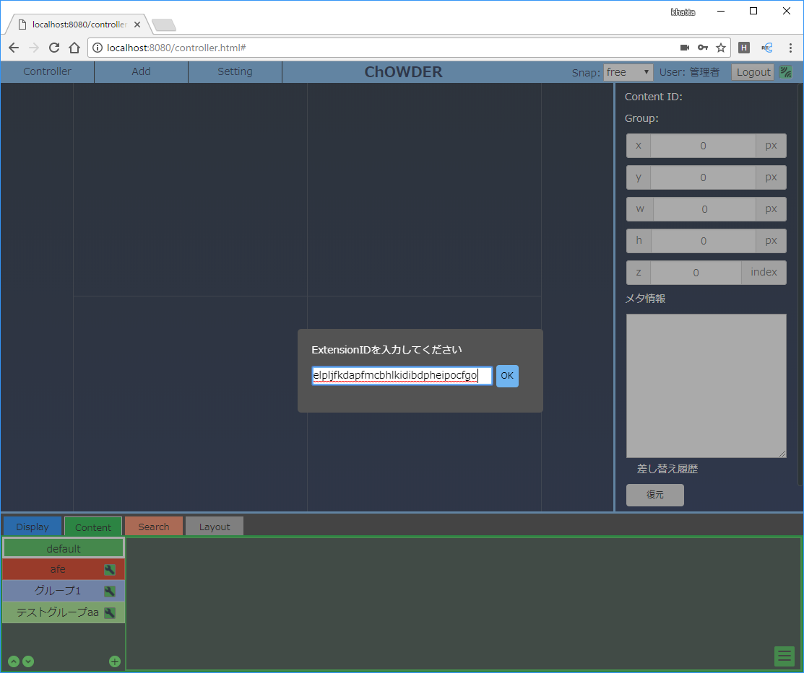
*Inputting ExtensionID when Starting ScreenShare*


Using the Large Scale Image Data Transmission Application
==================================================================
Overview
--------------------------------------------------------------------------------

You can send vast amounts of image data to the ChOWDER server using the CLI application.

Application Setup
--------------------------------------------------------------------------------
In setup file, you can set the number of splits (sub-divisions) and the Content ID/Group. 
The setup file is named “config.json” located in the “tileimage” directory. 
The format of the setup file is as follows:

    {
        "id": "APIUser",
        "password": "password",
        "url": "ws://localhost:8081/v2/",
        "xsplit": 8,
        "ysplit": 8,
        "contentid": "contentid",
        "contentgrp": "default"
    }

-	 `id` is fixed as `APIUser`
-	Set the password for `APIUser` in `password`. Passwords can be changed in password setup found on the [Administrator Screen](#administratorscreen).
-	Use the URL of the ChOWDER WebSocket server for 'url'
-	Set the number of horizontal and vertical image splits (sub-divisions) in `xplit` / `ysplit`.
	Designate Content ID and Content Group each in `contentid` / `contentgrp`

Using the Application
--------------------------------------------------------------------------------

Run the following command from either the command prompt or terminal.
Set the path of the image to transmit using the command argument.

### For Mac/Linux

Run the shell script below located in the `bin` directory.

    ./tileimage.sh

### For Windows

Run the command below located in the `bin` directory

    tileimage.bat

### Command Option

Set the path of the setup file using the `--config` option. The default path is `tileimage/tileimage.js`.
Set the meta data of images using `--metadata` option.

See below example of command:

    ./tileimage.sh --config conf.json --metadata "{\"key\":\"value\"}" image.jpg


Displaying and Managing Large Scale Image Data
==================================================================
Large scale image data registered using the large scale image data transmission application appear in the Controller with an icon like the one below.
Image appearing in Controller will be reduced from its original size.

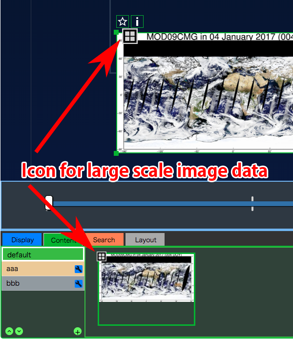

It will appear the same as other image contents in Display.

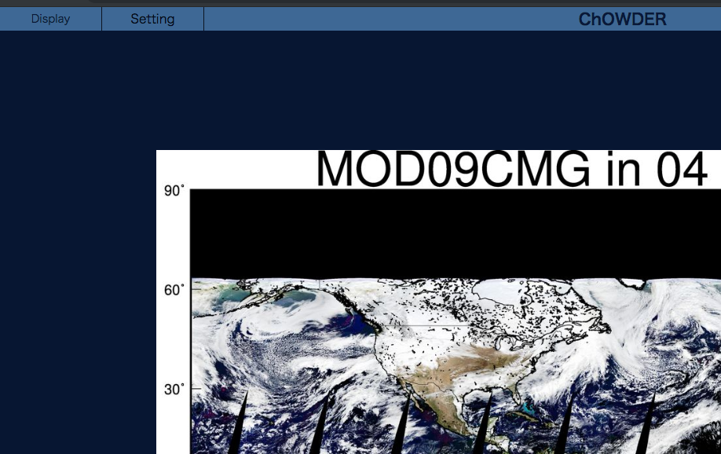

The following commands are available by selecting large scale image in Controller.

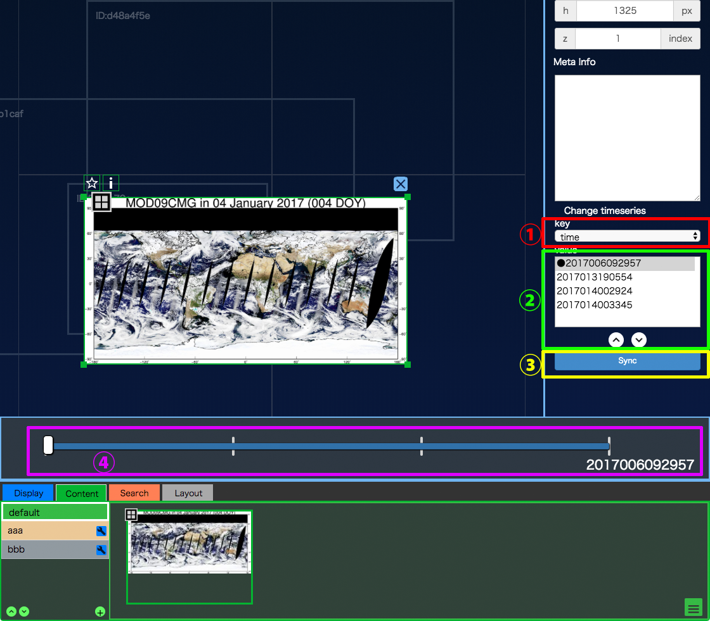

1. Switch `key` registered as `metadata` of the large scale image data.
2. Switch `value` registered as `metadata` of the large scale image data. Switching `value` changes the appearance of the large scale image data to the corresponding image data.
3. Synching of selected large scale image data begins upon pressing the Sync button. All contents in sync within the same group will switch to the corresponding image data according to the selection of `key` and `value` in `metadata`.
4. The slider may also be used to switch `value` as described in item 2 above.


Using the Display Application for the Electron version of ChOWDER
==================================================================

Overview
--------------------------------------------------------------------------------
You can automatically position a frameless window on the screen using the display application for the Electron version of ChOWDER.

Application Setup
---------------------------------------------------
Set up the application using the setup file in JSON format.
Create the setup file named `conf.json` in the `standalone-electron` directory. 

The format for the setup file is as follows:

    {
        "url": "http://localhost:8080/view.html",
        "windows": {
            "tile1": {
                "group": "hoge",
                "rect": [0, 0, 500, 500],
                "position": [0, 0],
                "scale": 1.0,
                "fullscreen": false,
                "frame": false
            },
            "tile2": {
                "group": "hoge",
                "rect": [500, 0, 500, 500],
                "position": [500, 0],
                "scale": 1.0,
                "fullscreen": false,
                "frame": false
            }
        }
    }

-	Use the URL of the ChOWDER server for `url`.
-	`windows` is the object that has the Display ID as key and display setup as value.
    -	Designate the display group in `Group`.
    -	Set the position and size of the window in `rect`.
    -	Set the position within VDA in `position`.
    -	Set the enlargement factor within VDA in `scale`.
    -	Designate whether to display or to not display the full screen of the window in `fullscreen`.
    -	Designate whether to display or to not display the window frame in `frame`. 


Launching the Application
---------------------------------------------------

Run the shell script below located in the `standalone-electron` directory

    electron .


Using HTTPS
==================================================================

Overview
---------------------------------------------------

There may be occasions screen sharing and camera sharing are activated only when using HTTPS in Firefox and Google Chrome due to security restrictions. 

ChOWDER has a built-in HTTPS server as well as a temporary SSL certificate. Under default settings, you can access the URL below and add it as a one-off exception to use a page using HTTPS. 

- URL for HTTPS — https://localhost:9090
- WebSocket Port for HTTPS — https://localhost:9091
