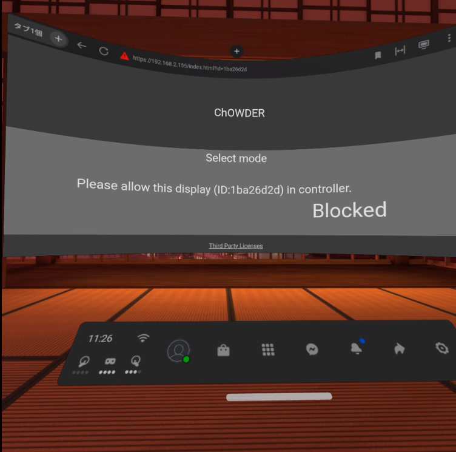
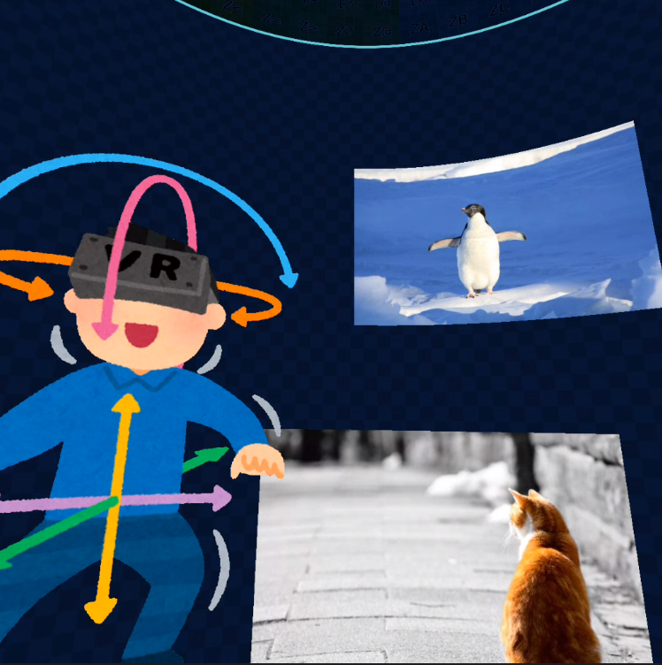
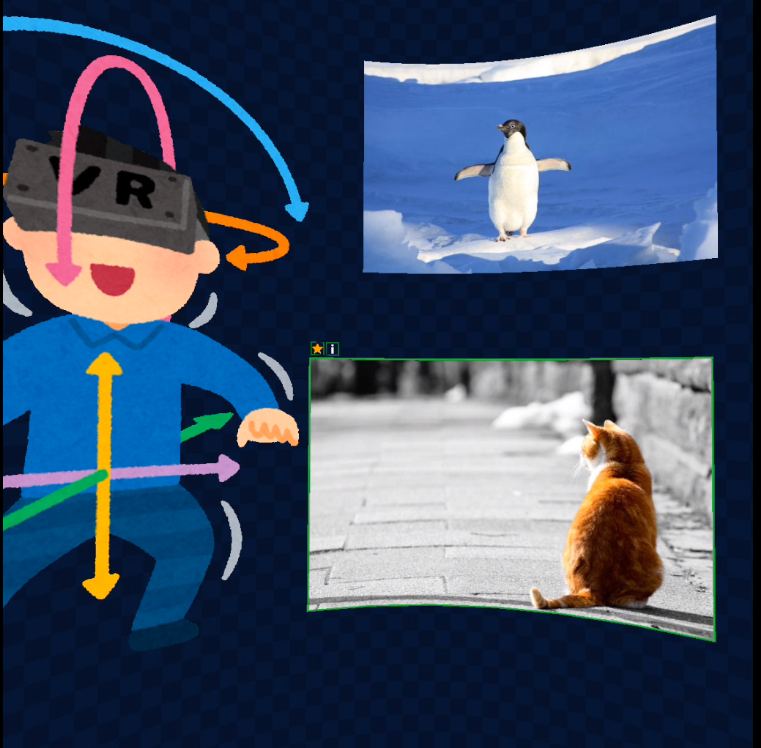
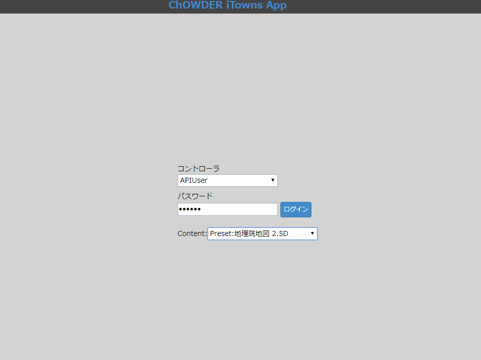
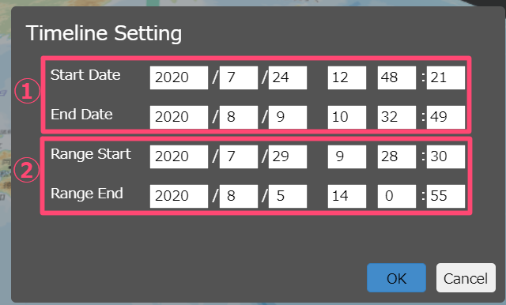
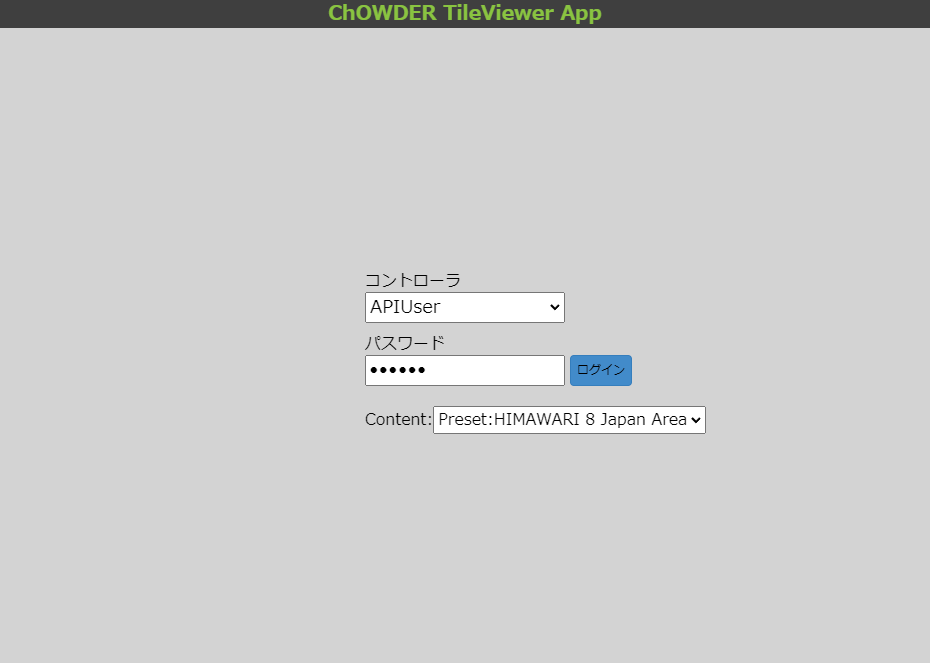
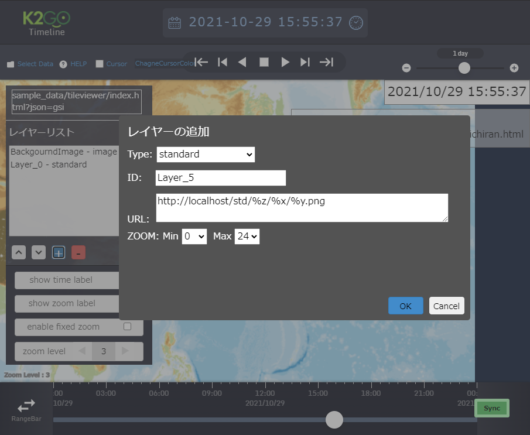

User Guide for ChOWDER
=============================================================

Table of Contents
---------------------------------------------------

- [About ChOWDER](#about-chowder)
- [System Requirements](#system-requirements)
- [Unarchiving the Source](#unarchiving-the-source)
- [Installing the Application](#installing-the-application)
  - [Installation](#installation)
  - [Installing ChOWDER-Specific Components](#installing-chowder-specific-components)
- [Launching ChOWDER's Server](#launching-chowders-server)
  - [Accessing ChOWDER from a Web Browser](#accessing-chowder-from-a-web-browser)
- [Quitting the Application](#quitting-the-application)
- [Server Setup](#server-setup)
  - [Basic Setup for Server](#basic-setup-for-server)
  - [Managing Administrative Users](#managing-administrative-users)
  - [The Administrator Configuration File](#the-administrator-configuration-file)
- [The Home Screen of ChOWDER](#the-home-screen-of-chowder)
  - [What’s On Your Home Screen](#whats-on-your-home-screen)
- [Navigating through the Controller Screen](#navigating-through-the-controller-screen)
  - [Overview](#overview)
  - [Connection Status](#connection-status)
  - [The Virtual Display Area](#the-virtual-display-area)
  - [ChOWDER's Menubar](#chowders-menubar)
  - [Displaying Visual Contents](#displaying-visual-contents)
  - [Display Tab](#display-tab)
  - [Virtual Display Setup](#virtual-display-setup)
  - [Content Tab](#content-tab)
  - [Search Tab](#search-tab)
  - [Layout Tab](#layout-tab)
  - [Property Window](#property-window)
  - [Working with Video Content](#working-with-video-content)
- [Controller Permissions and Administrator Screen](#controller-permissions-and-administrator-screen)
  - [Managing Permissions](#managing-permissions)
  - [Administrator Screen](#administrator-screen)
- [Working with Display Screen](#working-with-display-screen)
  - [Overview](#overview-1)
  - [Working with Display: Menu](#working-with-display-menu)
- [Working with VR Display](#working-with-vr-display)
  - [VR Mode](#vr-mode)
  - [VR mode settings](#vr-mode-settings)
  - [Operation in VR mode](#operation-in-vr-mode)
  - [VR mode restrictions](#vr-mode-restrictions)
- [Coordinating with HIVE](#coordinating-with-hive)
  - [Interactive Rendering](#interactive-rendering)
  - [SceneNodeEditor](#scenenodeeditor)
  - [Module System](#module-system)
- [Using Google Chrome Extension](#using-google-chrome-extension)
  - [Overview](#overview-2)
  - [Installing Extension](#installing-extension)
  - [Use Extension to Capture](#use-extension-to-capture)
- [Using Desktop Capture on ChOWDER](#using-desktop-capture-on-chowder)
  - [Overview](#overview-3)
  - [How to Use ChOWDER Desktop Capture](#how-to-use-chowder-desktop-capture)
- [Using Google Chrome Extension for WebRTC](#using-google-chrome-extension-for-webrtc)
  - [Overview](#overview-4)
  - [Installing Extension](#installing-extension-1)
  - [In case of ChOWDER server is running on the other PC](#in-case-of-chowder-server-is-running-on-the-other-pc)
  - [Capture Using Extension](#capture-using-extension)
- [Using the Large Scale Image Data Transmission Application](#using-the-large-scale-image-data-transmission-application)
  - [Overview](#overview-5)
  - [Application Setup](#application-setup)
  - [Using the Application](#using-the-application)
- [Displaying and Managing Large Scale Image Data](#displaying-and-managing-large-scale-image-data)
- [Using the WebGL distributed drawing function](#using-the-webgl-distributed-drawing-function)
  - [Overview](#overview-6)
  - [Application Setup](#application-setup-1)
  - [GIS layer addition function](#gis-layer-addition-function)
  - [GIS layer properties](#gis-layer-properties)
  - [GIS timeline settings and usage](#gis-timeline-settings-and-usage)
  - [Settings on the controller](#settings-on-the-controller)
- [Using the TileViewer](#using-the-tileviewer)
  - [Overview](#overview-7)
  - [Application Setup](#application-setup-2)
  - [Layer Menu](#layer-menu)
  - [Layer addition function](#layer-addition-function)
  - [How to set and operate the timeline](#how-to-set-and-operate-the-timeline)
  - [Preset settings for TileViewer](#preset-settings-for-tileviewer)
- [Using the Qgis2threejs plugin output drawing function](#using-the-qgis2threejs-plugin-output-drawing-function)
  - [Overview](#overview-8)
  - [Application Setup](#application-setup-3)
  - [Uploading data](#uploading-data)
- [Using the Display Application for the Electron version of ChOWDER](#using-the-display-application-for-the-electron-version-of-chowder)
  - [Overview](#overview-9)
  - [Installing the Application](#installing-the-application)
  - [Launching the Application](#launching-the-application-1)
  - [Application Setup](#application-setup-1)
  - [Editing the Configuration File](#editing-the-configuration-file)
  - [Installation on remote host](#installation-on-remote-host)
- [Using HTTPS](#using-https)
  - [Overview](#overview-10)
- [Using coturn](#using-coturn)
  - [Overview](#overview-11)
- [Using Himawari parser](#using-himawari-parser)
  - [Overview](#overview-12)
- [Using Himawari amaterass parser](#using-amaterass-parser)
  - [Overview](#overview-13)

About ChOWDER
==================================================================

ChOWDER is a tiled displays manager designed especially for collaborations among different locations. Each location can have different physical configuration, i.e. different screen resolutions and tiling setup. Tiles may also have different resolutions within its tiled displays. New locations can be added during the meeting session in an *ad hoc* manner.
Contents resides in a single display area, or the *virtual display area*, and are rendered in your tiled displays. In the virtual display area, each tile is mapped to its rectangular region. This region can be modified interactively depending on the physical configuration and following the course of the meeting.

For example, members of two groups from different locations can co-work on a shared screen while another person can independently work on a separated issue and include the contents in a later stage. For efficient network usage, the contents are firstly distributed to each display before being rendered, and then the coordinates in the virtual display area are communicated through the network. 

The rest of this user guide documents how you can set up and use ChOWDER.

System Requirements
==================================================================

ChOWDER requires a computer on which a single server program will run. Each tile of your tiled displays shall display a web browser window. The browser  renders a webpage, which is actually a client which renders the contents received from the server.

ChOWDER supports the following evironments.

- OS
  - Linux(CentOS7) or higher
  - Windows10 or higher
  - MacOSX 10.12 or higher

- Web browsers to render client pages
  - Apple Safari 12.x or higher
  - Firefox 65.0 or higher
  - Google Chrome 72 or higher
  - Edge 44 or higher

Each tile must display a web browser in full screen mode.

Unarchiving the Source
==================================================================

Extract the archive files.
The top directory shall contain the following directories and file

- bin: Executables
- client: Client Applications
- doc: Documentations
- redis: Components for [Redis](https://redis.io)
- server: ChOWDER's Server
- chrome_extension: Google Chrome Extensions
- package.json: Package configuration

Use the script located in the bin folder to start the Collaborative workspace driver. 

Installing the Application
==================================================================

Installation
---------------------------------------------------

### Installing Node.js

The GUI Portal requires the installation of Node.js. Download the latest version of Node.js from the official website (`http://nodejs.org/`). (See image below)


*The download page of Node.js, screen-captured at the time of writing this document.*

### Installing the Submodules for Node.js 

Install in the application directory the third-party modules of Node.js required by ChOWDER.

Installing ChOWDER-Specific Components
---------------------------------------------------

### On Macs or Linux

Run the installation script in the `bin` directory.

~~~
       $ cd bin
       $ sh install.sh
~~~

To install the turn server for WebRTC at the same time.

~~~
       $cd bin
       $sh install_with_turn.sh
~~~

### On Windows

Run the installation script in the `bin` directory. 

~~~
        > cd bin
        > install.bat
~~~

Launching ChOWDER's Server
==================================================================

On Macs or Linux
---------------------------------------------------

Run the execution script in the `bin` directory.

~~~
       $ cd bin
       $ ./run.sh
~~~

On Windows
---------------------------------------------------

Run the execution script in the `bin` directory. 

~~~
        > cd bin
        > run.bat
~~~

- Redis may not run properly in Windows if the Virtual Memory is set to 0 Kbyte. To avoid this issue, temporarily enable Virtual Memory. 

- On Windows, hiredis module and Python errors are displayed during installation, but because it is not a required module, it works without problems.

Accessing ChOWDER from a Web Browser
---------------------------------------------------

Enter ChOWDER's URL (`http://localhost/` by default) in the address bar of a web browser.


*The home screen of ChOWDER's client page*

Quitting the Application
==================================================================

Kill the ChOWDER server and redis (e.g. by hitting CTRL+C in the terminal).


Server Setup
========================================================================================

Basic Setup for Server
---------------------------------------------------
The server program reads the `server/setting.json` file while launching to configure various settings. 


    {
        "wsMaxMessageSize": 67108864,
        "reductionResolution" : 1920,
        "enableMeasureTime" : false,
        "stunServerUrl" : "",
        "turnServerUrl" : "",
        "turnServerUsername" : "",
        "turnServerCredential" : "",
        "enableHTTP" : true,
        "enableSSL" : true,
        "HTTPPort" : 80,
        "SSLPort" : 443,
        "enableCORS" : true,
        "VRMode" : 'cylinder'
        "reduceUpdate": false,
        "reduceInterval" : 500,
        "tileviewerCursorSize" : 100
    }

-   `wsMaxMessageSize` sets the maximum size of a single message that the server transmits. 
-   `reductionResolution` sets the size of the reduced image of large scale image data. When large scale image data that exceed this size is registered, a reduced image is generated which may be used to display depending on the resolution. 
-   `enableMeasureTime` sets whether time log output is enabled or not. The log file is output to `tileimage/log`, `server/log`. You can also download logs on Display on Display.
-   `stunServerUrl` sets the STUN server URL in the WebRTC connection.
-   `turnServerUrl` sets the TURN server URL in the WebRTC connection.
-   `turnServerUsername` sets the username in the WebRTC credential.
-   `turnServerCredential` sets the password in the WebRTC credential.
-   `enableHTTP` sets whether http server is enabled or not. 
-   `enableSSL` sets whether https server is enabled or not. 
-   `HTTPPort` sets the http port. websocket connections(ws) use the same port, too.
-   `SSLPort` sets the https port. websocket connections(wss) use the same port, too.
-   `enableCORS` sets whether CORS connections to chowder server is enabled or not. 
-   `VRMode` sets the VR mode to use. Currently available values ​​are "plane" (plane view) or "cylinder" (curved surface view) or "360" (360 degree view).
-   `reduceUpdate` Set true to reduce the frequency of issuing various update notifications from the Controller. The default is false.
-   `reduceInterval` When `reduceUpdate` is true, specify the maximum waiting time in milliseconds when reducing the frequency of issuing update notifications, etc. The default value is 500.
-   `tileviewerCursorSize` Set the cursor size as a relative value when using the RemoteCursor function in TileViewer. The default value is 100.

Managing Administrative Users
---------------------------------------------------
You can modify the administrator configurations by starting up ChOWDER.
The default password for the administrator is “admin”.

The section "Controller Permissions and Administrator Screen" in this document gives a more 

The Administrator Configuration File
---------------------------------------------------
To add or remove an administrator during the startup, create an `admin.json` file directly under the root directory of ChOWDER (the same directory under which `README.md` is placed.) See below for an example `admin.json` (`admin.json.org` under the root directory has the same file contents).

    {
        "administrator" : {
            "command" : "add",
            "password" : "admin"
        },
        "administrator2" : {
            "command" : "delete",
            "password" : "admin2"
        }
    }

In this example, the controller "administrator" is added  and “administrator2” is deleted.

The entry `“command” : “add”` adds an administrator (actually, the same command can be used for overwriting an existing administrator configuration).  `“command” : “delete”` deletes an administrator. The `"password"` entry is mandatory when adding an administrator.
The `admin.json` file will be processed when launching ChOWDER and administrators will be added or removed at that time. 
Once ChOWDER is launched, and thus the administrator configuration is reflected in the database, `admin.json` should be removed manually.

The Home Screen of ChOWDER
==================================================================

What's on Your Home Screen?
---------------------------------------------------

To access ChOWDER, run the server and visit `http://localhost/` with a web browser to open the home screen. The screen offers two modes, *display* and *controller*.

- **Controller mode** lets you set the screen configuration and move the displayed contents.

- **Display mode** renders the content in the browser window.

Usually, you want to choose the controller mode on a computer screen and the display mode on tiled displays.

Navigating through the Controller Screen
=================================================================

Overview
---------------------------------------------------

In the controller screen, you can control what is displayed on the tiled displays and manage the tiling setup. The visual contents are added into a special area in the control screen, the [Contents] tab, to ease the contents management. You add files to this tab and toggle its visibility in the tiled displays (or in the virtual display area, to be more precise).


*Screenshot of the controller screen*

Connection Status
---------------------------------------------------

The icon in the upper right of the screen indicates the status of the connection to the server.


*Status icon when connected to the server*
<br>

*Status icon when not connected to the server*

The Virtual Display Area
---------------------------------------------------

The virtual display area is located in the center of the browser page. It shows how tiles are arranged together with the displayed visual contents such as images, documents, and videos. Use it for arranging the display tiling. You can also add, move, interact with, and delete visual contents.


*Example of the virtual display area*

ChOWDER's Menubar
---------------------------------------------------

The menubar at the top of the browser page lists various actions that ChOWDER offers.


*Area at the Top of the Page*

### [Display]

You can add a display tile by clicking on the [Controller]>[Display] menu. 


*Clicking on the [Display] menu*

### [Add]

This action adds various visual contents.
For details, see [Adding Contents](#Adding-Contents).


*The [Add] menu*

### [Settings]

### Setting Menu

Under [Settings], you can toggle the appearance of ChOWDER's *remote cursor*.


*Selecting [Settings]*

The remote cursor is a cursor that appears on the tiled displays.


*The remote cursor*

You can specify the size of the remote cursor as the number of pixels based on VirtualDisplay.


*remote cursor size*

You can change languages in the menu below.


*Change Language*

### Returning to the Home Screen

You can return to ChOWDER's home screen by clicking on [ChOWDER].


*Returning to the home screen*

### Controller ID Setup

You can set up the Controller ID in the section shown in the image below.
You may be prompted for a password when changing the Controller ID as it is recognized as a different Controller. 


*Controller ID Setup*


Displaying Visual Contents
---------------------------------------------------

You can display various contents by clicking on the [Add] action in the menubar on the top or using the menu button (looking like [三]) at the lower right corner inside the [Contents] tab. 

### Displaying Images

Display images by following one of the methods below. 

- Menubar >[Add]>[Image]
- [Contents] tab>[Add Contents]>[Image File]
- Right-click inside the [Contents] tab and select [Add Contents]>[Image File]

Images added will be listed in the [Contents] tab.

The following image formats are accepted.

- PNG
- JPEG
- GIF
- BMP


*Opening an image*

### Displaying Videos

Display video files by following one of the methods below. 

- Menubar >[Add]>[Movie]
- [Contents] tab >[三]>[Add Content]>[Video File]
- Right-click inside the [Content] tab >[Add Content]>[Video File]

The MP4 video format is accepted by ChOWDER.
Once video files are imported, they are streamed via WebRTC. For more on WebRTC, see [Working with Video Contents](#Working-with-Video-Content).


*Adding a Video*

### Displaying Text

Display text by following one of the methods below. 

- Menubar >[Add]>[Text]
- [Content] tab >[三]>[Add Content]>[Text]
- Right-click inside the [Content] tab >[Add Content]>[Text]

### Displaying Text Files

Display a text file by following one of the methods below. 

- Menubar >[Add]>[Text File]
- [Content] tab > [三]>[Add Content]>[Text File]
- Right-click inside the [Content] tab > [Add Content]>[Text File]


*Select TextFile*
<br>

Adding a text file in the virtual display area

### Displaying Webpages

Display webpages by following one of the methods below.

- Menubar >[Add]>[URL]
- [Contents] tab >[三]>[Add Content]>[URL]
- Right-click inside the [Contents] Tab >[Add Content]>[URL]


*The URL Button*


*Displaying a webpage*

### Adding PDF

You can add PDF documents to Contents by any of the following methods. 

-   Main Menu → Add → PDF
-   Menu on the lower right side of Content Tab → Add Content → PDF File
-   Right-click within the Content Tab → Add Content → PDF File

The example below shows the screen adding a PDF as a Content.


*Example of an Added PDF File*

### Sharing Screens

Share screens by following one of the methods below. 

-   Menubar >[Add]>[Shared Screen]
-   [Content] tab >[三]>[Add Content]>[Shared Screen]
-   Right-click inside the [Content] tab >[Add Content]>[Shared Screen]

Captured videos are streamed using WebRTC.
For instructions on working with video contents, refer to [Working with Video Contents](#Working-with-Video-Contents).


*Displaying Screens*

### Sharing Cameras

Share cameras by following one of the methods below. 

-   Menubar >[Add]>[Shared Camera]
-   [Contents] tab >[三]>[Add Content]>[Shared Camera]
-   Right-click inside the [Contents] Tab>[Add Content]>[Shared Camera]

Captured videos are streamed using WebRTC.
For instructions on working with video contents, see [Working with Video Contents](#Working-with-Video-Contents).

The example below shows the screen after adding a shared camera to contents.


*Shared a camera*

The [Display] Tab
---------------------------------------------------


*Display Tab*

The [Display] tab shows the virtual display area and all display tiles connected to the ChOWDER server. ChOWDER's controller page allows you to move tiles in the virtual display areas. Adding Contents to the arranged Display enables a shared workspace. Use the mouse to drag and drop Display into the VirtualDisplaySpace.
The example above shows the environment when a client is connected. 


In the NewDisplays area, the newly accessed the [Display] is appeared.
You can specify permission to distribute content for new Display.
Content will not be delivered to the [Display] until permission.
Once selected, the permission data is saved, and in the next access it is delivered according to stored the permission data.


Virtual Display Setup
---------------------


*Virtual Display Setup*

### Splits (Sub-Divisions) Setup

Go to the Display tab and select Virtual Display to set up Virtual Display in the Property window. In the example above, the Virtual Display settings are 1500 pixels for width, 1500 pixels for height, horizontal split (sub-division) 2, and vertical split (sub-division) 2. 

### Snap Function

The Snap function helps you accurately align your display with the selected area.
You can switch between modes using the dropdown list seen below. 


*Pulldown Button for the Snap Function*

- Free: No restrictions
- Display: Display and Contents snap in alignment with the laid out Display
- Grid: Display and Contents snap in alignment with the split (sub-division) specified by VirtualDisplaySetting

The example below demonstrates using the snap function for layout purposes.


*Example of Drag Function with Snap*

You can enlarge and reduce the VirtualDisplaySpace using the Scale function.
Place the mouse inside the screen to right-click and drag to enlarge or reduce the screen.


*Example of Scale Function (Contents are reduced in size)*

### Display and ID

You can differentiate between all connected Display by the Display ID shown above each Display. 
IDs are specific to the connected terminal whereby each terminal is assigned one ID. 


*Display ID*

### Delete Button

The Delete button deletes the selected Display (by disconnecting from the ChOWDER server).


*Delete Button*

Note you will not be able to delete VirtualDisplay

### Select All Button

The Select All button selects all connected Display.


*Select All Button*

### Site Setup

You can set the Site assigned to the display within the Display tab.
You can set one Virtual Display per Site.

You can add a site or change the order of a created site by using the button.
In the settings menu, you can change the name of the site, the color of the site, and delete the site. 


*Adding and Changing the Order of the Site*
<br>

*Site Setup*

### Assigning the Site

You can make changes to the site assigned to Display by right-clicking menu in Display or through the menu on the lower right of the screen. Changes cannot be made to Groups in VirtualDisplay. 


*Make Changes to Site*
 


Content Tab
--------------------------------
To view Contents in Display, go to the Contents tab on the bottom of the page and drag and drop Contents into Display.

### View Contents 

Select Content from the list and drag and drop to the VirtualScreen area in the middle of view Content.


*View Content(s)*

### Working with Content(s)

Once added, you can select Content by left-clicking the mouse, or by pressing Ctrl and left-clicking the mouse to select multiple Contents. 
After selecting, you will see the Content Manipulator and editing buttons (see image below). 

- Editing buttons
  - Highlight button — highlights selected contents
                       Highlighted contents appear in Display with thick borders according to Group color.
  - Metadata button — Metadata of Contents appear in Display
  - Hide button — Hides Contents from VirtualDisplaySpace
                  Hidden contents can be viewed again by going to Contents and dragging and dropping.


*Contents Manipulator*

### Content Tab Menu

You will find various editing tools in the dropdown list by selecting the menu button located in the bottom right section of tab area.


*Adding Contents*	

### Replacing Images

You can replace the image selected in Contents tab.
The example below shows how to replace images selected within the Contents tab.


*Image Replacement Button*

Follow the example below to replace the Contents in the Contents tab.


*Select Replacement Image*
<br>

*Image Replaced*

### Group Setup

You can make changes to the settings of the Group assigned to Contents in the Content tab. You can add a group or change the order of groups by using the designated command buttons. In the settings menu, you can change the name of the group, the color of the group and delete the group.  


*Adding Groups, Changing Order of Groups*

<br>

*Group Setup*

### Assigning Groups

You can make changes to the Group assigned to Contents by right-clicking Contents or through the menu on the lower right side of the screen. 


*Make Changes to Groups*

Search Tab
-------------------------------

You can search through added Contents using the Search tab.


*Option to Search Contents*

### Search Metadata

You can search Metadata by using the text box in the Search tab. The search will be for Groups that have a check mark in the check box. 


*Selecting Groups to Search*

Layout Tab
-------------------------------

The Layout tab allows you to save the current view of Contents as a Layout.

### Adding Layout

You can add a Layout by right-clicking the Layout list on the bottom of the screen or through the menu on the lower right side of the screen. Adding to Layout will apply to Groups that have a check mark in the check box. 

### Saving Layout

You can overwrite/save the current view of Contents in the selected Layout.


*Layout Tab*

### Make Changes to Group

Change the Group composition of the Layout


*Layout Menu*

### Applying Layout

To apply a Layout, select Layout Contents from the Layout list on the bottom of the screen and drag and drop to the screen. 

Property Window
-------------------------------


The Property Window shows selected Contents, Display, ContentsID and other properties. Property allows you to edit items other than ID and set coordinates as well as the stacking order (Z-index). You can also download the selected Contents from the Download Button located on the bottom of the Property Window. 

Working with Video Content
-------------------------------

In addition to regular content control, by selecting video content while using a Controller connected to video data, you can view control (commands) pertaining to motion.  

### Video Control

The controls for video contents using the Controller connected to video can be seen below.


*Video Control Using Controller*

The function of each control is as follows:  

1. Play or Pause Video
2. Seekbar for Video
3. Volume control for the Controller
4. ON/OFF switch for transmitting video
5. ON/OFF switch for transmitting sound

### Video Setup

While using the Controller connected to video, you can select video content and switch between capture devices and change streaming settings in the Property Window. 


*Video Setup*

You can configure the settings per below:

1. Change video input device (only video contents from the camera can be set up)
2. Change audio input device (only video contents from the camera can be set up)
3. Set video quality. 
   If you select `Custom`, You can set the bitrate of the video streamed via WebRTC.(*1)
   If you select `RawResolution`, it switches to delivery mode using WebRTC Datachannel, and you can deliver the movie without any deterioration in full scale.(*2)
4. Set audio quality. You can set the bitrate of the audio streamed via WebRTC.(*1)
5. You can look up information on WebRTC quality saved in the metadata of Contents.

(*1)
The bitrate set here is used at the start of distribution.
Since the bitrate is automatically changed to the optimum bitrate at the time of distribution by WebRTC,
The set bitrate and actual bitrate are different.

(*2)
Distribution with `RawResolution` is effective only when distributing movie files.

### Bulk Operation of Video

Video content in the same group can be bulk processed for playing, pausing and cueing. 
The operation is as follows.

1. Right-click within the Content tab → Control All Videos in a group
2. Use the Video Bulk Controller on the bottom of the screen


*Bulk operation of video*


Controller Permissions and Administrator Screen
==================================================================

Managing Permissions
---------------------------------------------------
ChOWDER has 4 permission types. An *administrator* permission lets one access and edit all the functionalities of ChOWDER.
A *display* 
In a typical scenario, many users work in a group in front of a tiled displays system. A *group* permission is designed for this purpose. By default, this permission lets one view and edit the contents of her belonging group from their own computers.

|Category| Overview |Access Level|
| ---- | ---- | ---- |
|Administrator| Administrator can access all functions | All functions including Administrator Screen |
|Group| User per Content Group | Default setting of access restrictions of the Administrator Screen permits editing and viewing for own group and default setting|

You can set password and level of access to them. 

### Special Permissions
The Display and Guest can be used without password in and you can only set the access privilege.
|Category| Overview |Access Level|
| ---- | ---- | ---- |
|Guest| Guest User without Password | Default setting of access restrictions of the Administrator Screen permits editing and viewing for default setting only |
|Display| User Connected to Display | Default setting of access restrictions of the Administrator Screen permits editing and viewing for all groups |

Administrator Screen
---------------------------------------------------
Log into Controller as an Administrator to access the Administrator Screen via Management Menu. You can set user permissions and various other settings in the Administrator Screen.


*Menu for Administrator Login*
<br>

*Administrator Screen*

### Database Administration

You can create, switch, rename, delete and initialize storage space within the database administration ("DB Administration" in ChOWDER's GUI). Note that you will not be able to rename or delete the default storage area that is automatically created in the beginning. 


*DB Administration*

### Change History Administration

You can set the maximum number of historical changes to contents in Change History Administration. Historical changes per content will be saved up to the maximum number you designate here. This is a globally set value where the same value will be applied even when changing DB.  


*Change History Administration*

### Viewing/Editing Permission Setup

You can set up each user’s permission in Viewing/Editing Rights Settings.


*Viewing/Editing Permission Setup*

1. Select controller to set up.
2. Choose whether selected controller has permission to edit/view. Users with permission for “all” are able to edit/view newly created groups as well.
3. Select the site the controller has permission to edit. Users with permission for “all” are able to edit/view newly created sites as well.
4. Set up selected controller with permission levels for editing groups and working with Display.


### Password Setup

You can change controller’s password in Password Setup
The previous password will be required only for changing the Administrator’s password. 


*Password Setup*

### Display Delivery Permission Setup
In the display setting, you can change the content delivery permission setting.
It will be delivered only to allowed displays.


*Display Delivery Permission Setup*


Working with Display Screen
==================================================================

Overview
---------------------------------------------------


We describe how to work with Display including its tabs, windows and functions. 

Working with Display: Menu
---------------------------------------------------

Menu will appear by using a mouse or by touching the screen of a tablet in Display. There are a number of things you can do in Menu.

### Switch to Controller Screen

You can switch from Display mode to Controller mode.


*Switching to Controller Screen*

### Switch to Full Screen

You can switch between full screen and window mode.  You can return from full screen to window mode by selecting the same menu or by pressing the ESC key. 


*Switch to Full Screen*

### Display ID Setup

You can set up a recognizable Display ID in Controller. Type out the word (or letter combination) of your choice and press enter to set the ID. 


*Display ID Setup*

Working with VR Display
========================================================================================

VR Mode
---------------------------------------------------

When the Chowder page is displayed from the browser of the HMD tool, it can recognize the VR display, and fly to the immersive VR mode by WebXR.

### Switch to VR mode

When the Chowder page is displayed on the HMD device, it will be registered in the Chowder server as a new VR display, so it is necessary to set the permission on the controller.


*Allow setting on the controller is required*

If the VR display is allowed, the VR Display button will be displayed and you can press it to switch to the immersive VR mode.


*VR Display button*

VR mode settings
---------------------------------------------------

By specifying VRMode in setting.json in [Basic Setup for Server](#basic-setup-for-server), You can switch the display method in VR mode.

### Plane mode
In flat mode, the flat Chowder display is placed in front of the initial viewpoint position.
The display is equivalent to 3840px wide and 2160px high.
It is arranged so that you can see the horizontal viewing angle of about 114 degrees and the vertical viewing angle of 120 degrees from the initial viewpoint position in HDM's static mode.


*Plane mode*

### Curved surface(Cylinder) mode
In curved surface mode, a cylindrical rectangular area with a horizontal viewing angle of about 180 degrees and a vertical viewing angle of 120 degrees is placed in front of the initial viewpoint position.
A display area with an aspect ratio of 16: 9 is displayed as a Chowder display in the rectangular area.
The display is equivalent to a width of 3840px and a height of 2160px.


*Curved surface mode*

### 360度モード
360 degree mode is an extension of curved surface mode to a 360 degree cylindrical area.
The display displayed in the rectangular area is equivalent to 7680px in width and 2160px in height.

Operation in VR mode
---------------------------------------------------

In VR mode, you can use the hand controller of the VR device to select, move, scale, emphasize and cancel the content frame, and display and cancel the memo. The method of each operation is as follows.

|Operation|Required controller operation|
| ---- | ---- |
|Content selection|Place the cursor on the content and pull the trigger (PrimaryIndexTrigger)|
|Content deselection|Pull the trigger (PrimaryHandTrigger) of the controller that selected the content|
|Move|With content selected, tilt the controller in the direction you want to move it|
|Scale up|On the left and right controllers, tilt the controller and <br>pull the cursor away while pulling the trigger (PrimaryIndexTrigger) for the same content.|
|Scale down|With the left and right controllers, tilt the controller and <br>bring the cursor closer while pulling the trigger (PrimaryIndexTrigger) for the same content.|
|show/hide content borders highlights|After selecting the content, select the "☆" button with the trigger (Primary Index Trigger)|
|show/hide notes|After selecting the content, select the "i" button with the trigger (Primary Index Trigger).|


*Selection / highlighting example*

VR mode restrictions
---------------------------------------------------

### About the display area
In VR mode, the content is displayed until it is completely out of the display area.
Also, when moving content using a hand controller in VR mode, you can move content only within the display area.


*Display example of protruding content*

### Displaying WebGL content (content using iTown)
There is a problem that WebGL content is displayed in black when newly added while displaying in VR mode.
As a workaround, exit VR mode once, wait a few seconds, and then re-enter VR mode.


*Left:VR Display, Right :ChOWDER Controller*

### Display PDF content
There is a problem that PDF contents are not displayed when newly added while displaying in VR mode.
As a workaround, exit VR mode once, wait a few seconds, and then re-enter VR mode.

### About still images with alpha (transparency)
For still images with alpha values, 0.5 is set as the threshold value, and it is switched between displaying completely and making it transparent. (AlphaTest)
The alpha value is not blended, and the part containing the alpha is shown or hidden.

### About animated GIF format images
Animation GIF format animation display is not supported in VR mode.

Coordinating with HIVE
==================================================================

Interactive Rendering
---------------------------------------------------

You can transmit the graphics screen during HIVE’s interactive rendering to view in ChOWDER (see image below).


*Example of Transmission from HIVE Interactive Rendering*

Select the ChOWDER button in the menu located at the top of HIVE and designate ChOWDER’s URL to transmit. The URL’s initial setting is ws://localhost:8081/v2/. To connect, replace localhost with the IP address of the computer ChOWDER is running on. The ChOWDER button changes colors when connected. 


*Menu Item to Connect to ChOWDER *
<br>

*URL Setting*

SceneNodeEditor
---------------------------------------------------

You can transmit a rendered image using the RenderForSIP node in HIVE’s SceneNodeEditor to view in ChOWDER. The URL’s initial setting for SEND in Property is ws://localhost:8081/v2/.


*Example of Transmission from SceneNodeEditor*

Module System
---------------------------------------------------

You can transmit a rendered image using the ChOWDER node in HIVE’s ModuleSystem to view in ChOWDER. Since the ChOWDER node is able to connect with nodes that output BufferImageData format, you can send information of a variety of connectable nodes to ChOWDER.  

You can designate the address ChOWDER contents are transmitted to in Property of ChOWDER’s node. Default address is ws://localhost:8081/v2/. Use the ChOWDER server address instead. 


*Example of Transmission Using ModuleSystem *

Using Google Chrome Extension
==================================================================

Overview
---------------------------------------------------

Google Chrome allows adding functions and features in what is called Extension. By adding the specific ChOWDER Extension to Google Chrome, you can capture a web browser screen in real-time and add to Contents. 

Installing Extension
---------------------------------------------------

To install the Extension for Chrome, open the browser page for Extension and turn Developer mode on.

1. Open the browser page for Extension per below.
2. Turn on Developer mode toggle switch to enter Developer mode.
3. Reboot Chrome and open the browser page for Extension again.
4. Click `Load unpacked` and select `ChOWDER/chrome_extension` directory, then the Extension is going to be installed.


*Menu to Open Extension Page*
<br>

*Turn Developer mode on and load unpacked extension*

Use Extension to Capture
---------------------------------------------------

Once Extension is added, you can click the icon to begin Capture.

- Extension Menu
  - Capture — Captures web page currently in view and transmits to ChOWDER

  - AutoCapture — Captures web page currently in view at pre-set intervals and continuously transmits to ChOWDER

  - Setting — Opens Setup Menu


*Extension Menu*
<br>

*After Starting AutoCapture*

- Extension Setup

    - URL — Sets URL to connect to ChOWDER

    - Interval — Sets interval used in AutoCapture


*Extension Setup*

Using Desktop Capture on ChOWDER
==================================================================

Overview
---------------------------------------------------
You can use ChOWDER Desktop Capture to select an entire desktop, an active application window, or any selected area to add as an image content to ChOWDER.

Installing and Operating Environment
---------------------------------------------------

### Running the Install Script

On Macs or Linux 
Run the shell script below located in desktop capture.

       $cd desktop_capture
       $sh make$app.sh

On Windows  
Run the file below located in desktop capture.

        >cd desktop_capture
        >make$_app.bat

### Operating Environment

OS: Windows7, MacOSX 10.10

How to Use ChOWDER Desktop Capture
---------------------------------------------------

You can do the following things using ChOWDER Desktop Capture:

- Select capture target/area and transmit
- Set interval for transmission of captured image
- Set destination URL of captured image
- Set group captured image is transmitted to

### Select Capture Target/Area

#### Select Capture Target

During launch, ChOWDER Desktop Capture creates thumbnails of the following items that appear on the bottom of the page:
- Entire desktop
- Active window(s)


Click on the thumbnail to change the capture target. The clicked target appears on the top of the screen in preview mode waiting to be captured. 


*Preview of Capture Target*

Once the capture target is selected, press the “Capture Start” button to begin transmission to ChOWDER. 


*Capture Start Button*
<br>

*Pressing the Capture Start Button*

#### Selecting Capture Area
You can transmit a portion of the screen as an image to ChOWDER by selecting the capture area using ChOWDER Desktop Capture.

Pressing the “Set Capture Area” minimizes ChOWDER Desktop Capture and switches the mouse from cursor to indicator to select an area. In this state, you can select an area by pressing the mouse, so click and drag the mouse to the end of the area you want to capture and then release the mouse to complete the capture.


*Set Capture Area Button*
<br>

*Area Selection State*
<br>

*Preview of Selected Area*

Similar to “Select Capture Target,” you can begin transmission of images by pressing the “Capture Start” button.

### Set Capture Interval

You can set the interval for image transmission using ChOWDER Desktop Capture. You can input a numerical value for Capture Interval(sec) on the form on the right or use the up and down arrows. The minimum interval is 0.05 seconds. When you press the “Reset” button, the value goes back to its initial value of 1 second.


*Form to Set Capture Interval*

Values for Capture Interval, ChOWDER URL and Target Group are kept even after quitting the application for the next time the application is launched. 

### Setting the URL Destination of Captured Image

You can set the URL destination (ChOWDER) an image is transmitted to using ChOWDER Desktop Capture. You can overwrite the form on the right of ChOWDER URL with the URL destination. Pressing the “Reset” button returns it to its initial value. 


*Form to Set URL Destination*

### Set Up Capture Image Group

You can set the group the captured image is transmitted to by using ChOWDER Desktop Capture. Select from dropdown list on the right side of Target Group. Pressing the “Reload” button returns it to its initial value.


*Form to Set Group for Image Transmission*


Using Google Chrome Extension for WebRTC
==================================================================

Overview
---------------------------------------------------

You can stream video content from screen sharing by using HTML5’s WebRTC function.
While screen sharing is usually not possible in Google Chrome due to security restrictions, installing Chrome Extension allows you to stream video.

Installing Extension
---------------------------------------------------


To install the Extension for Chrome, open the browser page for Extension and turn Developer mode on.

1. Open the browser page for Extension per below as shown in [Installing Extension](#installing-extension).
2. Turn on Developer mode toggle switch to enter Developer mode.
3. Reboot Chrome and open the browser page for Extension again.
4. Click `Load unpacked` and select `ChOWDER/chrome_extension_for_webrtc` directory, then the Extension is going to be installed.

In case of ChOWDER server is running on the other PC
---------------------------------------------------

You need to add the URL of ChOWDER server to value of "matches" in `chrome_extension_for_webrtc/manifest.json` file.
If you modify the URL, you need to re-install the extension.

```
[before]
  "externally_connectable": {
    "matches": ["*://127.0.0.1/*", "*://localhost/*"]
  },
```

```
[after]
  "externally_connectable": {
    "matches": ["*://127.0.0.1/*", "*://localhost/*", "*://any.somedomain.co.jp/*"]
  },
```

Capture Using Extension
---------------------------------------------------

Once you add Extension, run Add -> ScreenShare and input ExtensionID in the dialogue to start capture. 


*Inputting ExtensionID when Starting ScreenShare*


Using the Large Scale Image Data Transmission Application
==================================================================
Overview
--------------------------------------------------------------------------------

You can send vast amounts of image data to the ChOWDER server using the CLI application.

Application Setup
--------------------------------------------------------------------------------
In setup file, you can set the number of splits (sub-divisions) and the Content ID/Group. 
The setup file is named “config.json” located in the “tileimage” directory. 
The format of the setup file is as follows:

    {
        "id": "APIUser",
        "password": "password",
        "url": "ws://localhost:8081/v2/",
        "xsplit": 8,
        "ysplit": 8,
        "contentid": "contentid",
        "contentgrp": "default",
        "reload_latest" : true,
	    "visible" : true
    }

-	 `id` is fixed as `APIUser`
-	Set the password for `APIUser` in `password`. Passwords can be changed in password setup found on the [Administrator Screen](#administratorscreen).
-	Use the URL of the ChOWDER WebSocket server for 'url'
-	Set the number of horizontal and vertical image splits (sub-divisions) in `xplit` / `ysplit`.
	Designate Content ID and Content Group each in `contentid` / `contentgrp`
-   `reload_latest`: Represents whether to display the latest image registered using the `--metadata` option.
-   `visible`: Represents visibility of registered images.


Using the Application
--------------------------------------------------------------------------------

Run the following command from either the command prompt or terminal.
Set the path of the image to transmit using the command argument.

### For Mac/Linux

Run the shell script below located in the `bin` directory.

    ./tileimage.sh

### For Windows

Run the command below located in the `bin` directory

    tileimage.bat

### Command Option

-   `--config` (Optional) : Set the path of the setup file. The default path is `tileimage/tileimage.json`.
-   `--metadata` (Optional) : Set the meta data of images.

See below example of command:

    ./tileimage.sh --config=conf.json --metadata="{\"key\":\"value\"}" image.jpg


Displaying and Managing Large Scale Image Data
==================================================================
Large scale image data registered using the large scale image data transmission application appear in the Controller with an icon like the one below.
Image appearing in Controller will be reduced from its original size.


It will appear the same as other image contents in Display.


The following commands are available by selecting large scale image in Controller.


1. Switch `key` registered as `metadata` of the large scale image data.
2. Switch `value` registered as `metadata` of the large scale image data. Switching `value` changes the appearance of the large scale image data to the corresponding image data.
3. Synching of selected large scale image data begins upon pressing the Sync button. All contents in sync within the same group will switch to the corresponding image data according to the selection of `key` and `value` in `metadata`.
4. The slider may also be used to switch `value` as described in item 2 above.

Using the WebGL distributed drawing function
========================================================================================

Overview
--------------------------------------------------------------------------------

Using iTowns, a GIS drawing library, GIS content can be drawn on a ChOWDER display using WebGL.

Application Setup
--------------------------------------------------------------------------------

You can access the following URL and use the WebGL distributed drawing function.
In the URL for HTTPS, it is necessary to add to the exception.

-   HTTP URL … http://ChOWDER_Server_Address/itowns.html
-   HTTPS URL … https://ChOWDER_Server_Address/itowns.html



Select the APIUser password and the preset to be displayed, and log in.
When the content is loaded successfully, the displayed preset will be added as a ChOWDER content at the same time.


 - 1. The registered content ID
 - 2. The URL of the preset
 - 3. Operable GIS layers 
 - 4. Add and delete GIS layers
 - 5. Manipulate GIS layer properties
 - 6. Display performance measurement function
 - 7. In the content corresponding to the time change, the time change by the timeline operation is reflected

GIS layer addition function
--------------------------------------------------------------------------------

By pressing the Add Layer button, the Add Layer dialog will appear.
You can add layers.


The type of layer that can be added and the method of specifying the URL are as follows
 - Color : EPSG3857 Color Tiles
    - http://server-address/{z}/{x}/{y}.png - Specify the tile number part with {x} {y} {z}
 - Elevation : EPSG4326 Elevation Tiles or DEM Tiles in gsi.co.jp
    - http://server-address/{z}/{x}/{y}.txt- Specify the tile number part with {x} {y} {z}
 - 3D Tile : 3D Tiles(b3dm)
    - http://server-address/tileset.json - Specify json address
 - 3DTiles Timeseries : 3D Tiles Layer of timeseries defined by json
    - http://server-address/timeseries.json Specify json address
 - PointCloud : Point cloud data created by potree Converter
    - http://server-address/cloud.json - Specify json address
 - PointCloudTimeSeries : Time series point cloud data created by potree Converter
    - http://server-address/timeseries.json - Specify json address
 - VectorTile : Vector tiles such as pbf
    - http://server-address/vectortile.pbf - Specify vector tile address
 - Bargraph : Bargraph layer defined by CSV file.
    - http://server-address/data1.csv - Specify csv address, or upload local file by `Import CSV File`.
    - http://server-address/setting1.json - Specify json addressm or upload local file by `Import JSON File`.
 - OBJ : Wavefront OBJ Layer
    - http://server-address/teapot.obj - Specify obj address
    - http://server-address/default.mtl - Specify mtl address


For the ID, set the name displayed in the layer list. Must be a unique name.

For ZOOM, specify the expansion range of the data source.
Corresponds to {z} in the tile URL.

For timeseries.json, specity following format
 - As a Key, wirte the timeseries's timestamp defined by ISO8601
 - For 3DTiles, enter the address of tileset.json as the value.
 - For PointCloud, enter the cloud.json address as the value.

In 3D Tiles and 3D Tiles Time series Type,<br>
You can perform coordinate conversion by specifying the EPSG code when reading. <br>
The specification method is as follows, <br>
- Conversion : From - Select or enter the EPSG code for your data
- Conversion : To - Select or enter the EPSG code to which you want to convert the data


<br><br>

GIS layer properties
--------------------------------------------------------------------------------

The following properties can be set from the GUI for each type of layer added

  - All Layers
    - attribution - name and url for copyright
 - Color
    - visible - Show / Hide
    - opacity - Opacity
 - Elevation
    - scale - Elevation magnification
 - 3D Tiles
    - visible - Show / Hide
    - opacity - Opacity
    - wireframe - Show / Hide of wireframe
    - sseThreshold  - Threshold used for LoD processing
    - offset tu, offset uv, offset u, offset v - Tangent position offset
    - offset w  - Position offset in height direction

 - PointCloud
    - visible - Show / Hide
    - bbox - Show / Hide of bounding box
    - opacity - Opacity
    - size  - Point size in screen space
    - sseThreshold  - Threshold used for LoD processing
    - offset tu, offset uv, offset u, offset v - Tangent position offset
    - offset w  - Position offset in height direction

  - Bargraph
    - time - Select the CSV column name that contains the ISO8601 time string.
    - Latitude - Select the CSV column name that contains the latitude number.
    - Longitude - Select the CSV column name that contains the longitude number.
    - PhysicalValue1 - Select the CSV column name to use as the bargraph height value. <br>
                     - The overall height can be adjusted separately with the scale value.
    - PhysicalValue2 - Select the CSV column name to use as the color value for the bargraph.<br>
                    - Of the values ​​included in CSV, the minimum to maximum values ​​are assigned to the jet color map and used as colors.

PhysicalValue2 Min→←PhysicalValue2 Max

GIS timeline settings and usage
--------------------------------------------------------------------------------
In the timeline for GIS, you can specify the time corresponding to the data and play / stop it.
An area called the range bar can be specified on the timeline, and ChOWDER uses it as the data display range.


 - 1. Play/Stop button - Plays / stops the timeline.
 - 2. Range bar - In ChOWDER, it is used as a data display range.
 - 3. Sync button - Determines whether the time in the timeline is synchronized between different iTowns contents.<br>
                  - The default is sync.
 - 4. Setting button - You can set the display range of the timeline and the range of the range bar.

The range setting GUI by the setting button is as follows.



 - 1. Setting the start date and time and end date and time of the timeline<br>
                   - Usually changed automatically by scrolling the timeline or changing the window size
 - 2. Setting the start date and time and end date and time of the range bar<br>
                   - Set the effective range of data display.

The data corresponding to the timeline and the details of showing / hiding are as follows.

 - Bargraph
     - If the value in the column specified as the time is a time stamp before the time on the timeline, a bar graph will be displayed.
     - If the time stamp is after the time on the timeline, the bar graph will be hidden.
     - If there are multiple time stamps before the time on the timeline, all the relevant bar graphs will be displayed.

 - 3DTiles Timeseries
 - PointCloudTimeSeries
     - If the time stamp specified in json is a time stamp earlier than the time on the timeline, the data will be displayed.
     - If there are multiple time stamps specified in json, only the data of the nearest past time stamp will be displayed.

Settings on the controller
--------------------------------------------------------------------------------


The controller cannot operate the camera of GIS content, etc.,
In addition to the normal content settings, you can set the display / non-display of the time information on the timeline


Using the TileViewer
========================================================================================

Overview
--------------------------------------------------------------------------------

Using the 2D Tile Viewer, satellite images of the meteorological satellite Himawari and map data in Web Mercator format can be registered as Chowder content and drawn on the Chowder display.

Application Setup
-----------------------------------------------------------

You can use the functions of TileViewer by accessing the following URL.
-   HTTP URL … http://ChOWDER_Server_Address/tileviewer.html
-   HTTPS URL … https://ChOWDER_Server_Address/tileviewer.html

Select the API User password and the file to use, and log in.



Select the APIUser password and the preset to display, and log in.

When the content loads successfully, the displayed presets are added as Chowder content at the same time.


 - 1. The time (date and time) to be displayed is displayed, and you can change the date and time.
 - 2. From the left, the layer menu display, help display, remote cursor enable, and remote cursor color change buttons.
 - 3. It is a play / stop button of the time (date and time).
 - 4. Specifies the scale of the timeline.
 - 5. Enables or disables the range bar on the timeline.
 - 6. It is a timeline. You can operate the time (date and time).
 - 7. A toggle button that toggles whether the time on the timeline is synchronized between content.

Layer Menu
-----------------------------------------------------------


 - 1. The content ID is displayed
 - 2. The URL of the preset that is the content source is displayed.
 - 3. A list of layers containing the current content is displayed.
 - 4. From the left, move the layer order up, move the layer order down, add a new layer, delete a new layer.
 - 5. The tile URL of the layer is displayed.
 - 6. From the top, it is the setting of showing / hiding (visible) of the layer and the setting of opacity (opacity) of the layer.
 - 7. Set the copyright information (name, URL) to the layer. When set, it will be displayed in the upper left of the content.
 - 8. Toggles the display / non-display of the time label on the upper left of the content.
 - 9. Shows or hides the zoom label at the bottom right of the content.
 - 10. Toggles whether the zoom factor is fixed for all controllers / displays.
 - 11. You can set a fixed zoom factor when the zoom factor is fixed.

Layer addition function
--------------------------------------------------------------------------------

By pressing the add layer button, in the add layer dialog
You can add layers.



The type of layer that can be added and the method of specifying the URL are as follows.
 - `standard` : EPSG3857 color tile layer
    - In the URL, such as `https://server-address/{z}/{x}/{y}.png`, specify the tile number part by {x} {y} {z} or %x %y %z.
    - For ZOOM, specify the scope of expansion (MIN, MAX) of the data source. Corresponds to {z} in the tile URL.
 - `himawari8.jp` : Layer of meteorological satellite Himawari 8 in Japan.
    - In the URL, such as `https://localhost/himawari8/img/D531107/%cd/%w/%YYYY/%MM/%DD/%hh%mm%ss_%x_%y.png`, The `%` variable is described below. For the time (%hh%mm%ss), a value is inserted every 2 minutes and 30 seconds.
 - `himawari8.fd` : Layer of meteorological satellite Himawari 8 in full disk format.
    - In the URL, such as `https://localhost/himawari8/img/D531106/%cd/%w/%YYYY/%MM/%DD/%hh%mm%ss_%x_%y.png` The `%` variable is described below. For the time (%hh%mm%ss), a value is inserted every 10 minutes.
 - `background image` : Add a background image. Or replace the existing background image.
    -  In the URL, such as `https://localhost/backgroundImage.png` 
 - `other` : It is used for images of uniquely defined presets that do not belong to the above.

The meanings of the `%` and `{}` variables are as follows.
 - `{x}{y}{z}`or`%x%y%z` : Indicates the tile number xy and zoom rate z.
 - %c : Shows the dimensions of the image of Himawari-8
 - %w : Shows the width of the image. It is replaced with the image width described in scales when the image is acquired.
 - %YYYY%MM%DD : Indicates the year, month, and day.
 - %hh%mm%ss : Indicates hours, minutes and seconds.

How to set and operate the timeline
--------------------------------------------------------------------------------

The timeline for TileViewer uses k2go Timeline (https://www.k2go.jp/public/Timeline/).
You can specify the time corresponding to the data and play, stop, etc.

If you press the RangeBar button on the bottom left to enable it, you can specify an area called the RangeBar and control the playable area.

Also, if the Sync button on the bottom right is enabled, the time information of the timeline operation will be transmitted to all other Sync-enabled TileViewer contents.
You can enable / disable it by pressing the button.


Preset settings for TileViewer
--------------------------------------------------------------------------------

TileViewer presets are defined by the json file stored below.
 - Preset list definition file : public/sample_data/tileviewer/preset_list.json
 - Preset definition files : public/sample_data/tileviewer/settings/osm.json etc

### Preset list definition file
"url": "sample_data/tileviewer/index.html?json=xxxx"
In the format of, put the preset definition json file name in the xxxx part.

For example, in a preset that uses osm.json, specify:

```
{
    "preset_list": [
        {
            "name": "OpenStreetMap",
            "url": "sample_data/tileviewer/index.html?json=osm"
        }
    ]
}
```

This will cause the `OpenStreetMap` preset to appear in the preset list when accessing the tile viewer, allowing you to use the tile map with the osm.json definition information.

### Preset definition file

In the preset definition file, describe the URL of the map, etc., and create the state when the preset is loaded.

```
// An example of preset definition file (json)
{
    "backgroundImage": "https://cyberjapandata.gsi.go.jp/xyz/std/0/0/0.png",
    "maps": [{
        "url": "https://cyberjapandata.gsi.go.jp/xyz/std/%z/%x/%y.png",
        "zoom" : {
            "min" : 0,
            "max" : 18
        },
        "attribution":  {
            "name" : "出典：国土地理院",
            "url" : "https://maps.gsi.go.jp/development/ichiran.html"
        },
        "opacity": 1.0,
        "visible" : true
    }],
    "geodeticSystem": "standard",
    "initialPosition" : {
        "center": {
            "degrees": {
                "lon": 139.69167,
                "lat": 35.68944
            }
        }
    },
    "timeout" : 0,
    "timeout_on_setting_date" : 5000,
}

```

 - backgroundImage : Specify the URL of the background image
 - maps : Define layers in array format. The items that can be set for each layer are as follows.
     - url : Specify the URL of the tile map.
     - zoom : If the geodeticSystem is a standard map, set the minimum and maximum values ​​for zoom.
     - scales : If the geodeticSystem is a map other than standard, set the map information for each zoom level. (see himawari_jp.json)
     - attribution : Specify the name and URL of the copyright information.
     - opacity : Specifies the opacity immediately after loading the preset. The default is 1.0.
     - visible : Specifies the display / non-display state immediately after loading the preset. The default is true.
 - geodeticSystem : Specifies the coordinate system for this preset. `standard`(EPSG3857) `himawari8.jp`(Himawari 8 for Japan) `himawari8.fd`(Himawari 8 FullDisk) can be specified.
 - initialPosition : You can specify the initial camera position in latitude and longitude.
 - timeout : Set the maximum waiting time in milliseconds to wait until the tile display is completed during normal operation. The default is 0.
 - timeout_on_setting_date : Set the maximum waiting time in milliseconds to wait until the tile display is completed when the time is changed. The default is 1000.


Using the Qgis2threejs plugin output drawing function
========================================================================================

Overview
------------------------------------------------------------------

HTML + Javascript content output from Qgis2threejs, an open source plug-in for QGIS, can be registered as ChOWDER content and rendered on a ChOWDER display.

Application Setup
-----------------------------------------------------------

You can access the following URL and use the WebGL distributed drawing function.
In the URL for HTTPS, it is necessary to add to the exception.

-   HTTP URL … http://ChOWDER_Server_Address/qgis.html
-   HTTPS URL … https://ChOWDER_Server_Address/qgis.html


Select the APIUser password and the file to be used, and login.

The selected file will be uploaded, and as soon as the content is successfully loaded, the selected Qgis2threejs plugin output data will be added as ChOWDER content.


 - 1. The registered content ID.
 - 2. The URL of the content
 - 3. Toggles the label display.
 - 4. Toggles the wire frame display.
 - 5. Resets the camera to its initial state.
 


Uploading data
-----------------------------------------------------------
Upload the data specified in the file selection of "Select and load a zip file" when you log in.

The file to be uploaded is in zip format, and should be the following directory structure output from the Qgis2threejs plugin compressed into a single file.

```
filename/
    data/
    threejs/
    index.html
    Qgis2threejs.css
    Qgis2threejs.js
    Qgis2threejs.png
```


Using the Display Application for the Electron version of ChOWDER
==================================================================

Overview
--------------------------------------------------------------------------------
You can automatically position a frameless window on the screen using the display application for the Electron version of ChOWDER.


Installing the Application
---------------------------------------------------

Installation of Electron version ChOWDER is included in the [installation of Chowder](#installation).

Launching the Application
---------------------------------------------------

Run the following executable located in the `standalone-electron` directory

 - Windows: ChOWDER-Standalone-Electron-win32-x64/ChOWDER-Standalone-Electron.exe
 - Mac: ChOWDER-Standalone-Electron-darwin-x64/ChOWDER-Standalone-Electron.app
 - Linux: ChOWDER-Standalone-Electron-linux-x64/ChOWDER-Standalone-Electron

Application Setup
---------------------------------------------------
Set up the application using the setup file in JSON format.
Create the setup file named `conf.json` in the `standalone-electron` directory. 

The format for the setup file is as follows:

    {
        "url": "http://localhost/view.html",
        "password" : "password",
        "windows": {
            "tile1": {
                "group": "sample",
                "position": [0, 0],
                "size" : [1920, 1080],
                "vda_position": [0, 0],
                "vda_scale": 1.0,
                "fullscreen": false,
                "frame": false
            },
            "tile2": {
                "group": "sample",
                "position": [1920, 0],
                "size" : [1920, 1080],
                "vda_position": [1920, 0],
                "vda_scale": 1.0,
                "fullscreen": false,
                "frame": false
            }
        }
    }

-	Use the URL of the ChOWDER server for `url`.
-   For `password`, specify a password for display distribution permission.
    By setting same password for `ElectronDisplay` on the controller,
    Content is delivered without separately setting display permission.
-	`windows` is the object that has the Display ID as key and display setup as value.
    -	Designate the site in `Group`.
    -	Set the position `[Vertical, Horizontal]` of the window on display device in `position`. This is the screen coordinates of the display device. The origin is the upper left corner of screen.
    -	Set the size `[width, height]` of the window in `size`.
    -	Set the position `[Vertical, Horizontal]` within VDA in `vda_position`. The origin is the upper left corner of Virtual Display.
    -	Set the enlargement factor within VDA in `vda_scale`.
    -	Designate whether to display or to not display the full screen of the window in `fullscreen`.
    -	Designate whether to display or to not display the window frame in `frame`. 

Editing the Configuration File
---------------------------------------------------

Running `npm install` in the` standalone-electron` directory and overwriting the package will reflect the settings.

Installation on remote host
---------------------------------------------------

By copying and executing the following folder containing the executable file, the Electron version ChOWDER display will also be launched on the remote host.

 - Windows: ChOWDER-Standalone-Electron-win32-x64
 - Mac: ChOWDER-Standalone-Electron-darwin-x64
 - Linux: ChOWDER-Standalone-Electron-linux-x64

 To edit the configuration file after copying to the remote host, edit `conf.json` in the directory containing the executable file.

Using HTTPS
==================================================================

Overview
---------------------------------------------------

There may be occasions screen sharing and camera sharing are activated only when using HTTPS in Firefox and Google Chrome due to security restrictions. 

ChOWDER has a built-in HTTPS server as well as a temporary SSL certificate. Under default settings, you can access the URL below and add it as a one-off exception to use a page using HTTPS. 

- URL for HTTPS — https://localhost/

Using coturn
==================================================================

Overview
---------------------------------------------------

In a Linux environment, coturn can be used as a STUN / TURN server for WebRTC.
coturn is installed at the same time as install.sh and is used by default.
If you want to use another STUN/TURN server, you can specify any STUN/TURN server by [Basic Setup for Server](#basic-setup-for-server).

Using Himawari parser
==================================================================

Overview
---------------------------------------------------
ChOWDER contains the parser for the DAT file of [the Himawari 8/9 weather satellite] (https://www.data.jma.go.jp/sat_info/himawari/satellite.html) in ChOWDER/server/parser.
The parser is written for use with node.js and is implemented with the following format information.

Himawari 8/9 Himawari Standard Data Usage Guide
https://www.data.jma.go.jp/mscweb/ja/info/pdf/HS_D_users_guide_jp_v13.pdf


Using Himawari Parser
---------------------------------------------------
(1) The absolute path of the data file (10 files) used for conversion is described in himawari_parse_test_file_list.txt.

(2) When himawari_parse_test.js is executed by the following command, various physical quantities are saved as a geotiff file (output.tiff).

> node --max-old-space-size=32000 himawari_parse_test.js

The physical quantities that are stored are as follows.
 - In bands 1 to 6, radiance is converted to reflectance and stored as a physical quantity.
 - In bands 7 to 16, radiance is converted to luminance temperature and stored as a physical quantity.

For information on how to convert data to latitude / longitude coordinates
[Meteorological Satellite Center "Himawari Standard Data Reading Sample Program"] (https://www.data.jma.go.jp/mscweb/ja/info/sample_data_program.html)
It is implemented as the following function by javascript with reference to hisd_pixlin2lonlat.c.
 - (In himawari_parser.js) HimawariConverter.convertPixLinToLonLat
 - (In himawari_parser.js) HimawariConverter.convertLonLatToPixLin

See the code in himawari_parse_test.js and himawari_convert_test.js for detailed usage.

Using Amaterass Parser
==================================================================

Overview
---------------------------------------------------
ChOWDER contains the parser for the data provided by the [Solar Radiation Consortium](http://www.amaterass.org/).
The parser is written for use with node.js and is implemented with the following format information.

About solar radiation consortium's data:
http://www.amaterass.org/data.html

Using Amaterass Parser
---------------------------------------------------
When amaterass_parse_test.js is executed by the following command, the physical quantity stored in the data is saved as a geotiff file (output.tiff).

> node --max-old-space-size=32000 ./amaterass_parse_test.js amaterassDataAbsolutePath

In amaterassDataAbsolutePath, describe the path of the data to be parsed with an absolute path.

 - When amaterass_convert_test.js is executed by the following command, the point cloud data in xyziRGB (.txt) format is saved as output.txt based on the cloud top altitude and cloud thickness stored in the data.
 - By default, point cloud data of about 400 million points is created, so be careful about the disk capacity.

 > node --max-old-space-size=32000 ./amaterass_convert_test.js heightFileAbsolutePath thicknessFileAbsolutePath

In heightFileAbsolutePath, describe the path of the cloud top altitude data as an absolute path.

In thicknessFileAbsolutePath, describe the path of cloud thickness data as an absolute path.
