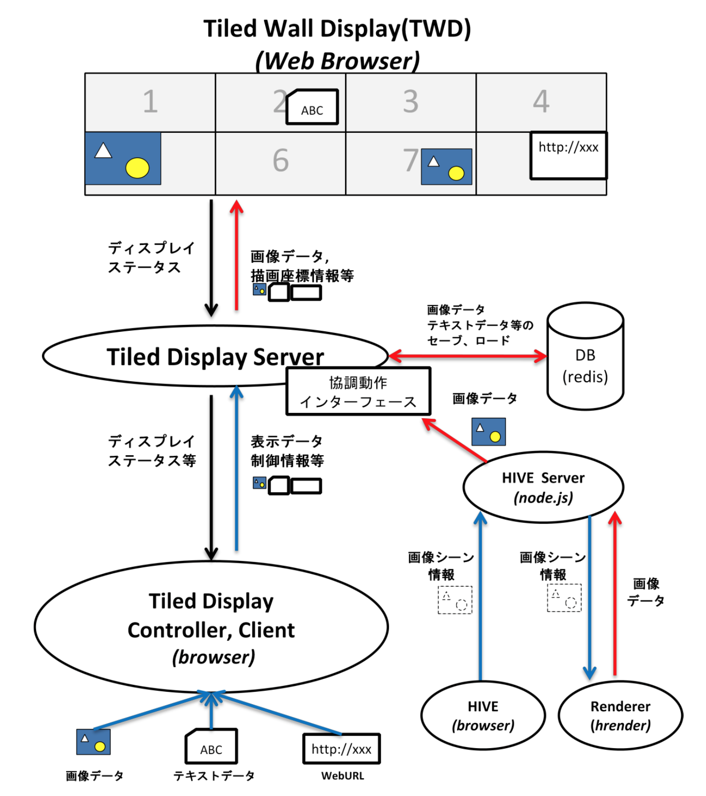
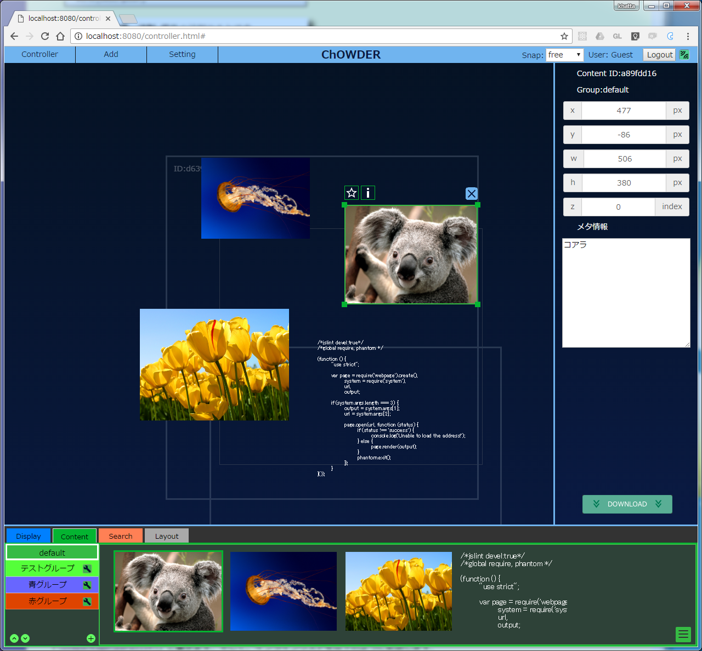
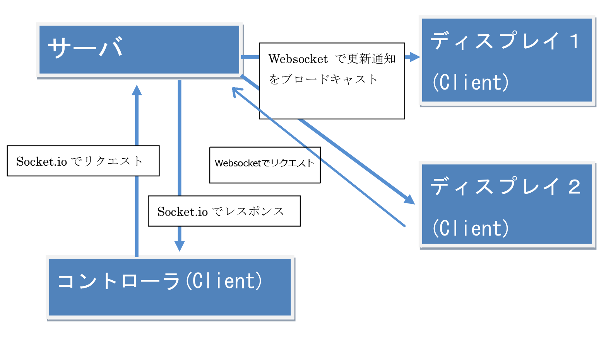
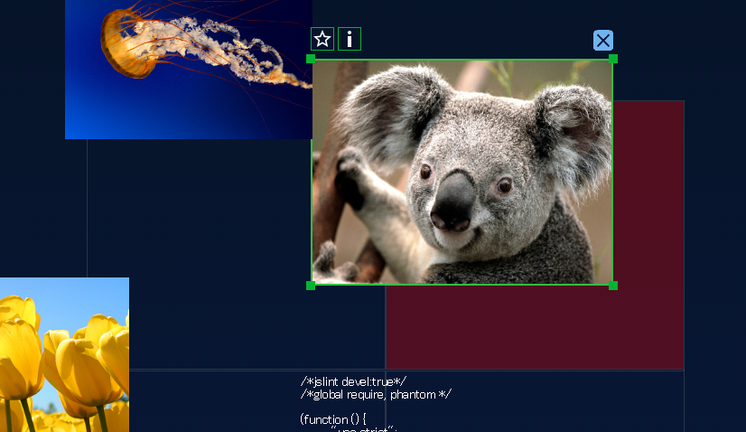
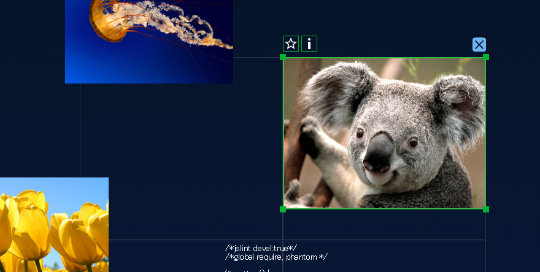
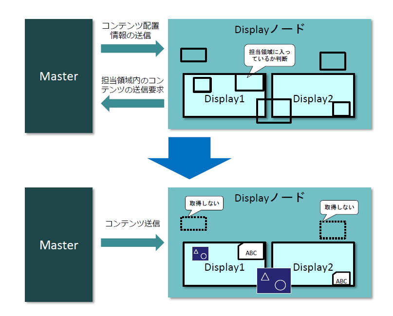
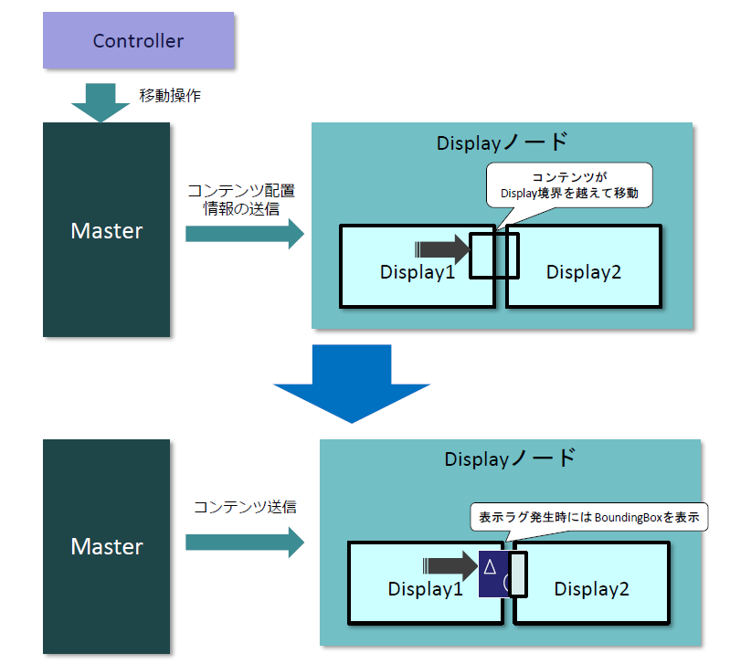
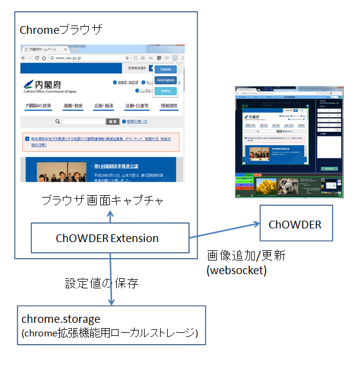

詳細設計書
========================================================================================

はじめに
========================================================================================

本書では協調ワークスペースドライバと協調動作フレームワークの設計について解説します.


システム構成について
========================================================================================

全体の構成
---------------------------------------------------
本システムは, node.js及びwebsocketsを用いたクライアントサーバプログラムであり, 複数のアプリケーションや,複数のユーザが共同作業を行える, 巨大なスクリーンスペースを, 仮想ディスプレイとして提供する. 構成図を以下に示す.



サーバとクライアントの役割
---------------------------------------------------

### サーバの役割
- HTTP通信 - クライアントに対してHTMLページなどを送信する
- Websocket通信 - websocketプロトコルにより, クライアントのコントローラ及びディスプレイとの間で通信を行う
- データベース入出力 - クライアントから送信された画像データやテキストデータをredisに保存し, 永続化する.
- サーバサイドレンダリング - 送信されたURLのウェブサイトをphantomjsを用いてサーバサイドでレンダリングし, png画像として保存する.


### クライアント - コントローラの役割
- ディスプレイの登録, 削除
- ディスプレイの移動, 拡縮 などのメタデータ編集操作
- コンテンツ(画像データ, テキスト, URL)の登録, 削除
- コンテンツの移動, 拡縮 などのメタデータ編集操作
- ディスプレイの分割数の設定
- コンテンツデータのダウンロード

### クライアント - ディスプレイの役割
 - 自身のウィンドウをディスプレイとしてサーバへ登録
 - コントローラで設定されたとおりにコンテンツを表示.

サーバの構成
---------------------------------------------------

### サーバ
サーバは, node.jsを使用して, HTTP/HTTPSによる通信と, websocketによる通信(ws/wss)に対応している. それぞれの通信方法によって受付ポートを分けている. 

|通信方式|用途|初期ポート|
| ---- | ---- | ---- |
| HTTP | 静的ページ及び静的コンテンツの提供 | 80 |
| Websocket(ws) | ChOWDER APIを介した動的コンテンツの提供, 操作等 | 80 |
| HTTPS | 静的ページ及び静的コンテンツの提供 | 443 |
| Websocket(wss) | ChOWDER APIを介した動的コンテンツの提供, 操作等 | 443 |

ポート番号及び使用許可については, サーバ設定ファイルより変更することができる.

### データベース

データベースはredisを使用して高速なレスポンスを実現している. 
データの格納方法については,  !!!TODO!!! を参照.

### その他ソフトウェア
ウェブページレンダリング用にPhantomJS, 及びphantom.jsのnpmラッパーであるphantomjsを使用している.
ウェブページレンダリングはサーバサイドレンダリングを行っている.

クライアントの構成
---------------------------------------------------

クライアントサイドは, 仮想ディスプレイに対してコンテンツの追加登録等の操作を行う「コントローラ」と, 表示のみを行う「ディスプレイ」から構成されている.

### コントローラ
コントローラは, Websocketを用いてサーバと通信を行っている. 
コントローラの画面イメージを以下に示す.




### ディスプレイ
ディスプレイは, コントローラで設定したコンテンツを表示する. HTML5の機能であるwebsocketを用いてサーバと通信している. ディスプレイの画面イメージを以下に示す.


全体的な設計
========================================================================================

ChOWDERは[Flux](https://github.com/facebook/flux/tree/master/examples/flux-concepts)をベースにした設計となっており, 下図のような呼び出しフローになっている.


ChOWDERで行うほとんどの操作は, `action.js`に記載してあり, 例えばGUIを追加して任意の操作を行いたい場合は, GUIからaction.jsに定義された関数を呼び出すことになる.

また, `store.js`がデータを保持し, ビジネスロジックを実行するが, サーバサイドのRedisDBこそが真のStoreであるので, クライアントサイドのstore.jsはキャッシュとして振舞っている.

`GUI`については, 本来ShadowDOMなどを使用するべきであるが, ChOWDERではもともと(古い)pure jsで開発していたため, その流れを汲んでShadowDOMは使用せず, 各部品を`component`として分離させている.


モジュール構成
========================================================================================


サーバのフォルダ構成
---------------------------------------------------


サーバでは, `server/server.js`がエントリーポイントとなっている.
APIに相当するコマンドが, `command.js`に定義されており, それらの実装が`operator/`以下に入っている.


クライアントのフォルダ構成
---------------------------------------------------


クライアントサイドの公開HTMLページは以下の通り
 - `index.html` : トップページ
 - `controller.html` : コントローラのページ
 - `display.html` : ディスプレイのページ

コントローラ, ディスプレイから, `webpack`により生成された`controller.bundle.js`, `display.bundle.js`をそれぞれ読み込んでいる.

また, `js/controller_app.js`及び`js/display_app.js`がwebpack用エントリーポイントとなっている.

ソースコードは, `public/src/js/`に以下のように入っている.
  - `controller` : コントローラのソース
  - `display` : ディスプレイのソース
  - `components` : GUIのコンポーネント
  - `common` : コントローラ, ディスプレイで共通で使うソース


通信用APIの仕様
========================================================================================

クライアントサーバ間の通信についての仕様を記載する.

サーバではクライアントからwebsocketでメタバイナリを受け取り, メタデータに記載されているコマンドによって処理を行う. 処理を実行した後, クライアントに対して, レスポンスを含んだメタバイナリをwebsocketにて送信する.

データの更新が発生した際は, 更新通知をクライアントに対してブロードキャストする.
ディスプレイは, 更新通知を受け取ると, サーバへコンテンツ/ウィンドウ情報取得リクエストを送り, コンテンツ/ウィンドウ情報を取得する.

また, ディスプレイ新規表示時には, ディスプレイからサーバへ, ディスプレイ登録リクエストを発行し, 自身のディスプレイを登録する.



メタバイナリ
---------------------------------------------------

クライアントサーバ間でやり取りするデータである, メタバイナリフォーマットのフォーマットを以下に示す.
以下の表は, メタバイナリフォーマットの先頭から順に, 格納されているデータを示したものである.

|用途|データ型|バイト数|
| ---- | ---- | ---- |
|ヘッダ| "MetaBin:"(文字列) | 8byte |
|バージョン| UInt32 | 4byte |
|メタデータサイズ| UInt32 | 4byte |
|メタデータ| Ascii文字列(JSON) | メタデータサイズ |
|コンテンツデータ| Binaryなど | 残りのbyte |

バージョンは, 現在通常2が入る. 

コンテンツデータには, コンテンツの画像のバイナリデータまたはテキストデータを入れる.

メタデータには, JSON文字列を格納する. 具体的に以下のような値が入る.
```
　　{
　　　　　　"jsonrpc" : "2.0",
　　　　　　"method" : "AddContent",
　　　　　　"to" : "master",
　　　　　　"params" : {
　　　　　　　　　　"id" : "someid",
　　　　　　　　　　"type" : image
　　　　　　}
　　}
```

"jsonprc"は, 現在常に"2.0"となる 

"method"は, サーバー（コントローラー）に与える命令を入れる. 命令の詳細については, リクエスト/レスポンスメッセージを参照.

"to"は, データの送り先を入れる.

 - to = master の場合：サーバ(コントローラ)へ送信するためのデータ
 - to = client の場合: ディスプレイへ送信するためのデータ
 
"params"の"id"は, コンテンツを一意に識別するためのIDを入れる.

"params"の"type"は, コンテンツデータの種別を入れる. 種別は現在以下の通りです.

|typeの値|コンテンツの内容|
| ---- | ---- |
| text | UTF8文字列 |
| url | URLエンコードされた文字列 |
| image | 画像ファイルのバイナリ |
| layout | レイアウト情報(内部で使用) |
| video | 動画ファイルまたは動画ストリーミング |
| pdf | PDFファイル |
| tileimage | 大規模画像 |
| webgl | WebGLページ |

リクエスト/レスポンスメッセージ
---------------------------------------------------

通信API呼び出しは, メタバイナリ(method, params, 及び バイナリデータ)によって行う.
サーバで受け付けているAPIについて, method名, 及び実行に必要なパラメータを, 以下に示す. 

## 追加, 取得

| Method | Params | 必須 | 形式 | 用途 | 
| ---- | ---- | ---- | ---- | ---- |
| AddContent | | | |コンテンツを追加します. 既に登録済のIDが指定された場合は更新します. コンテンツによってはバイナリデータをMetaBinaryに入れる必要があります. <br>更新通知: Update(追加完了時), UpdateContent(更新完了時) |
||id | ○ | String | ID |
|| type | ○ | String | コンテンツ種別 | 
|| group |  | String | コンテンツグループ |
|| posx  |  | Integer | コンテンツx座標) |
|| posy  || Integer | コンテンツy座標 |
|| width  || Integer | コンテンツ幅 |
|| height  || Integer | コンテンツ高さ |
|| visible  || "true" or "false" | 可視不可視 |
|| user_data_text  || { "text" : "" }の形式の文字列 | memoに相当する内容 |
|| zIndex  || Integer | 上下位置関係の設定のための値 |
| AddTileContent || | | タイルコンテンツを追加します |
|| id | ○ | String | ID |
|| type | ○ | String | コンテンツ種別 | 
|| content_id | ○ | String | コンテンツID | 
|| history_id | ○ | String | ヒストリーID |
|| tile_index | ○ | Integer | タイル番号 | 
| AddHistoricalContent || | | 時系列タイルコンテンツを追加します |
|| id | ○ | String | ID |
|| type | ○ | String | コンテンツ種別 | 
|| content_id | ○ | String | コンテンツID | 
|| keyvalue | ○ | String | 大規模画像用key-valueペア |
|| reductionWidth || Integer | 縮小幅 |
|| reductionHeight || Integer | 縮小高さ |
| AddMetaData　|| | | コンテンツに対応するメタデータを追加します |
|| id | ○ | String | ID |
|| content_id |  | String | コンテンツID | 
|| group |  | String | コンテンツグループ |
|| posx  |  | Integer | コンテンツx座標) |
|| posy  || Integer | コンテンツy座標 |
|| width  || Integer | コンテンツ幅 |
|| height  || Integer | コンテンツ高さ |
|| 任意のコンテンツパラメータ |  |  | key-valueペアとしてDBに格納される | 
|　AddWindowMetaData　|| | | ウィンドウを追加します.<br>更新通知: UpdateWindowMetaData |
|| id | ○ | String | ID |
|| type | ○ | String | コンテンツ種別 | 
|| width  || Integer | ウィンドウ幅 |
|| height  || Integer | ウィンドウ高さ |
| AddGroup　|| | | グループを追加します.<br>更新通知: UpdateGroup |
||  name | ○ | String | グループ名 |
||  type | ○ | String | "content"または"display" |
||  color |  | String | グループ色 |
| DeleteGroup　|| | | グループを削除します.<br>更新通知: UpdateGroup |
|| id | ○ | String | グループid |
|| name | ○ | String | グループ名 |
| GetContent　|| | | コンテンツを取得します.<br>更新通知: 無し |
|| id | ○ | String | ID |
|| group || String | グループID |
| GetTileContent　|| | | タイルコンテンツを取得します.<br>更新通知: 無し |
|| id | ○ | String | ID |
|| content_id | ○ | String | コンテンツID | 
|| group || String | グループID |
|| history_id | ○ | String | ヒストリーID |
|| tile_index | ○ | Integer | タイル番号 | 
|　GetMetaData|| | | メタデータを取得します.<br>更新通知: 無し |
|| id | ○ | String | ID |
|| type | ○ | String | コンテンツ種別 | 
|| history_id || String | 大規模画像用ヒストリーID |
| GetWindowMetaData|| | | ウィンドウメタデータを取得します.<br>更新通知: 無し |
|| id | ○ | String | ID |
|| type | ○ | String | コンテンツ種別 | 
|| history_id || String | 大規模画像用ヒストリーID |
|　GetVirtualDisplay|| | | 仮想ディスプレイ情報を取得します.<br>更新通知: 無し |
|| group | ○ | String | グループID |
|　GetGroupList|| | | グループリストを取得します. メタデータは不要なので{}としてリクエストします<br>更新通知: 無し |

## 更新, 削除, 通知

| Method | Params | 必須 | 形式 | 用途 | 
| ---- | ---- | ---- | ---- | ---- |
| UpdateContent|| | | コンテンツを更新します. コンテンツによってはバイナリデータをMetaBinaryに入れる必要があります.<br>更新通知: UpdateContent |
|| id | ○ | String | ID |
|| content_id | ○ | String | コンテンツID | 
|| group |  | String | グループID |
| UpdateMetaData| | | | メタデータを更新します. <br>更新通知: UpdateMetaData |
|| id | ○ | String | ID |
|| content_id | ○ | String | コンテンツID | 
|| type | ○ | String | コンテンツ種別 | 
|| group |  | String | グループID |
|| restore_index | | Integer | バックアップデータより復帰する場合はrestore_indexを指定します |
|| history_sync || "true" or "false" | 時系列大規模画像における同期フラグを指定します |
|| restore_key || String | history_syncがtrueの場合に使用します. 大規模画像の復元対象のキーを指定します |
|| restore_value || String | history_syncがtrueの場合に使用します. 大規模画像の復元対象のバリューを指定します |
| UpdateVirtualDisplay| | | | 仮想ディスプレイ情報を更新します. <br>更新通知: UpdateVirtualDisplay |
|| group || String | グループIDを指定します |
|| その他VirtualDisplay情報 ||| GetVirtualDisplayで取得可能な値を変更して更新に使用します |
| UpdateWindowMetaData| | | | ウィンドウメタデータを更新します. <br>更新通知: UpdateWindowMetaData |
|| id | ○ | String | ID |
|| group |  | String | コンテンツグループ |
|| posx  |  | Integer | コンテンツx座標) |
|| posy  || Integer | コンテンツy座標 |
|| width  || Integer | コンテンツ幅 |
|| height  || Integer | コンテンツ高さ |
|| visible  || "true" or "false" | 可視不可視 |
|| user_data_text  || { "text" : "" }の形式の文字列 | memoに相当する内容 |
| UpdateMouseCursor| | | | マウスカーソルを更新します. <br>更新通知: UpdateMouseCursor |
|| controllerID || String | 更新メッセージ送り元のコントローラID |
|| rgb || "rgb(255, 255, 255)"といった色を表すString | マウスカーソル色 |
|| cursor_size || Integer | マウスカーソルサイズ |
| UpdateGroup| | | | グループ情報を更新します. GetGroupListで取得可能な値を変更して更新に使用します <br>更新通知: UpdateGroup |
|| id | ○ | String | グループID |
|| name | ○ | String | グループ名 |
| ChangeGroupIndex| | | | グループインデックスを変更します. <br>更新通知: ChangeGroupIndex |
|| id | ○ | String | グループID |
|| index | ○ | Integer | グループインデックス |
| DeleteContent| | | | コンテンツを削除します. <bIDr>更新通知: DeleteContent |
|| id | ○ | String | ID |
|| content_id | ○ | String | コンテンツID |
| DeleteWindowMetaData| | | | ウィンドウメタデータを削除します. <br>更新通知: DeleteWindowMetaData |
|| id | ○ | String | ID |
|| group | ○ | String | グループ名 |
| ShowWindowID| | | | ウィンドウIDを表示通知を送ります. <br>通知: ShowWindowID |
| SendMessage| | | | ユーザ定義メッセージを全クライアントに送ります. paramには任意のJSONを入れられます. <br>通知: ShowWindowID |
| ReloadDisplay| | | | ディスプレイ再読み込み通知を送ります. <br>通知: ReloadDisplay |
| Disconnect| | | | websocketが切断された場合にクライアントに通知します. <br>通知: Disconnect

## DB管理
以下の`DB`はredisDBの中に作成した、ChOWDERコンテンツ管理領域を表します。
redisDBのChOWDER保存領域内に、以下のmethodで作成した複数の`DB`が含まれます。
これら`DB`は、ChOWDERコントローラの管理ページで操作することができます.
対応するmethodは以下の通りです.

| Method | Params | 必須 | 形式 | 用途 | 
| ---- | ---- | ---- | ---- | ---- |
|  NewDB| | | | DBの新規追加. <br>更新通知: ChangeDB |
|| name | ○ | String | DB名 |
|  InitDB| | | | DBの初期化. <br>更新通知: ChangeDB |
|| name | ○ | String | DB名 |
|  DeleteDB| | | | DBの削除. <br>更新通知: ChangeDB |
|| name | ○ | String | DB名 |
|  RenameDB| | | | DBのリネーム. <br>更新通知: UpdateSetting |
|| name | ○ | String | 変更前DB名 |
|| new_name | ○ | String | 変更後DB名 |
|  ChangeDB| | | | DBの切り替え. <br>更新通知: ChangeDB |
|| name | ○ | String | DB名 |
|  GetDBList| | | | DBリストの取得.メタデータは不要なので{}としてリクエストします <br>更新通知: ChangeDB |

## グローバル設定
サーバでは, server/setting.jsonを初期値としたグローバル設定が, DBに格納されています。

| Method | Params | 必須 | 形式 | 用途 | 
| ---- | ---- | ---- | ---- | ---- |
| GetGlobalSetting| | | | グローバル設定を取得します. <br>更新通知: なし |
| ChangeGlobalSetting| | | | グローバル設定を変更します.GetGlobalSettingで取得可能な値を変更して更新に使用します  <br>更新通知: UpdateSetting |

## ユーザー管理
ログイン時ログアウトや, ChOWDERコントローラに管理者権限でログインした場合に管理画面より行う, 各種ユーザ管理に対応したmethodです. 

| Method | Params | 必須 | 形式 | 用途 | 
| ---- | ---- | ---- | ---- | ---- |
| Login| | | | ログインします. <br>通知: AskDisplayPermission |
|| id| id/password または loginkey どちらか必須| String | ログインID | 
|| password|  id/password または loginkey どちらか必須| String |  パスワード |
|| loginkey |  id/password または loginkey どちらか必須| String |  一度ログイン成功した際に得られる, 再アクセスのためのキーを指定 |
| Logout| | | | ログアウトします. <br>更新通知: なし |
|| loginkey | |  String |  一度ログイン成功した際に得られる, 再アクセスのためのキーを指定. 指定しない場合は, アクセス元クライアントのログインセッションが削除される. |
| ChangePassword| | | | パスワードを変更します. <br>通知: なし |
| ChangeAuthority| | | | 権限を変更します. <br>更新通知: ChangeAuthority |
| GetUserList| | | | ユーザリストを取得します. <br>更新通知: なし |
| GenerateControllerID| | | | コントローラIDを生成します. <br>更新通知: なし |

## コントローラデータ
ChWODERコントローラのコントローラIDに紐づくデータの取得更新methodです. 

| Method | Params | 必須 | 形式 | 用途 | 
| ---- | ---- | ---- | ---- | ---- |
| UpdateControllerData | | | コントローラデータを更新します. <br>通知: なし |
| GetControllerData| | | コントローラデータを取得します. <br>通知: なし |

## WebRTC
WebRTCを使用した動画配信に関するmethodです. 

| Method | 用途 | 
| ---- |---- |
| RTCRequest |WebRTCリクエストを行います. <br>通知: なし |
| RTCOffer |Offerを通知します. <br>通知: なし |
| RTCAnswer  |Anserを通知します. <br>通知: なし |
| RTCIceCandidate |IceCandidateを通知します. <br>通知: なし |
| RTCClose | WebRTCを終了します. <br>通知: なし |

## ディスプレイ配信許可設定
ディスプレイ配信許可に関するmethodです. 

| Method | 用途 | 
| ---- | ---- | 
| AskDisplayPermission |新規Displayを, サーバが許可して良いかどうかを取得します. <br>通知: AskDisplayPermission |
| UpdateDisplayPermissionList  |Display許可設定一覧の変更を行います <br>通知: UpdateDisplayPermissionList |
| DeleteDisplayPermissionList | Display許可設定一覧を削除します <br>通知: DeleteDisplayPermissionList |
| GetDisplayPermissionList |Display許可設定一覧を取得します<br>通知: なし |

### Upload

更新通知
---------------------------------------------------

サーバへのリクエストに対して, 必ず同メソッド名で, リクエスト送信元クライアントへ, レスポンスが返送される.
また, 一部のメソッドでは, サーバでの処理完了時に, クライアントへのレスポンスの返送に加えて, 更新通知が, 接続されている全てのディスプレイとコントローラに対して, ブロードキャストされる. 

サーバからブロードキャストされる更新通知の一覧を以下に示す.


| サーバからの更新通知コマンド | 通知内容 | 
| ---- | ---- |
| Update | 全てのコンテンツ/ウィンドウのデータが, <br> 更新された可能性があることを通知します |
| UpdateMetaData | 1つ以上のIDのコンテンツのメタデータが, 更新されたことを通知します |
| UpdateContent | 1つ以上のIDのコンテンツが, 更新されたことを通知します |
| UpdateWindowMetaData | 1つ以上のIDのウィンドウが, 追加または更新されたことを通知します |
| UpdateGroup | 1つ以上のIDのグループが, 追加または更新または削除されたことを通知します |
| DeleteContent | 1つ以上のIDのコンテンツが, 削除されたことを通知します |
| DeleteWindowMetaData | 1つ以上のIDのコンテンツが, 削除されたことを通知します |
| UpdateSetting | 設定が変更されたことを通知します |
| ChangeDB | DBが変更されたことを通知します |
| ChangeAuthority | 権限が変更されたことを通知します |
| UpdateMouseCursor | コントローラーのマウスカーソルが, 更新されたこと通知します |
| ShowWindowID | ウィンドウIDを表示する必要があることを通知します |
| SendMessage | 任意のユーザーデータが送信されたことを通知します |

メッセージ送信例
---------------------------------------------------

### 画像登録の例


登録するメソッドと, 幅や高さなどの情報を, メタデータとしてJSONRPC2.0形式で定義する.
```
(送信)metadata = {
    "jsonrpc" : "2.0",
    "id" : "uhquioa", 
    "method" : "AddContent",
    "to" : "master",
    "params" : {
        "type": "image", 
        "posx": 100, 
        "posy": 200, 
        "width": 500,
        "height": 400 
    }
};
```

metadata+と, 画像などのバイナリデータを組み合わせて,メタバイナリを作成する.

送信するメタバイナリ
|  |  |  |   |   | 
| ---- | ---- | ---- | ---- | ---- |
| "MetaBin:" | 1 | metadata+のサイズ | metadata | バイナリデータ |


コントローラから, サーバに, メタバイナリを送信することで, 画像が登録される. サーバでは登録時に,
オリジナルのイメージサイズを, orgWidth+, orgHeight としてメタデータに追加する. 
登録が終了したら, “AddContent”メソッド名を含んだ, メタデータがコントローラに返信される. 
もし, サーバでエラーが発生した場合は, "error" : "エラー文字列"を含んだメタデータが返信される.

```
(返信)metadata = {
    "jsonrpc": "2.0", 
    "id" : "uhquioa", 
    "method" : "AddContent",
    "result" : {
        "id": "8ba1dwm", 
        "type": "image", 
        "posx": 100, 
        "posy": 200, 
        "width": 500,
        "height": 400 ,
        "orgWidth": 500,
        "orgHeight" : 400
    }
};
```

データ構造について
---------------------------------------------------

### DBのデータ構造

本システムは, データベースとしてredisを使用しており, サーバによって受け付けたコンテンツやウィンドウ情報を保存している. 以下に, DBのデータ構造を示す.

DBのデータ構造

| キー | 内容 | 意味 | 
| ---- | ---- | ---- |
| tiled_server:t:DBID:virtual_display | splitX | 仮想ディスプレイ全体のx方向分割数 |
|                                     | splitY | 仮想ディスプレイ全体のy方向分割数 |
|                                     | orgWidth | 仮想ディスプレイ全体の幅 |
|                                     | orgHeight | 仮想ディスプレイ全体の高さ |
| tiled_server:t:DBID:content:[コンテンツID] | バイナリまたは<br>テキストデータ | コンテンツの実データ |
| tiled_server:t:DBID:contentref:[コンテンツID] | テキストデータ | コンテンツの参照カウント |
| tiled_server:t:DBID:content_backup:[コンテンツID] | バイナリまたは<br>テキストデータ | コンテンツバックアップ |
| tiled_server:t:DBID:group_list | JSONテキストデータ | グループ定義リスト |
| tiled_server:t:DBID:group_user | JSONテキストデータ | グループユーザー情報 |
| tiled_server:t:DBID:metadata:[メタデータID] |  id | メタデータID |
|                                             | content_id | コンテンツID |
|                                             | type | コンテンツの種類 |
|                                             | posx | x座標 |
|                                             | posy | y座標 |
|                                             | width | 幅 |
|                                             | height | 高さ |
|                                             | orgWidth &初期幅 |
|                                             | orgHeight | 初期高さ |
|                                             | zIndex | zインデックス |
|                                             | visible | 表示状態 |
|                                             | mime | 	mimeタイプ |
|                                             | group | 所属グループ名 |
|                                             | mark | 強調表示フラグ |
|                                             | mark_memo | メタ情報表示フラグ |
|                                             | user_data_text | ユーザーデータ(メタ情報) |
|                                             | backup_list | 保持するバックアップのバックアップ時刻のリスト |
|                                             | restore_index | どのバックアップを復元しているか表すインデックス |
| tiled_server:t:DBID:metadata_backup:[メタデータID]:[時刻] | JSONテキストデータ | メタデータバックアップ |
| tiled_server:t:adminlist | JSONテキストデータ | 管理者定義リスト |
| tiled_server:t:admin_user | JSONテキストデータ | 管理ユーザー情報 |
| tiled_server:t:default:window_content:[コンテンツID] | id | メタデータID |
|                                             | content_id | コンテンツID |
|                                             | type | window |
|                                             | posx |  x座標 |
|                                             | posy | 	y座標 |
|                                             | width | 	幅 |
|                                             | height | 	高さ |
|                                             | orgWidth | 	初期幅 |
|                                             | orgHeight | 	初期高さ |
|                                             | visible | 	表示状態 |
|                                             | reference_count | 	参照カウント |
| tiled_server:t:default:window_contentref:[コンテンツID] | テキストデータ | ウィンドウの参照カウント |
| tiled_server:t:default:window_metadata:[メタデータID] | id | メタデータID |
|                                             | content_id | コンテンツID |
|                                             | type | window |
|                                             | posx | x座標 |
|                                             | posy | y座標 |
|                                             | width | 幅 |
|                                             | height | 高さ ||                                             | orgWidth | 初期幅 |
|                                             | orgHeight | 初期高さ |
|                                             | visible | 表示状態 | |                                             | reference_count | 参照カウント |
|                                             | mark_memo | メタ情報表示フラグ |
|                                             | user_data_text | ユーザーデータ(メタ情報) |
| tiled_server:t:tiled_server:sessions | default | セッションID |

データ格納方法について
---------------------------------------------------

### IDについて
コンテンツ情報, ウィンドウ情報は, それぞれコンテンツID, ウィンドウIDを割り当てて, データを格納している. IDはサーバでコンテンツ保存時に, ランダムな英数字8桁で作成される, “AddContent”などの追加メソッドに, 任意のIDを指定して追加することができる.

### 格納形式について
画像データ, テキストデータは, クライアントから送信されたものをそのままバイナリまたはUTF8文字列として保存している. URLについては, phantom.jsでレンダリングした画像データをバイナリとして保存している.

### サーバで付与するメタデータについて
画像データについては, サーバ側で保存する際に, mimeを自動判別して保存している. また, phantomjsでレンダリングした画像については,  posx, posy, width, height, orgWidth, orgHeight, mime を, サーバ側で付与している. 

### 参照カウントについて
コンテンツ及びウィンドウは, 複数のメタデータまたはディスプレイから参照されることがあるため, 参照カウントをサーバ側で保持している. 

### ユーザーデータについて
コンテンツのメタデータに, user\_data\_textとしてユーザーデータ(メタ情報)を保持している. 

user_data_textは, JSONテキスト形式で, 以下のようなキーバリューの値を保持している.

```
{
    text : "メタ情報に入力されたテキストをここに保持している"
}
```

### グループ定義リストについて
グループ定義リスト( tiled_server:t:default:group_list ) は, 以下のようなJSONテキスト形式で, 登録されている全てのグループ定義を保持している, 
```
{
    "grouplist": [
        {
            "name": "default",
            "id": "group_defalut"
        },
        {
            "name": "テストグループ",
            "color": "rgb(85,255,58)",
            "id": "b97b9952"
        },
        {
            "name": "青グループ",
            "color": "rgb(104,102,255)",
            "id": "f66cac77"
        },
        {
            "name": "赤グループ",
            "color": "rgb(222,68,0)",
            "id": "4e3a9dd6"
        }
    ]
}
```

コントローラについて
========================================================================================

コントローラページでは, コンテンツとディスプレイに対して各種操作を行うページである. 具体的には, コンテンツの登録, 削除, 移動, 拡大縮小, ディスプレイの削除, 移動, 拡大縮小, 仮想ディスプレイ全体の大きさの更新, 仮想ディスプレイ分割数の変更を行うことができる.

コンテンツの登録について
---------------------------------------------------

コントローラにて, 画像ファイル, テキスト, テキストファイル, URLをコンテンツとして登録することができる. 画像ファイルはjpg, gif, png, bmp形式に対応している. また, URLはサーバにてpng形式の画像としてレンダリングされて登録される.

| コンテンツの種類 | 形式 | 備考 |
| ---- | ---- | ---- |
| テキスト | 文字列 | |
| テキストファイル | txt | |
| 画像 | jpg, gif, png, bmp | 動画表示は連続して画像の連続更新により実現できる |
| URL | png | サーバサイドレンダリング |

仮想ディスプレイ全体の設定について
---------------------------------------------------

仮想ディスプレイ全体の設定として, 仮想ディスプレイ全体の幅, 高さ, 分割数を設定することができる. 

コンテンツ/ディスプレイの設定について
---------------------------------------------------

登録したコンテンツ及びディスプレイは, 仮想ディスプレイを表す矩形上に, 自由に配置し,移動, 拡大縮小等を行うことができる. また, スナップ設定を有効にすることで, 仮想ディスプレイの分割領域に対してフィットするように配置することができる.

### コンテンツ設定
コンテンツは, x(x座標), y(y座標), w(幅), h(高さ), z(zIndex)のプロパティを持っており, 移動, 拡大縮小,zオーダーの変更を行うことが出来る.

### ディスプレイ設定
ディスプレイは, w(幅), h(高さ), split x(x方向分割数), spilt y(y方向分割数)のプロパティを持っており, w, hを変更することで, 幅, 高さの変更を行うことが出来る. 
また, split x, split y を変更することで,　各方向に指定した分割数で仮想ディスプレイが分割される.]

### スナップについて
スナップ設定は, Free, Display, Grid から選択でき, Freeを選択した場合はスナップ設定が無効になり Displayを選択した場合はディスプレイに対してスナップする設定となる.
また, Gridを選択した場合はVirtualDisplayの分割領域に対してスナップする設定となる.
配置した際は, 左上が原点となり, 分割領域に収まるようにコンテンツまたはディスプレイが, アスペクト比を保った状態でリサイズされる.

分割した領域に対してスナップ配置しているイメージを以下に示す

スナップ配置前
<br>
<br>
スナップ配置後

ディスプレイについて
========================================================================================

ディスプレイページでは, コントローラで操作した結果のコンテンツを表示することができるページである. 操作は全てコントローラより行う仕様となっている.

ディスプレイの登録について
---------------------------------------------------
サーバが起動した状態でディスプレイページを開くと, websocketのAPIを用いて自動的にサーバに登録される. 登録後は, コントローラにてコンテンツと同様に配置, 移動することができ, ディスプレイページを閉じても, コントローラで明示的に削除するまでは, 配置情報をデータベースに保持する. 

表示の高速化について
---------------------------------------------------
ディスプレイページでは, コンテンツ配置情報を受け取った後, 配置情報が自身のディスプレイの担当領域に入っているか判断し, 
担当領域内のコンテンツのみ取得することで, 表示の高速化を行っている.



また, コンテンツをディスプレイ境界を超えて移動させた場合, 境界を越えた時点でコンテンツ取得が実行されるため, 表示までにラグが発生する. そのため, コンテンツが表示されるまでに, 代わりにBoundingBoxを表示している.



ChromeExtensionについて
========================================================================================
ChOWDERのChrome Extension(ChOWDER Extensionとする)は, Chromeブラウザの拡張機能としてインストールすることで,
Chromeブラウザで開いている任意のページを画像としてキャプチャーし, websocket接続によりChOWDERへ送信することができる.
プラグインの構成を以下に示す.



キャプチャーは, Chrome ExtensionのAPIである, chrome.tabs.captureVisibleTabを用いて取得し, 画像形式はPNG形式となっている.
APIの仕様上, キャプチャーできるタブは, アクティブになっているタブ1つのみとなっている.
また, ChOWDER Extensionの設定値は, chrome.storageを用いて保存される.

動作環境について
========================================================================================

Windows, Linux, MacOSXのGoogleChrome, Firefox及びSafariで動作する.
各ブラウザの最新のバージョンにて動作確認を行う.
