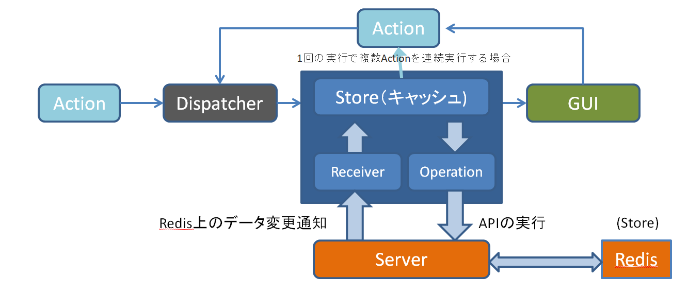
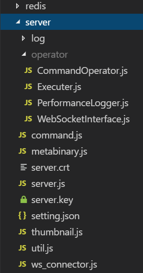
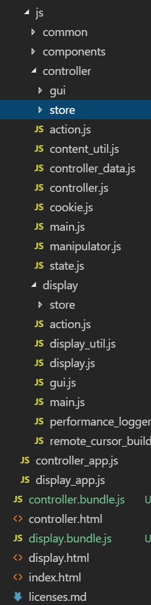
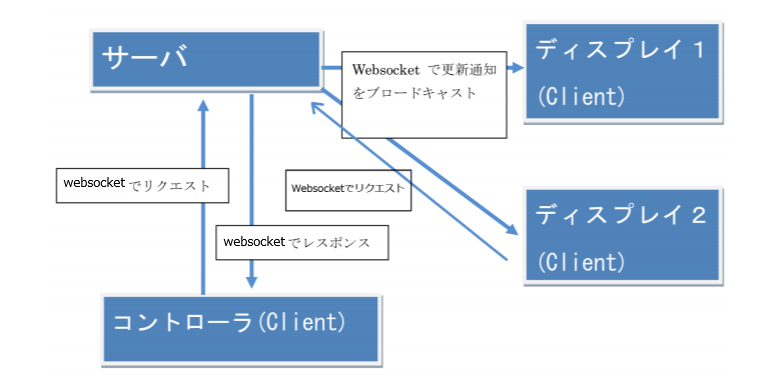

DevelperGuide
========================================================================================

はじめに
========================================================================================

本書ではChOWDERの開発方法について解説します.

開発環境
========================================================================================

### サーバサイド
 - redis
 - node.js

### クライアントサイド
 - webpack+babel

サーバとクライアントの役割
========================================================================================
### サーバの役割
 - HTTP 通信 - クライアントに対して HTML ページなどを送信する
 - Websocket 通信 - websocketにより, クライアントのコントローラ及びディスプレイとの間で通信を行う
 - データベース入出力 - クライアントから送信された画像データやテキストデータを redis に保存し, 永続化する.
 - サーバサイドレンダリング - 送信された URL のウェブサイトをサーバサイドでレンダリングし, png 画像として保存する.
 - 各種アクセス権限の設定を行う.
 - WebRTCでの動画配信の通信の仲介を行う.

### クライアント - コントローラの役割
 - コントローラは, 複数のディスプレイの配置を制御したり, ディスプレイに配信するコンテンツの登録/削除/配置等をサーバに問い合わせて行うことができる.
 - また, Administrator権限がある場合は, コンテンツ配信許可不許可などの, 権限設定を行うことができる.

### クライアント - ディスプレイの役割
 - 自身のウィンドウをディスプレイとしてサーバへ登録する.
 - 配信されたコンテンツを表示する.

デバッグ方法
========================================================================================

### サーバサイド
ChOWDERサーバを`bin/run.bat`等で起動した後, 
`RedisDesktopManager`等で, reidsに登録したデータを簡単に閲覧できます
   > https://github.com/uglide/RedisDesktopManager


### クライアントサイド
クライアントサイドでは, `webpack`, 及び `babel`を使用し, Javascriptコードのトランスコンパイルを行っています.

ChOWDERサーバを`bin/run.bat`等で起動しした後, 
```
npm run watch
```
コマンドにより, `public/`以下のクライアントサイドのファイルの変更を検知し, 変更があれば`webpack`が走るようになります.
この状態で開発すると効率的に開発できます.
`webpack`が走ったあとは, ブラウザを手動でのリロードする必要があります.

または, 手動で以下のコマンドを実行することで`webpack`が走ります.
```
npm run webpack
```

全体的な設計
========================================================================================

ChOWDERは[Flux](https://github.com/facebook/flux/tree/master/examples/flux-concepts)をベースにした設計となっており, 下図のような呼び出しフローになっている.



ChOWDERで行うほとんどの操作は, `action.js`に記載してあり, 例えばGUIを追加して任意の操作を行いたい場合は, GUIからaction.jsに定義された関数を呼び出すことになる.

また, `store.js`がデータを保持し, ビジネスロジックを実行するが, サーバサイドのRedisDBこそが真のStoreであるので, クライアントサイドのstore.jsはキャッシュとして振舞っている.

`GUI`については, 本来ShadowDOMなどを使用するべきであるが, ChOWDERではもともと(古い)pure jsで開発していたため, その流れを汲んでShadowDOMは使用せず, 各部品を`component`として分離させている.

サーバのフォルダ構成
========================================================================================



サーバでは, `server/server.js`がエントリーポイントとなっている.
APIに相当するコマンドが, `command.js`に定義されており, それらの実装が`operator/`以下に入っている.


クライアントのフォルダ構成
========================================================================================



クライアントサイドの公開HTMLページは以下の通り
 - `index.html` : トップページ
 - `controller.html` : コントローラのページ
 - `display.html` : ディスプレイのページ

コントローラ, ディスプレイから, `webpack`により生成された`controller.bundle.js`, `display.bundle.js`をそれぞれ読み込んでいる.

また, `js/controller_app.js`及び`js/display_app.js`がwebpack用エントリーポイントとなっている.

ソースコードは, `public/src/js/`に以下のように入っている.
  - `controller` : コントローラのソース
  - `display` : ディスプレイのソース
  - `components` : GUIのコンポーネント
  - `common` : コントローラ, ディスプレイで共通で使うソース


# 通信用 API の仕様

クライアント-サーバ間のデータやり取り手段として、通信用APIを用意している.

サーバではクライアントから websocket 通信にてメタバイナリ(後述)を受け取り, メタデータに記載されているコマンドによって処理を行う. 処理を実行した後, クライアントに対して, レスポンスを含んだメタバイナリを websocket にて送信する.

コントローラで画像を差し替えるなどの, データの更新が発生した際は, 更新通知をクライアントに対してブロードキャストする. ディスプレイは, 更新通知を受け取ると, サーバへコンテンツ/ウィンドウ情報取得リクエストを送り, コンテンツ/ウィンドウ情報を取得する.

また, ディスプレイ新規表示時には, ディスプレイからサーバへ, ディスプレイ登録リクエストを発行し, 自身のディスプレイを登録する.




## メタバイナリ

クライアントサーバ間でやり取りするデータとして, メタバイナリと呼ぶバイナリフォーマットを定義している. フォーマットは, 単一のメタデータか複数送るかによって以下の通りに定義している.

バージョン1 (単一のデータの送信)

| 内容  |  型  |  バイト数 |
| ---- | ---- | ---- |
|  ヘッダ  |  ”MetaBin:” (文字列) | 8 byte |
|  バージョン  |  UInt32  | 4 byte |
|  メタデータサイズ  |  UInt32  | 4 byte |
|  メタデータ  |  Ascii文字列 (JSON)  | メタデータサイズ |
|  コンテンツデータ  |  Binary など  | 残りの byte |

バージョン2 (複数のデータの送信)

| 内容  |  型  |  バイト数 |
| ---- | ---- | ---- |
|  ヘッダ  |  ”MetaBin:” (文字列) | 8 byte |
|  バージョン  |  UInt32  | 4 byte |
|  メタデータサイズ  |  UInt32  | 4 byte |
|  メタデータ  |  Ascii文字列 (JSON)  | メタデータサイズ |
|  リストサイズ  |  UInt32  | 4 byte |
|  (*) メタデータサイズ  |  UInt32  | 4 byte |
|  (*) メタデータ  |  Ascii文字列 (JSON)  | メタデータサイズ |
|  (*) コンテンツデータサイズ  |  UInt32  | 4 byte |
|  (*) コンテンツデータ  |  Binary など  | コンテンツデータサイズ |

(*)はリストサイズ個分、繰り返し後ろに付け足していく.

コンテンツデータには, コンテンツの画像のバイナリデータまたはテキストデータを入れる.
メタデータには, ＪＳＯＮ文字列を格納する. 具体的に以下のような値が入る.

```
　　{
　　　　　　"jsonrpc" : "2.0",
　　　　　　"method" : "AddContent",
　　　　　　"to" : "master",
　　　　　　"params" : {
　　　　　　　　　　"id" : "someid",
　　　　　　　　　　"type" : image
　　　　　　}
　　}
```

”jsonprc”は, 現在常に”2.0”となる

”method”は, サーバー（コントローラー）に与える命令(Command.jsで定義されているAPI名)を入れる. 

”to”は, データの送り先を入れる.
 - to = master の場合：サーバ (コントローラ) へ送信するためのデータ
 - to = client の場合: ディスプレイへ送信するためのデータ
 
 ”params”の”id”は, コンテンツを一意に識別するための ID を入れる.
 ”params”の”type”は, コンテンツデータの種別を入れる. 種別は現在以下の通り.
 - type = text の場合：UTF8 文字列
 - type = url の場合: URL エンコードされた文字列
 - type = image の場合: 画像ファイルのバイナリ
 - type = pdf の場合: pdfファイルのバイナリ
 - type = video の場合: 動画のサムネイルバイナリ
 - type = tileimage の場合: 大規模画像のサムネイルバイナリ

