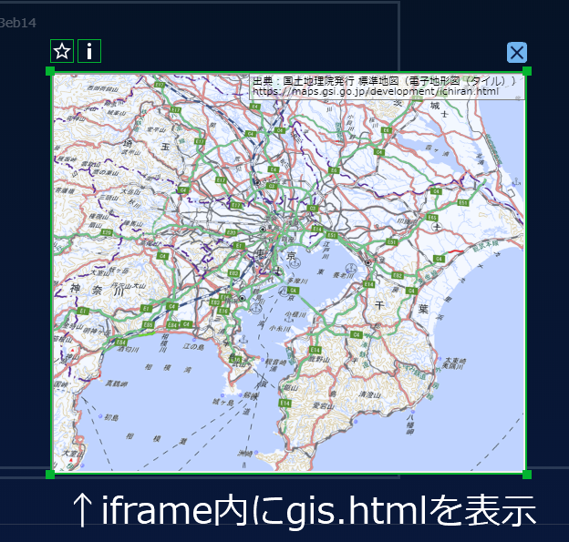
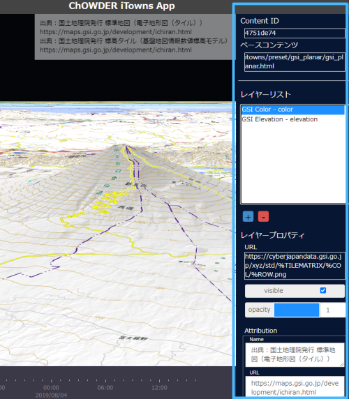
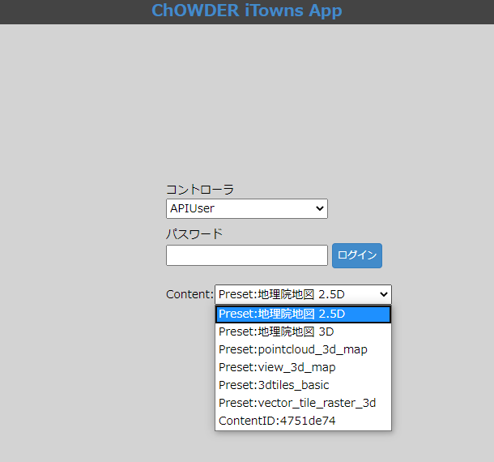
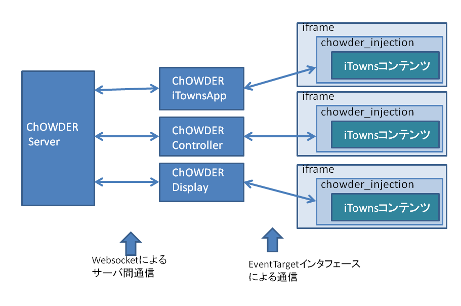

DevelperGuide For iTowns Support
========================================================================================

はじめに
========================================================================================

本書ではChOWDERに対応したiTownsコンテンツの概要及び開発方法について解説します.

iTownsコンテンツの概要
========================================================================================

ChOWDERでは、iTownsライブラリを用いたWebGLのコンテンツページを、ChOWDERのコンテンツとして表示させることができます。
ChOWDERでの表示はインラインフレーム(iframe)を用いて実現しています。

例えば、デフォルトで用意している`Preset: 地理院地図 3D`は、
```
ChOWDER/public/itowns/Preset/gsi
```
に格納されています。
```
gsi.html
gsi.js
gsi.json
```
とファイルがありますが、ChOWDERでは、このうちgsi.htmlをiframeにて表示します。



ChOWDERに対応したiTownsコンテンツでは、`iTowns用いたプリセットページの相対URL`と、
ChOWDER iTowns Appにて編集可能な`レイヤープロパティ`が、ChOWDERのデータベースに保存されます。

ChOWDERのコントローラ、ディスプレイ、ChOWDER iTowns Appでは、
まず、保存情報を元にプリセットページをiframeで表示し、その後、保存されているレイヤープロパティを適用して、
プリセットに対するコンテンツごとの編集状態を復元します。
つまり、ChOWDER iTowns Appでのレイヤープロパティの編集は、元のプリセットのhtmlに対して、非破壊的に行っています。


ChOWDER iTowns Appでのレイヤープロパティ編集

iTownsコンテンツの開発方法
========================================================================================
iTownsコンテンツの開発方法について記載します。

## 基本的な開発方法

ChOWDERに対応したiTownsコンテンツを作るには、まず、
`chowder_injection.bundle.js`というJavascriptコードを読み込みます。

chowder_injection.bundle.jsでは、iTownsのリサイズイベントの制御も行っているため、htmlファイル内での読み込み順として、iTownsより先に読み込む必要があります。
```html
<head>
    <script src="../../../chowder_injection.bundle.js"></script>
    <script src="../../itowns/itowns.js"></script>
・・・
```

次に、iTownsコンテンツにて、iTownsのレイヤー編集などを可能にするために、
iTownsコンテンツページの`onload`のタイミングで、`injectChOWDER`関数を呼ぶ必要があります。
関数のプロトタイプは以下の通りです。
呼び出しには、itownsのviewインスタンスとiTownsのviewerのdivエレメントが引数として必要です。

```js
/**
 * itownsを使ったwebアプリケーションをchowder対応するための関数
 * injectChOWDER(view, viewerDiv); と呼び出す
 * @param view itownsのviewインスタンス. GlobeViewやPlanarViewなど.
 * @param viewerDiv itownsのviewerのdiv
 * @param timeCallback 時刻が変更されたとき呼び出される、function(time) {} 形式のコールバック関数
 */ 
window.injectChOWDER = (view, viewerDiv, timeCallback = null) => {
	// ・・・
};
```

例えば、デフォルトで用意している`Preset: 地理院地図 3D`では、以下のように呼び出しています
```js
// gsi.js

/// 地理院地図(Color)を3D球体で表示する
window.onload = function () {
    // 地理院地図(Color)の読み込み
    function loadGSIColor() {
        itowns.Fetcher.json('./gsi.json').then(function (config) {
            var mapSource = new itowns.TMSSource(config.source);
            var layer = new itowns.ColorLayer(config.id, {
                source: mapSource,
                updateStrategy: {
                    type: 3
                },
            });
            view.addLayer(layer);
        });
    }

    // `viewerDiv` will contain iTowns' rendering area (`<canvas>`)
    var viewerDiv = document.getElementById('viewerDiv');
    var placement = {
        coord: new itowns.Coordinates("EPSG:4326", 138.7539, 35.3539),
        range: 25000
    };
    var view = new itowns.GlobeView(viewerDiv, placement);

    loadGSIColor();

    injectChOWDER(view, viewerDiv); // ←ここで呼び出しています
};
```

iTowns公式のサンプルなどでも、同様にして、`injectChOWDER`を呼ぶことで、ChOWDERに対応させることができます。

ChOWDERにPresetとして入れてある、3dtiles_basic、pointcloud_3d_map、vector_tile_raster_3d、view_3d_mapは、iTowns公式サンプルに対して、ChOWDERに対応するように`chowder_injection.bundle.js`を読み込み、`injectChOWDER`関数を呼ぶように改変したものとなっています。

## ChOWDER iTowns Appのプリセットリストへの反映

Presetディレクトリ(ChOWDER/public/itowns/Preset/)に、新たにPresetを作成した場合、
Presetディレクトリ内の、preset_list.jsonに、作成したコンテンツの名前と相対URLを追加することで、
ChOWDER iTowns Appのプリセットリストへ反映させ、Presetとして利用できるようになります。

```json
// preset_list.json
{
	"preset_list" : [
		{
			"name" : "地理院地図 2.5D",
			"url" : "itowns/preset/gsi_planar/gsi_planar.html"
		},
		{
			"name" : "地理院地図 3D",
			"url" : "itowns/preset/gsi/gsi.html"
		},
		{
			"name" : "pointcloud_3d_map",
			"url" : "itowns/preset/pointcloud_3d_map/pointcloud_3d_map.html"
		},
		{
			"name" : "view_3d_map",
			"url" : "itowns/preset/view_3d_map/view_3d_map.html"
		},
		{
			"name" : "3dtiles_basic",
			"url" : "itowns/preset/3dtiles_basic/3dtiles_basic.html"
		},
		{
			"name" : "vector_tile_raster_3d",
			"url" : "itowns/preset/vector_tile_raster_3d/vector_tile_raster_3d.htm"
		}
	]
}
```


上記JSONによるPresetリスト表示例

# chowder_injectionについて(詳細)

`chowder_injection`の実装コードは、
`src/js/chowder_itowns_injection/`にあります。

chowder_injectionでは、以下のことを行っています。
 - iTownsのリサイズイベントの制御
    - iTownsを使用したページで、リサイズが発生すると、iTowns内で必ずカメラなどの更新が行われ、
    ディスプレイ分割用に設定したフラスタムがずれてしまうため、ChOWDERのディスプレイ表示は、このリサイズイベントを抑制しています。

 - レイヤーの追加、削除
    - ChOWDER iTowns Appにて、レイヤーの追加/削除操作が行われた際に、chowder_injectionによって、表示中のiTownsコンテンツに対して、レイヤーの追加/削除を実際に行っています。
    - レイヤーの追加時のURLのxyz指定について、iTownsの`${z}/${x}/${y}`だけでなく、地理院地図などで用いられる`{z}/{x}/{y}`にも対応するようにしています。

 - レイヤープロパティの取得、変更
    - ChOWDER iTowns Appにて、iTownsコンテンツ読み込み時に、iTownsコンテンツ内のレイヤーデータを取得し、一部のレイヤープロパティ（透明度や表示非表示など）をChOWDER iTowns Appで表示、変更できるようにしています。
    レイヤープロパティを変更した際は、変更したデータはChOWDERのコンテンツ内のメタデータとして、ChOWDERが使用しているRedisDB内に保存されます。

 - データに応じた特殊対応
    - src/js/chowder_itowns_injection/store.jsの`createLayerByType`及び`createLayerConfigByType`関数にて、データに応じた特殊対応を行っています
    - 地理院地図のベクトルタイルデータに対応するため、iTownsライブラリ自体の改変、及び、入力ソースのEPSGの指定(EPSG4326)を行っています。
    - 地理院地図の標高データに対応するため、拡張子がcsv、txt、pngの場合に、独自の地理院地図用パーサーを使用して標高データを展開するようにしています。

 - ChOWDERへのサムネイル登録
    - ChOWDERコンテンツ用のサムネイル画像を作成しています。

 - パフォーマンス計測機能
    - ChOWDER iTowns Appにて、パフォーマンス計測のボタンが押された際に、ChOWDERディスプレイに表示中のiTownsコンテンツのchowder_injection内で、1フレーム当たりの時間、表示ポリゴン数などを計測しています。
 
  - タイムライン機能
    - ChOWDER iTowns Appにて、タイムラインで日時を変更したときに、`injectChOWDER`関数の引数に入れた`timeCallback`を呼び出します。timeCallbackは、第一引数にタイムラインの日時を指すDateオブジェクトが入ります。

## chowder_injectionと、ChOWDER、iTownsコンテンツ間の通信

ChOWDERは、chowder_injection及びiTownsコンテンツを読み込み、コンテンツとして表示しますが、
このときChOWDERとchowder_injection間では、標準の`EventTargetインタフェース`を用いて通信を行っています。通信データは、ChOWDER本体と同じく、JSONRPC2に沿ったものとなっています。詳細は以下をご参照ください。

 EventTarget - https://developer.mozilla.org/ja/docs/Web/API/EventTarget

 ChOWDER-chowder_injection間の通信コード - src/js/common/iframe_connector.js



また、chowder_injectionとiTownsコンテンツの間では、前述の`injectChOWDER`関数を呼び出し、chowder_injectionが直接iTownsのオブジェクトを参照することで、chowder_injectionの機能を実現しています。
