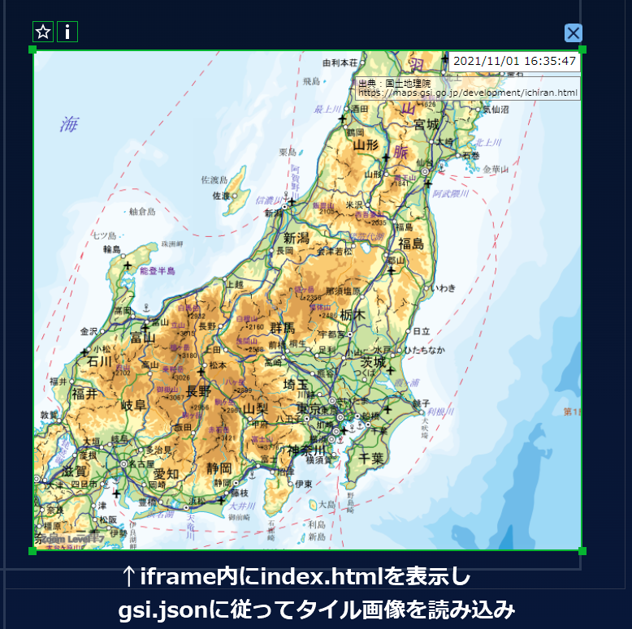
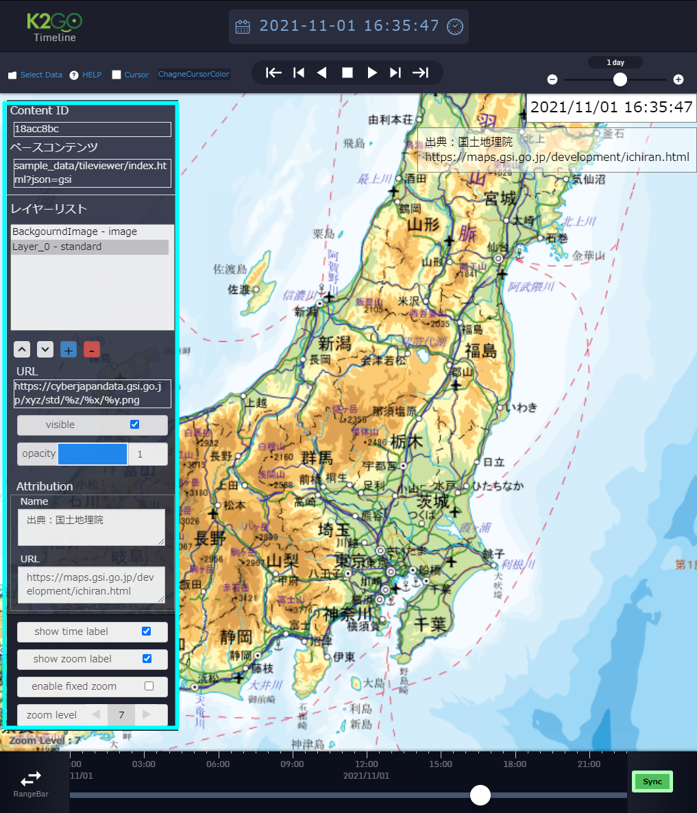
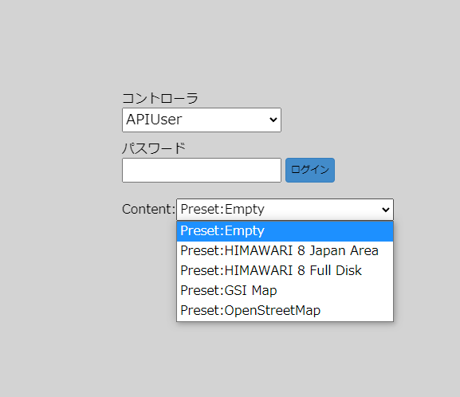

DevelperGuide For TileViewer
========================================================================================

はじめに
========================================================================================

本書ではChOWDERに対応したTileViewerコンテンツの概要及び開発方法について解説します.

TileViewerコンテンツの概要
========================================================================================

ChOWDERでは、TileViewerライブラリを用いたコンテンツページを、ChOWDERのコンテンツとして表示させることができます。
ChOWDERでの表示はインラインフレーム(iframe)を用いて実現しています。

例えば、デフォルトで用意している`Preset:GIS Map`は、
```
ChOWDER/public/sample_data/tileviewer/preset_list.json
```
に定義があり, 
```
ChOWDER/public/sample_data/tileviewer/settings/gsi.json
```
を参照させるために, URLに以下のように
GETパラメータにてファイル名相当の文字列を付与しています.
```json
// preset_list.json
{
    "preset_list": [
        // 中略
        {
            "name": "GSI Map",
            "url": "sample_data/tileviewer/index.html?json=gsi"
        },
        // 後略
    ]
}
```


ChOWDERでは、`sample_data/tileviewer/index.html`をiframeにて表示し, 
読み込まれた`index.js`内で, GETパラメータである`gsi`を読み取り, `sample_data/tileviewer/settings/gsi.json`を読み込み, プリセットとして設定します.



ChOWDERに対応したTileViewerコンテンツでは、`TileViewer用いたプリセットページの相対URL`と、
ChOWDER TileViewer Appにて編集可能な`レイヤープロパティ`,
及び, 一部表示オプションなどのパラメータが, コンテンツのメタデータとして, ChOWDERのデータベースに保存されます。

ChOWDERのコントローラ、ディスプレイ、ChOWDER TileViewer Appでは、
まず、保存情報を元にプリセットページをiframeで表示し、その後、保存されているレイヤープロパティを適用して、
プリセットに対するコンテンツごとの編集状態を復元します。
つまり、ChOWDER TileViewer Appでのレイヤープロパティの編集は、元のプリセットのhtmlに対して、非破壊的に行っています。


ChOWDER TileViewer Appでのレイヤープロパティ編集


TileViewerコンテンツの開発方法
========================================================================================
TileViewerコンテンツの開発方法について記載します。

## プリセットの開発方法

jsonファイルでプリセット設定ファイルを用意することで, TileViewerAppのプリセットリストに, 独自のプリセットを追加することができます.

具体的には, 以下の場所にプリセット設定ファイル(json)を追加し, 
```
ChOWDER/public/sample_data/tileviewer/settings/my_new_preset.json
```

preset_list.jsonの定義に, 追加したjsonファイルを読み込む設定を追記します.
```json
// preset_list.json
{
    "preset_list": [
        // 中略
        {
            "name": "GSI Map",
            "url": "sample_data/tileviewer/index.html?json=my_new_preset"
        },
        // 後略
    ]
}
```

プリセット設定ファイルのパラメータについては, 
UserGuide.md プリセット定義ファイル を参照してください.


## HTML/jsファイルを含めた独自コンテンツの開発方法

`tileviewer.js`を使用したコンテンツを開発する場合, 以下のファイルの作成が必要となります
 - `tileviewer.js`
 - `tileviewer.js`を読み込むhtmlファイル
 - 初期化や`tileviewer.js`を使用したタイル動作を実現するためにjsファイル

`tileviewer.js` は以下の場所に格納されています
```
ChOWDER/public/sample_data/tileviewer/tileviewer.js
```

これらhtmlファイル及びjsファイル単体で, 動作することを確認した後に, ChOWDERに対応したTileViewerコンテンツとして使用するために, `chowder_tileviewer_injection.bundle.js`というJavascriptコードを読み込みます。

`chowder_tileviewer_injection.bundle.js`では、TileViewerのマウスイベントの制御も行っているため、htmlファイル内での読み込み順として、TileViewerより先に読み込む必要があります。
```html
<head>
    <script src="../../../chowder_tileviewer_injection.bundle.js"></script>
    <script src="tileviewer.js"></script>
・・・
```

次に、TileViewerコンテンツにて、TileViewerのレイヤー編集などを可能にするために、
TileViewerコンテンツページの`onload`のタイミングで、`injectChOWDER`関数を呼ぶ必要があります。
関数のプロトタイプは以下の通りです。
呼び出しには、itownsのviewインスタンスとTileViewerのviewerのdivエレメントが引数として必要です。

```js
/**
 * tileviewerを使ったwebアプリケーションをchowder対応するための関数
 * injectChOWDER(viewerDiv); と呼び出す
 * @param instance TileViewerのinstance
 * @param viewerDiv viewerのdiv
 * @param timeCallback 時刻が変更されたとき呼び出される、function(time) {} 形式のコールバック関数
 */
window.injectChOWDER = (instance, viewerDiv, timeCallback = null) => {
	// ・・・
};
```

例えば、デフォルトで用意している`index.js`では、以下のように呼び出しています
```js
// index.js

// 前略

window.onload =  () => {
    // TileViewerの初期化
    const viewer = new TileViewer(document.getElementById('tileviewer'));
    
    // jsonパラメータがあれば取得
    const url = new URL(location.href);
    const params = url.searchParams;
    const jsonName = params.get('json');
    if (jsonName) {
        fetch('settings/' + jsonName+'.json')
            .then(response => response.json())
            .then(async data => {
                // TileViewerにGETパラメータで指定されたプリセット設定を適用
                await viewer.setOptions(data);
                // タイル作成
                await viewer.create();
                
                if (window.chowder_view_type !== undefined) {
                    // injectChWDERを呼び出しchowderコンテンツとして使用.
                    injectChOWDER(viewer, document.getElementById('tileviewer'));
                } else {
                    // 単体起動時はデバッグ用GUIを表示
                    showDebugGUI(viewer);
                }
                // マウスイベントなどでtileviewerを操作する
                enableMouseEvents(viewer);
            });
    }
};
```

独自に`tileviewer.js`を使用して開発したものでも、同様にして、`injectChOWDER`を呼ぶことで、ChOWDERに対応させることができます。

独自に`tileviewer.js`を使用して開発する場合は、`tileviewer.js`の設計ドキュメント`TileViewer_Dev.md`及びAPIドキュメント`TileViewer_API.md`を参照してください。


## ChOWDER TileViewer Appのプリセットリストへの反映

新たにPresetを作成した場合、
Presetディレクトリ内の、preset_list.jsonに、作成したコンテンツの名前と相対URLを追加することで、
ChOWDER TileViewer Appのプリセットリストへ反映させ、Presetとして利用できるようになります。
デフォルトではGETパラメータによるプリセット設定を使用したものとなっていますが, 独自に作成したGETパラメータ無しのhtmlファイルを指定することも可能です.

```json
// preset_list.json
{
    "preset_list": [
        {
            "name": "Empty",
            "url": "sample_data/tileviewer/index.html?json=empty"
        },
        {
            "name": "HIMAWARI 8 Japan Area",
            "url": "sample_data/tileviewer/index.html?json=himawari_jp"
        },
        {
            "name": "HIMAWARI 8 Full Disk",
            "url": "sample_data/tileviewer/index.html?json=himawari_fd"
        },
        {
            "name": "GSI Map",
            "url": "sample_data/tileviewer/index.html?json=gsi"
        },
        {
            "name": "OpenStreetMap",
            "url": "sample_data/tileviewer/index.html?json=osm"
        }
    ]
}
```


上記JSONによるPresetリスト表示例

# chowder_tileviewer_injectionについて(詳細)

`chowder_tileviewer_injection`の実装コードは、
`src/js/chowder_tileviewer_injection/`にあります。

chowder_tileviewer_injectionでは、以下のことを行っています。

 - レイヤーの追加、削除
    - ChOWDER TileViewer Appにて、レイヤーの追加/削除操作が行われた際に、chowder_tileviewer_injectionによって、表示中のTileViewerコンテンツに対して、レイヤーの追加/削除を実際に行っています。
    - レイヤーの追加時のURLのxyz指定について、TileViewerの`%z/%x/%y`だけでなく、地理院地図などで用いられる`{z}/{x}/{y}`にも対応するようにしています。

 - レイヤープロパティの取得、変更
    - ChOR TileViewer Appにて、TileViewerコンテンツ読み込み時に、TileViewerコンテンツ内のレイヤーデータを取得し、一部のレイヤープロパティ（透明度や表示非表示など）をChOWDER TileViewer Appで表示、変更できるようにしています。
    レイヤープロパティを変更した際は、変更したデータはChOWDERのコンテンツ内のメタデータとして、ChOWDERが使用しているRedisDB内に保存されます。

 - ChOWDERへのサムネイル登録
    - ChOWDERコンテンツ用のサムネイル画像を作成しています。
    
  - タイムライン機能
    - ChOWDER TileViewer Appにて、タイムラインで日時を変更したときに、`injectChOWDER`関数の引数に入れた`timeCallback`を呼び出します。timeCallbackは、第一引数にタイムラインの日時を指すDateオブジェクトが入ります。
