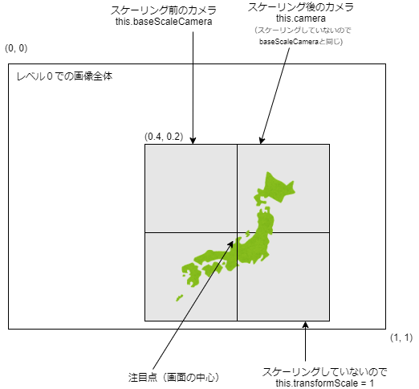
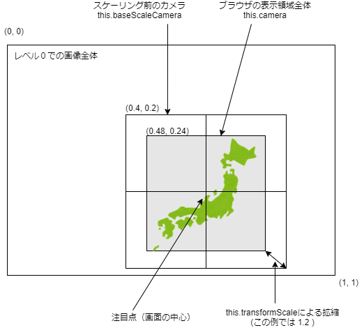
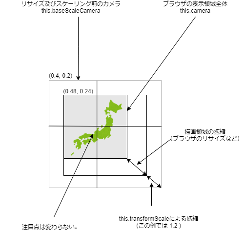
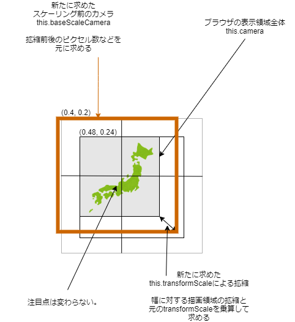
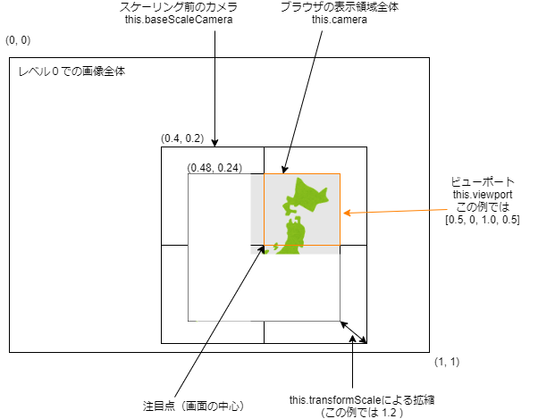

# ChOWDER用TileViewer 実装詳細

# 基本方針

 - タイルのLoDレベルの間のスムーズな拡縮を行う。
 - ビューポートによる表示範囲の制限を可能とする。
 - 移動、拡縮、LoDレベルの変更を可能とする。
 - 座標値等については、メンバ変数などに保持して、それを元に計算していく。極力DOMから取れる値を使用しない。
 - カメラ値として見た目を維持するための変数を保持し、新たに表示させた別のTileViewerに対して、同じカメラ値を設定すれば同じ見た目となるようにする。

# 座標系周りの仕様

## スケールを行わない状況での座標系
レベル０のタイルの左上を(0, 0)右下を(1, 1)とした座標系を
カメラスペースと呼ぶこととする。

スケーリングを行わない状態（つまりレベル０のタイルを実寸で見ている状態）での、カメラスペースでの座標を、baseScaleCameraに格納している。




---

## 画面中心へのスケーリング
画面中心にスケーリングさせた場合の状況を考える。
スケール後の画面の、カメラスペースでの座標を、this.cameraに格納している。
また、このときのスケール値をtransformScaleとして格納している。



---

## 移動
視点を移動させる場合は、まずbaseScaleCameraをカメラスペースで移動させ、
その結果からtransformScaleを考慮してthis.cameraを求める。

---

## 画面のリサイズ等による拡縮
画面の見た目をなるべく維持して拡縮を行う。
すなわち、注目点を見た目上維持したまま、タイルに対してスケーリングを行う。
拡縮後のアスペクト比が同じであれば、拡縮後のタイルの見た目は同じ見た目となる。
アスペクト比が異なる場合は、縦方向か横方向のどちらかを維持することが考えられるが、世の中のディスプレイは横長の場合が多いので、横方向を維持するようにした。



この場合、拡縮後の範囲から、新たなbaseScaleCameraと、新たなtransformScaleを計算して求める必要があり、結構ややこしい。
新たなbaseScaleCameraは、描画領域の拡縮量や、描画前後のピクセル数などを元に、注目点を中心とした拡縮計算を行い求めた。
新たなtransformScaleは、描画領域の拡縮量の幅方向にかかる値と、元のtransformScaleの乗算によって求めた。



---

## タイルのレベル変更

タイルのレベルを変更した際に、レベルごとの全画像の合計画素数は当然異なるが、レベルを変更した際の見た目を同じにしたいので、各タイルに必要な量(ratioとする)の拡縮を行い、合計画素数をレベル０での合計画素数に揃える。

前述のtransformScaleによる拡縮を行わない場合、すなわち、transformScale=1の場合、レベルを上げれば上げるほど、タイルの幅が小さくなり、見た目を維持したままレベルが上がっていく。

```js
// 画像エレメントの幅の計算部分。
tileInfo.w = Math.ceil(s.width / ratio.x * this.transformScale);
tileInfo.h = Math.ceil(s.height / ratio.y * this.transformScale);
```

一方で、transformScaleを併用し、基本的にはtransformScaleでズームさせ、現在の画面サイズであるレベルの実寸サイズが表示できるようになったときに、レベルを上げていく。

そうすることで、例えば１枚256x256pixelのタイルで構成されている場合、画像用エレメントの幅は、レベルとレベルの間では、256以上または以下に拡縮されるが、レベルが切り替わった段階で新たなレベルの画像が256x256pixelとして表示される。

---

## ビューポートの設定

this.cameraの領域について、左上を(0, 0) 、右下を(1, 1)と考えた場合に、タイルを表示するべきビューポートを指定できるようにしている。

単純にDOMの配置を決めるときに、ビューポート外のタイルであったら弾くような処理を入れているだけある。
ビューポートに少し入っているタイルについては、ビューポート外の部分の画像も当然読み込まれているので、以下のように少しビューポート外にはみ出るような感じで地図等が表示される。
使用する場合は、DOMのstyleなどでビューポート内のみ表示させる必要がある。


