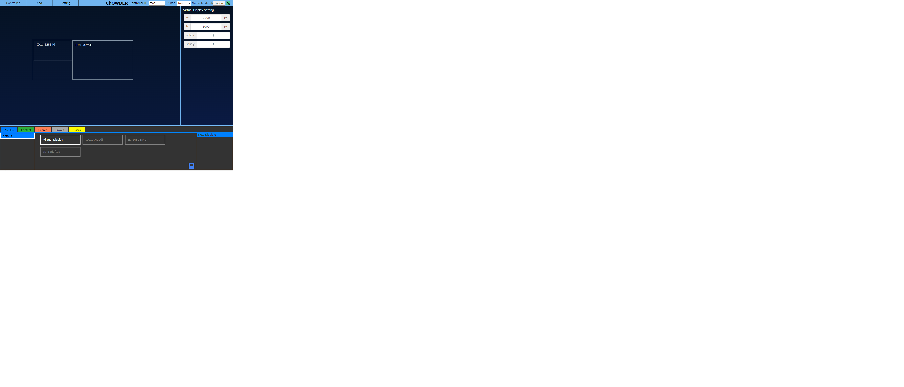
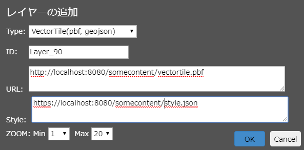

利用説明書
========================================================================================

目次
---------------------------------------------------

-   [はじめに](#はじめに)
    -   [動作環境とインストール](#動作環境とインストール)
-   [アプリケーションの展開方法](#アプリケーションの展開方法)
-   [アプリケーションのインストール方法](#アプリケーションのインストール方法)
    -   [インストール](#インストール)
    -   [インストールスクリプトの実行](#インストールスクリプトの実行)
-   [アプリケーションの起動方法](#アプリケーションの起動方法)
    -   [Mac/Linuxの場合](#maclinuxの場合)
    -   [Windowsの場合](#windowsの場合)
    -   [起動確認](#起動確認)
    -   [コントローラへアクセス](#コントローラへアクセス)
-   [アプリケーションの終了方法](#アプリケーションの終了方法)
    -   [サーバープログラムの終了](#サーバープログラムの終了)
    -   [redisの終了](#redisの終了)
-   [サーバー設定](#サーバー設定)
    -   [サーバー基本設定](#サーバー基本設定)
    -   [管理者初期設定](#管理者初期設定)
    -   [管理者設定ファイル](#管理者設定ファイル)
-   [ChOWDERのホーム画面](#chowderのホーム画面)
    -   [ホーム画面説明](#ホーム画面説明)
-   [コントローラ画面の操作](#コントローラ画面の操作)
    -   [概要](#概要)
    -   [接続状態について](#接続状態について)
    -   [Virtual Display Screenについて](#virtual-display-screenについて)
    -   [メインメニュー](#メインメニュー)
    -   [コンテンツの追加](#コンテンツの追加)
    -   [Displayタブ](#displayタブ)
    -   [Contentタブ](#contentタブ)
    -   [Searchタブ](#searchタブ)
    -   [Propertyウィンドウ](#propertyウィンドウ)
    -   [動画コンテンツの操作](#動画コンテンツの操作)
-   [コントローラ権限と管理画面](#コントローラ権限と管理画面)
    -   [コントローラ権限](#コントローラ権限)
    -   [管理画面](#管理画面)
-   [ディスプレイ画面の操作](#ディスプレイ画面の操作)
    -   [概要](#概要-1)
    -   [ディスプレイの操作：メニュー](#ディスプレイの操作：メニュー)
-   [VRディスプレイ](#VRディスプレイ)
    -   [VRモード](#VRモード)
    -   [VRモードの設定](#VRモードの設定)
    -   [VRモードでの操作](#VRモードでの操作)
    -   [VRモードの制限事項](#VRモードの制限事項)
-   [HIVEとの連携](#hiveとの連携)
    -   [インタラクティブレンダリング](#インタラクティブレンダリング)
    -   [SceneNodeEditor](#scenenodeeditor)
    -   [Module System](#module-system)
-   [Google Chrome Extensionの利用](#google-chrome-extensionの利用)
    -   [概要](#概要-2)
    -   [Extensionのインストール](#extensionのインストール)
    -   [Extensionでキャプチャする](#extensionでキャプチャする)
-   [ChOWDER Desktop Captureの利用](#chowder-desktop-captureの利用)
    -   [概要](#概要-3)
    -   [ChOWDER Desktop Captureの使い方](#chowder-desktop-captureの使い方)
-   [Google Chrome Extension for WebRTCの利用](#google-chrome-extension-for-webrtcの利用)
    -   [概要](#概要-4)
    -   [Extensionのインストール](#extensionのインストール-2)
    -   [ChOWDERサーバーが別PCで動作している場合](#chowderサーバーが別pcで動作している場合)
    -   [Extensionでキャプチャする](#extensionでキャプチャする-1)
-   [大規模画像データ送信アプリケーションの利用](#大規模画像データ送信アプリケーションの利用)
    -   [概要](#概要-5)
    -   [アプリケーションの設定](#アプリケーションの設定-1)
    -   [アプリケーションの利用方法](#アプリケーションの利用方法-1)
-   [大規模画像データの表示と操作](#大規模画像データの表示と操作)
-   [WebGL分散描画機能の利用](#WebGL分散描画機能の利用)
    -   [概要](#概要-6)
    -   [アプリケーションの利用方法](#アプリケーションの利用方法-2)
    -   [GISレイヤー追加機能](#GISレイヤー追加機能)
    -   [GISレイヤーのプロパティ](#GISレイヤーのプロパティ)
    -   [GIS用タイムラインの設定と操作方法](#GIS用タイムラインの設定と操作方法)
    -   [コントローラでの設定](#コントローラでの設定)
-   [TileViewerの利用](#TileViewerの利用)
    -   [概要](#概要-7)
    -   [アプリケーションの利用方法](#アプリケーションの利用方法-3)
    -   [レイヤーメニュー](#レイヤーメニュー)
    -   [レイヤー追加機能](#レイヤー追加機能)
    -   [TileViewer用タイムラインの設定と操作方法](#tileviewer用タイムラインの設定と操作方法)
    -   [TileViewer用プリセットの設定](#tileviewer用プリセットの設定)
-   [Qgis2threejsプラグイン出力描画機能の利用](#Qgis2threejsプラグイン出力描画機能の利用)
    -   [概要](#概要-8)
    -   [アプリケーションの利用方法](#アプリケーションの利用方法-4)
    -   [データのアップロード](#データのアップロード)
-   [Electron版ChOWDERディスプレイアプリケーションの利用](#Electron版ChOWDERディスプレイアプリケーションの利用)
    -   [概要](#概要-9)
    -   [アプリケーションのインストール](#アプリケーションのインストール)
    -   [アプリケーションの起動](#アプリケーションの起動)
    -   [アプリケーションの設定](#アプリケーションの設定-2)
    -   [アプリケーションの設定の反映](#アプリケーションの設定の反映)
    -   [リモートホストへのインストール](#リモートホストへのインストール)
-   [HTTPSの利用](#httpsの利用)
    -   [概要](#概要-10)
-   [coturnの利用](#coturnの利用)
    -   [概要](#概要-11)
-   [ひまわりパーサーの利用](#ひまわりパーサーの利用)
    -   [概要](#概要-12)
-   [太陽放射コンソーシアムデータ用パーサーの利用](#太陽放射コンソーシアムデータ用パーサーの利用)
    -   [概要](#概要-13)
    
はじめに
========================================================================================

本書ではChOWDERの操作方法について解説します.

動作環境とインストール
---------------------------------------------------

以下の環境で動作確認を行っております.

* OS
    * Linux(CentOS7)
    * Windows10
    * MacOSX 10.12
* Webブラウザ
    * Apple Safari 12.x
    * Firefox 65
    * Chrome 72
    * Edge 44

アプリケーションの展開方法
========================================================================================

アーカイブファイルの解凍を行ってください.
解凍すると、以下の構成でファイルが作成されます.

* bin : 実行スクリプトフォルダ
* client : クライアントアプリケーションフォルダ
* doc : ドキュメントフォルダ
* redis : redisアプリケーションフォルダ
* server : サーバアプリケーションフォルダ
* chrome\_extension : Google Chrome 拡張機能フォルダ
* package.json

協調ワークスペースドライバの起動にはbinフォルダに格納されているスクリプトを使用します.

アプリケーションのインストール方法
========================================================================================

インストール
---------------------------------------------------

### Node.jsのインストール

ポータルGUIの動作にはNode.jsのインストールが必要です.
Node.jsの公式サイト(`http://nodejs.org/`)からNode.js本体をダウンロードし,インストールします.(下図)


*node.jsのinstall画面*

### Node.jsサブモジュールのインストール

アプリケーションを展開したディレクトリに, ChOWDERで利用しているNode.jsの必要なサードパーティモジュールのインストールを行います.

インストールスクリプトの実行
---------------------------------------------------

### Mac/Linuxの場合

bin配下の以下のシェルスクリプトを実行します.

       $cd bin
       $sh install.sh

Linux環境において、WebRTC用のturnサーバを同時にインストールする場合は以下を実行します.
(turnはLinux環境のみ動作確認しております. Mac環境では非対応となります.)

       $cd bin
       $sh install_with_turn.sh

### Windowsの場合

bin配下の以下のファイルを実行します.

       >cd bin
       >install.bat

 - Windowsでは, インストール時に, hiredisモジュールやPythonのエラーが表示されますが, 必須モジュールではないため, 問題なく動作します.

アプリケーションの起動方法
========================================================================================

Mac/Linuxの場合
---------------------------------------------------

bin配下の以下のシェルスクリプトを実行します.

       ./run.sh

Windowsの場合
---------------------------------------------------

bin配下の以下のファイルを実行します.

       >cd bin
       >run.bat

※ Windowsの場合、仮想メモリを0KByteにしていると、 redisが正常に起動しない場合があります.
その場合は一時的に仮想メモリを有効にしてご利用ください.

起動確認
---------------------------------------------------

起動スクリプトを実行するとChOWDERサーバーが起動します.

       $sh run.sh
       (Windows版は run.bat)

コントローラへアクセス
---------------------------------------------------

ChOWDERへのアクセスは、Webブラウザのアドレス欄に「 http://localhost/ 」と入力することでアクセス出来ます.
アクセスし、下図の画面が表示されたらインストールは完了となります。.


*install終了後ホーム画面*

アプリケーションの終了方法
========================================================================================

以下2点の操作にて終了させます.

サーバープログラムの終了
---------------------------------------------------

run.sh(bat)を起動したterminalをCTRL+Cで終了するか、 serverプログラムをkillします.

redisの終了
---------------------------------------------------

redisが起動しているterminalを終了させます.
また、プロセスとして起動している場合は、プロセスをpsコマンドにて見つけて killコマンドにて終了させます.

サーバー設定
========================================================================================

サーバー基本設定
---------------------------------------------------
サーバープログラムでは、起動時に`server/setting.json`ファイルを読み込み、各種設定を行っています。


    {
        "wsMaxMessageSize": 67108864,
        "reductionResolution" : 1920,
        "enableMeasureTime" : false,
        "stunServerUrl" : "",
        "turnServerUrl" : "",
        "turnServerUsername" : "",
        "turnServerCredential" : "",
        "enableHTTP" : true,
        "enableSSL" : true,
        "HTTPPort" : 80,
        "SSLPort" : 443,
        "enableCORS" : true,
        "VRMode" : 'cylinder',
        "reduceUpdate": false,
        "reduceInterval" : 500,
        "tileviewerCursorSize" : 100
    }

-   `wsMaxMessageSize`には、サーバーが1回で送受信できる最大メッセージサイズを設定します。
-   `reductionResolution`には、大規模画像データの縮小画像のサイズを設定します。このサイズ以上の大規模画像データを登録した場合は、縮小画像が生成され、表示解像度によっては縮小画像が表示に使用されます。
-   `enableMeasureTime`には、時刻ログ出力を有効にするかどうかを設定します。時刻ログ出力を有効にした場合、tileimage/log、server/logに対してログファイルが出力されます。また、Display上でDisplayでのログがダウンロードできるようになります。
-   `stunServerUrl`には、WebRTC接続において使用する、STUNサーバのURLを指定します。
-   `turnServerUrl`には、WebRTC接続において使用する、TURNサーバのURLを指定します。
-   `turnServerUsername`には、WebRTC接続において使用する、TURNサーバの認証用ユーザー名を指定します。
-   `turnServerCredential`には、WebRTC接続において使用する、TURNサーバの認証用パスワードを指定します。
-   `enableHTTP`には、HTTP通信を有効にするかどうかを指定します。
-   `enableSSL`には、HTTPS通信を有効にするかどうかを指定します。
-   `HTTPPort`には、HTTP通信で使用するポート番号を指定します。Websocket(ws)通信でも同様のポートが使用されます。
-   `SSLPort`には、HTTPS通信で使用するポート番号を指定します。Websocket(wss)通信でも同様のポートが使用されます。
-   `enableCORS`には、ChOWDER Serverで公開するウェブコンテンツに対し、CORSを許可するかどうかを指定します。
-   `VRMode`には、使用するVRモードを指定します。現在指定可能な値は"plane"(平面表示)または"cylinder"(曲面表示)または"360"(360度表示)です。
-   `reduceUpdate`には、Controllerからの各種更新通知などが発行される頻度を減らす場合trueを設定します。デフォルトではfalseです。
-   `reduceInterval`には`reduceUpdate`がtrueの場合に、更新通知などの発行頻度を減ら際の、最大待ち時間をミリ秒単位で指定します。デフォルト値は500です。
-   `tileviewerCursorSize`には、TileViewerでRemoteCursor機能を使用した場合のカーソルサイズを相対値で指定します。デフォルト値は100です。


管理者初期設定
---------------------------------------------------

管理者コントローラを起動時に設定することができます.
デフォルトでは, 管理者パスワードは「admin」に設定されています

管理者設定ファイル
---------------------------------------------------
ChOWDER の最上位フォルダ(README.md があるフォルダ) に, admin.json ファイルを作成することで,
起動時に管理者の追加削除を行うことができます. admin.json の書式は以下の通りです(admin.json.org ファイルにも記
載しております)

    {
        "administrator" : {
            "command" : "add",
            "password" : "admin"
        },
        "administrator2" : {
            "command" : "delete",
            "password" : "admin2"
        }
    }

この例では, コントローラ”administrator”が追加(上書き) され, ”administrator2”が削除されます

キーとして管理者名を入れ, 追加(上書き) する場合は, ”command” : ”add”
削除する場合は”command” : ”delete” と記載します. 追加時には”password”が必須です.
このjson ファイルはChOWDER 起動時に読み込まれ, DB に管理者が登録または削除されます.
一度ChOWDER を起動して, DB に登録された後は, admin.json ファイルは不要となります.

ChOWDERのホーム画面
========================================================================================

ホーム画面説明
---------------------------------------------------

ChOWDERへのアクセスは、前述のアプリケーション起動を行った後、Webブラウザのアドレス欄に「 http://localhost/ 」と入力することでアクセス出来ます.
アクセスすると上述のホーム画面が表示されます.
ChOWDERは、以下の2つのモード(Display, Controller)を持っており、ホーム画面でどちらのモードを使うかを決定します.

-   Controller: コントローラ画面へと遷移します.

-   Display : ディスプレイ画面へと遷移します.

上記の通り、アクセスしたPCを「コントローラ」として使用するか、 「ディスプレイ」として使用するかを選択することができます.

コントローラ画面の操作
========================================================================================

概要
---------------------------------------------------

コントローラは下図の通りとなっております.


*コントローラ画面概要*

接続状態について
---------------------------------------------------

画面右上部分には、サーバーとの接続状態がアイコンで表示されます.


*サーバーとの接続ありの状態*
<br>

*サーバーとの接続が無い状態*

Virtual Display Screenについて
---------------------------------------------------

中央はVirtual Display Screenと呼ばれ、ChOWDERに接続された ディスプレイの操作、Contentsの移動、操作、削除等を行う 汎用スペースとなっております.


*VirtualDisplayScreenの凡例*

メインメニュー
---------------------------------------------------

### 上部に配置されたメニュー

画面上部に配置されたメニューから各種操作が行えます.


*画面上部領域*

### Displayボタン

下図に示すとおり、Displayボタンを押下すると、 Displayウィンドウを開くことができます.


*Displayボタン押下時*

### Addメニュー

Addメニューからは各種コンテンツを追加することができます.
操作方法の詳細については [コンテンツの追加](#コンテンツの追加) を参照してください.


*Addメニュー展開時*

### Settingメニュー

Settingメニューからはリモートカーソルの表示状態切替や、言語の切り替え、管理画面の表示が行えます。管理画面の表示は管理者のみ可能です。
管理画面については [コントローラ権限と管理画面](#コントローラ権限と管理画面) を参照してください。


*Settingメニュー展開時*

リモートカーソルは以下のように表示されます。


*リモートカーソル*

ディスプレイに表示されるリモートカーソルのサイズを、VirtualDisplayを基準としたピクセル数で指定します。


*カーソルサイズ*


言語の切り替えは以下のメニューで行います。


*言語切り替え*

### ホームに戻る

下図のように、ChOWDERと書かれた部分をクリックすると、 ホームに戻ることができます.


*タイトル名のクリックでホームに戻る*

### コントローラIDの設定

下図の部分で、コントローラIDの設定を行うことができます。
コントローラIDを変更すると、別のコントローラとして認識されるので、パスワードの再入力が求められる場合があります。


*コントローラIDの設定*


コンテンツの追加
---------------------------------------------------

メインメニューのAdd、または、コンテンツタブ右下のメニューから、各種コンテンツを追加することができます。

### 画像ファイルの追加

任意の画像ファイルをContentsに追加します.
以下のいずれかの方法で追加できます

-   メインメニュー → Add → Image.
-   Contentタブ右下メニュー → コンテンツ追加 → 画像ファイル.
-   Contentタブで右クリック → コンテンツ追加 → 画像ファイル.

対応している画像フォーマットは以下の通りです.

-   PNGフォーマット形式.
-   JPEGフォーマット形式.
-   GIFフォーマット形式.
-   BMPフォーマット形式.

以下は、画像をContentsとして追加したあとの表示例となります.


*画像ファイルの追加例*

### 動画ファイルの追加
任意の動画ファイルをContentsに追加します.
以下のいずれかの方法で追加できます.

-   メインメニュー → Add → Movie.
-   Contentタブ右下メニュー → コンテンツ追加 → 動画ファイル.
-   Contentタブで右クリック → コンテンツ追加 → 動画ファイル.

MP4フォーマット形式の動画に対応しています.\\
読み込んだ動画は、WebRTCを使用してストリーミング配信されます。\\
WebRTCの詳細については  [動画コンテンツの操作](#動画コンテンツの操作)  を参照してください.

以下は、動画ファイルをContentsとして追加したあとの表示例となります.


*動画ファイルの追加例*

### テキストの追加

任意のテキストをContentsに追加します.
以下のいずれかの方法で追加できます.

-   メインメニュー → Add → Text.
-   Contentタブ右下メニュー → コンテンツ追加 → テキスト.
-   Contentタブで右クリック → コンテンツ追加 → テキスト.

### テキストファイルの追加

任意のテキストファイルをContentsに追加します.
以下のいずれかの方法で追加できます.

-   メインメニュー → Add → TextFile.
-   Contentタブ右下メニュー → コンテンツ追加 → テキストファイル.
-   Contentタブで右クリック → コンテンツ追加 → テキストファイル.

以下追加例となります.


*テキストファイルを選択*
<br>

*テキストファイルのVirtualScreenへの追加*

### URLの追加

指定されたURLのサイトの画像をContentsに追加します.
以下のいずれかの方法で追加できます.

-   メインメニュー → Add → URL.
-   Contentタブ右下メニュー → コンテンツ追加 → URL.
-   Contentタブで右クリック → コンテンツ追加 → URL.

以下例となります.


*URL送信ボタン*

追加すると以下の通りとなります.


*URL追加後の様子*

### PDFの追加

任意のPDFドキュメントをContentsに追加します.
以下のいずれかの方法で追加できます.

-   メインメニュー → Add → PDF.
-   Contentタブ右下メニュー → コンテンツ追加 → PDFファイル.
-   Contentタブで右クリック → コンテンツ追加 → PDFファイル.

以下は、PDFをContentsとして追加したあとの表示例となります.


*PDFファイルの追加例*

### スクリーン共有の追加

スクリーン共有をContentsに追加します.
以下のいずれかの方法で追加できます.

-   メインメニュー → Add → ScreenShare
-   Contentタブ右下メニュー → コンテンツ追加 → スクリーン共有
-   Contentタブで右クリック → コンテンツ追加 → スクリーン共有

キャプチャーした動画が、WebRTCを使用してストリーミング配信されます.
動画コンテンツの操作方法については [動画コンテンツの操作](#動画コンテンツの操作) を参照してください.

以下は、スクリーン共有を追加したあとの表示例となります.


*スクリーン共有の追加例*

### カメラ共有

カメラ共有をContentsに追加します.
以下のいずれかの方法で追加できます.

-   メインメニュー → Add → CameraShare
-   Contentタブ右下メニュー → コンテンツ追加 → カメラ共有
-   Contentタブで右クリック → コンテンツ追加 → カメラ共有

キャプチャーした動画が、WebRTCを使用してストリーミング配信されます.
動画コンテンツの操作方法については [動画コンテンツの操作](#動画コンテンツの操作) を参照してください.

以下は、カメラ共有をContentsとして追加したあとの表示例となります.


*カメラ共有の追加例*


Displayタブ
---------------------------------------------------


*Displayタブ*

VirtualDisplayと、ChOWDERサーバーに接続されているDisplayの一覧を表示します.
コントローラは、このDisplayをVirtualDisplay上に配置することができます.
配置したDisplay上にContentsを追加することによってContentsを共有するワークスペースを実現します.
Displayはマウスドラッグドロップにより、VirtualDisplaySpaceに配置することができます.
上図は、クライアントが接続された環境の例となります.


NewDisplays欄には、新規にアクセスされたDisplayが表示され、
新規Displayに対するコンテンツ配信の許可不許可を指定できます。
許可するまではDisplay側にコンテンツは配信されません。
一度選択すると、情報が保存され、次のアクセスでは保存された許可情報に従って配信されます.

Virtual Displayの設定
---------------------


*Virtual Displayの設定*

### 分割数の設定

Displayタブにて, Virtual Display を選択すると, Property ウィンドウにて, Virtual Display の設定が行えます. 上図では, 幅1500ピクセル, 高さ1500ピクセル, 横方向分割数2, 縦方向分割数2, をVirtual Displayに設定しています.

### snap機能

Displayを正確に区画に配置するための機能として「snap機能」があります.
下図のドロップダウンリストからモードの変更が行えます.


*Snap機能の設定プルダウンボタン*

* Free : 自由配置となります.
* Display : 配置したDisplayに対してDisplay及びContentsがスナップするようになります.
* Grid : VirtualDisplaySettingにより分割した区画に沿ってDisplay及びContentsがスナップするようになります.

下図にsnap機能を用いて配置する凡例を示します.


*Snap機能ドラッグ時凡例*

またVirtualDisplaySpaceの拡大縮小オプションとして、Scale機能があります.
画面内でマウスの右ボタンを押しながらドラッグ操作することで、画面全体を拡大縮小することができます.


*scale後の例（コンテンツが小さく表示されている）*

### ディスプレイとID

接続されたDisplayのIDを各接続されたDisplay上に表示し、識別できるようにします.
尚、IDは、接続された端末固有であり、1端末につき1IDが割り当てられます.


*Display ID*

### 削除ボタン

選択したDisplayを削除(ChOWDERサーバーから切断)します.


*削除ボタン*

※尚、VirtualDisplayは削除することはできません.

### 全選択ボタン

接続されているDisplayすべてを選択状態にします.


*全選択ボタン*


### DisplayGroupの設定

Displayタブでは, ディスプレイに割り当てるDisplayGroupの設定が行えます.
各DisplayGroupでは, Virtual Displayを1つ設定することができます.

ボタンにより, グループの追加, 及び, 作成したグループの順序入れ替えを行います.
また, 設定メニューにより, グループの名前変更, グループ色変更, 削除を行います.


*DisplayGroupの追加, 順序変更*
<br>

*DisplayGroupの設定*

### DisplayGroupの割り当て

ディスプレイ右クリックメニュー, または, 画面右下のメニューから, ディスプレイへ割り当てられたグループを, 変更することができます. ただしVirtualDisplayのグループは変更できません.


*DisplayGroupの変更*


Contentタブ
--------------------------------

本アプリケーションでは, ディスプレイへのContentsの表示は, 画面下側のContentsタブからディスプレイにContentsをドラッグアンドドロップすることにより行います.

### Contentsの表示

Contents一覧から, 中央のVirtualScreenの領域へ, ドラッグアンドドロップすることで, 表示させることができます.


*Contentsの表示*

### コンテンツの操作

追加されたContentは, マウス左クリックにより選択, または, Ctrl + マウス左クリックにより複数選択することができます.
選択すると, 操作用マニピュレータ, 及び操作用ボタンが表示されます(下図)

-   選択時の操作用ボタン
    -   強調表示ボタン … 選択中のコンテンツを, 強調表示します.
        強調表示されたコンテンツは, Displayでグループ色の太い枠が付いた状態で表示されます
    -   メタ情報表示ボタン … コンテンツに設定されているメタ情報をDisplay側で表示させます.
    -   非表示ボタン … VirtualDisplaySpaceからコンテンツを非表示にします
        非表示にしたコンテンツは, コンテンツ一覧からドラッグすることで再び表示できます.


*コンテンツ操作用マニピュレータ*

### Contentタブメニュー

タブ領域右下のメニューボタンを押下することで、各種操作が行えます.


*Contentsの追加*

### 画像の差し替え

Contentsタブにて選択している画像の差し替えを行います.
差し替え例を以下に示します.


*画像の差し替えボタン*

下図の通り指定すると、Contentsタブに存在するContentsが差し替わります。


*画像の差し替え指定*
<br>

*画像の差し替え結果*

### Groupの設定

Contentタブでは, コンテンツに割り当てるGroupの設定が行えます.
ボタンにより, グループの追加, 及び, 作成したグループの順序入れ替えを行います.
また, 設定メニューにより, グループの名前変更, グループ色変更, 削除を行います.


*Groupの追加, 順序変更*
<br>

*Groupの設定*

### Groupの割り当て

コンテンツの右クリックメニュー, または, 画面右下のメニューから, コンテンツへ割り当てられたグループを, 変更することができます.


*Groupの変更*

Searchタブ
-------------------------------

Searchタブでは、追加したコンテンツのサーチが行えます.


*Contentsの検索が可能*

### メタデータの検索

Searchタブにあるテキストボックスからは、メタデータの検索が行えます. 検索は、チェックボックスにチェックが入っているグループに対して行われます.


*対象となるグループの選択*

Layoutタブ
-------------------------------

Layout タブでは、現在のコンテンツの表示状態を、Layout として保存することができます. 

### Layoutの追加

Layout の追加は画面下部Layout リスト内の右クリックメニュー, または画面右下のメニューから行えます. 追加は、
チェックボックスにチェックが入っているグループに対して行われます.

### Layoutの上書き

選択中のレイアウトに, 現在のコンテンツの表示状態を上書きします.


*Layoutタブ*

### Groupの変更

Layout が所属するグループを変更します.


*Layout メニュー*

### Layoutの適用

画面下部Layout リスト内のLayout コンテンツを画面にドラッグアンドドロップすることで適用されます.

Propertyウィンドウ
-------------------------------


Propertyウィンドウは選択されたContents、Display、ContentsID、 およびそれぞれのPropertyを表示します.
Propertyは以下の通りID以外を編集し、座標、表示の優先順位( Zindex )、及び、最上位に表示の強制を、指定することができます.
また、選択されたContentsはPropertyウィンドウ下部のダウンロードボタンから ダウンロードすることができます.

動画コンテンツの操作
-------------------------------

動画データを保持しているコントローラー上で、動画コンテンツを選択すると、通常のコンテンツのコントロールに加えて、動作用のコントロールが表示されます.

### 動画コントロール

動画を保持しているコントローラーでは、動画コンテンツに次のようにコントロールが表示されます.


*コントローラーでの動画コントロール*

各コントロールでは以下の操作が可能です

1. 動画の再生、一時停止
2. 動画のシーク
3. コントローラPC上での音声コントロール
4. 動画送信のON/OFF
5. 音声送信のON/OFF

### 動画設定
動画を保持しているコントローラで、動画コンテンツを選択すると、Propertyウィンドウで、キャプチャデバイスの切り替えや、配信設定を行うことができます.


*動画設定*

以下の設定を行うことができます.

1. ビデオ入力デバイスを変更できます（カメラによる動画コンテンツの場合のみ設定可能）
2. オーディオ入力デバイスを変更できます（カメラによる動画コンテンツの場合のみ設定可能）
3. ビデオ品質の設定。
   `手動`を選択することで、WebRTCでストリーミングされるビデオのビットレートを設定できます.(※1)
   `原寸`を選択すると、WebRTC Datachannelを使用した配信モードに切り替わり、動画を原寸で劣化無しに配信することができます(※2)
4. オーディオ品質の設定。WebRTCでストリーミングされるオーディオのビットレートを設定できます.(※1)
5. コンテンツのメタデータに保存されているWebRTC品質情報を参照できます.

(※1)
ここで設定したビットレートは配信開始時のビットレートとして使用されます。
ビットレートはWebRTCによって配信時に最適なビットレートに自動的に変更されていくため、
設定したビットレートと実ビットレートは異なります。

(※2)
`原寸`での配信は、動画ファイルを配信する場合にのみ有効です。

### 動画の一括操作

同じグループ内にある動画コンテンツを、一括で再生・一時停止・頭出しすることができます。
操作は以下の手順で行います。

1. Contentタブで右クリック → グループ内動画の一括操作
2. 画面下に表示された動画一括制御コントローラより操作


*動画の一括操作*


コントローラ権限と管理画面
========================================================================================

コントローラ権限
---------------------------------------------------
コントローラは以下の種別があり, 各コントローラごとにパスワード及びアクセス権限を設定することができます.

|種別|概要|アクセス|
| ---- | ---- | ---- |
|管理者|全ての機能にアクセスできる管理者|管理画面を含む全ての機能|
|グループ|各コンテンツグループごとの権限|管理者画面で設定したアクセス制限に従うデフォルトでは, 自グループとdefault のみの編集閲覧が可能　|

特殊な権限
Guest及びDisplayはパスワード無しで利用でき、アクセス権限のみを設定することができます.

|種別|概要|アクセス|
| ---- | ---- | ---- |
|Guest| パスワード無しで入れるGuest|管理者画面で設定したアクセス制限に従うデフォルトでは, default のみ編集閲覧が可能　|
|Display| Display 接続時の権限|管理者画面で設定したアクセス制限に従うデフォルトでは, 全てのグループの編集閲覧が可能　|

管理画面
---------------------------------------------------
コントローラーに, 管理者でログインすることで、Management メニューから, 管理画面にアクセスすることができま
す. 管理画面では, コントローラ権限や, 各種設定を行うことができます.


*管理者ログイン時のメニュー*
<br>

*管理画面*

### DB 管理
DB 管理では, 保存領域の新規作成, 切り替え, 名前変更, 削除, 初期化, を行えます.ただし, 最初に自動で作ら
れるdefault という保存領域については, 名前変更及び削除は行えません.


*DB 管理*

### 履歴管理
履歴管理では, コンテンツの差し替え履歴の最大保存数を設定できます. 各コンテンツごとに, ここで設定した数だけ,
履歴が保存されます. この値は, グローバルな設定値で, DB を変更した場合でも同じ値が適用されます.


*履歴管理*


### 閲覧・編集権限の設定
閲覧・編集権限の設定では, コントローラごとの権限の設定が行えます.


*閲覧・編集権限の設定*

 1. 設定対象コントローラを選択します.
 2. 選択中のコントローラが, 編集可能なコンテンツグループ, 及び, 閲覧可能なコンテンツグループを選択します.「全て」を選択した場合は, 新規に作成されたグループも閲覧・編集対象となります.
 3. 選択中のコントローラが, 編集可能なサイトを選択します.「全て」を選択した場合は, 新規に作成されたサイトも閲覧・編集対象となります.
 4. 選択中のコントローラに対して, グループの編集やDisplayを許可するかどうか設定します.

### パスワードの設定
パスワードの設定では, コントローラのパスワード変更を行えます. 
管理者のパスワードを変更する場合のみ, 変更前のパスワードが必要となります.


*パスワードの設定*

### ディスプレイ設定
ディスプレイ設定では, コンテンツ配信許可設定を変更できます.
許可されたディスプレイのみに配信されます.


*ディスプレイ設定*


ディスプレイ画面の操作
========================================================================================

概要
---------------------------------------------------


ディスプレイの操作方法について解説します。 それぞれのタブ、ウィンドウ等、機能について解説します.

ディスプレイの操作：メニュー
---------------------------------------------------

ディスプレイでは、マウスもしくはタブレットの場合は画面へのタッチを行うと、メニューが表示されます。 メニューではいくつかの操作を行うことができます。

### コントローラ画面への切り替え

ディスプレイモードからコントローラモードへ切り替えることができます。


*コントローラ画面への切り替え*

### フルスクリーンへの切り替え

ウインドウモードとフルスクリーンモードの切り替えが可能です。 フルスリーンからウインドウモードに戻る場合は、同じメニューを再度選択またはESCキーを押すことで 戻ることができます。


*フルスリーンへの切り替え*

### Display IDの設定

コントローラで認識可能なディスプレイのIDを設定することができます。 任意の文字列を入力後、エンターキーを押すことで、設定することができます。


*ディスプレイIDの設定*

VRディスプレイ
========================================================================================

VRモード
---------------------------------------------------

HMDデバイスのウェブブラウザから、ChOWDERのページを表示した際、
VRディスプレイとして認識し、WebXRにより、没入型のVRモードに移行することができます。

### VRモードへの切り替え

HMDデバイスで、ChOWDERのページを表示したとき、新規VRディスプレイとしてChOWDERサーバに登録されるので、
まず、コントローラで許可設定を行う必要があります。


*コントローラでの許可設定が必要*

VRディスプレイが許可されていると、VR Displayボタンが表示され、押下することで没入型のVRモードに移行します。


*VR Displayボタン*

VRモードの設定
---------------------------------------------------

[サーバー基本設定](#サーバー基本設定) において、setting.jsonでVRModeを指定することで、
VRモードの表示方法を切り替えることができます。

### 平面モード
平面モードでは、初期視点位置の前方に、平面のChOWDERディスプレイが配置されます。
ディスプレイは幅3840px、高さ2160px相当で、
静止モードでの初期視点位置から、水平視野角約114度、垂直視野角が120度の範囲で見渡せるように配置されます。


*平面モード*

### 曲面モード
曲面モードでは、初期視点位置の前方に、水平視野角約180度、垂直視野角が120度の円筒状の矩形領域が配置され、
矩形領域内に、ChOWDERディスプレイとして、アスペクト比16:9のディスプレイ表示領域を設け、
ディスプレイは幅3840px、高さ2160px相当で、表示されます。


*曲面モード*

### 360度モード
360度モードは、曲面モードを360度の円筒状の領域に広げたもので、
矩形領域内に、表示されるディスプレイは幅7680px、高さ2160px相当となります。


VRモードでの操作
---------------------------------------------------

VRモードでは、VRデバイスのハンドコントローラを用いて、コンテンツの選択、移動、拡縮、コンテンツ枠の強調とその解除、メモの表示とその解除を行うことができます。各操作の方法は以下の通りです。

|操作|必要なコントローラの操作|
| ---- | ---- |
|コンテンツ選択|コンテンツにカーソルを合わせ、トリガー(PrimaryIndexTrigger)を引く|
|コンテンツ選択解除|コンテンツを選択したコントローラの、トリガー(PrimaryHandTrigger)を引く|
|移動|コンテンツを選択した状態で、コントローラを移動させたい方向に傾ける|
|拡大|左右のコントローラで、同じコンテンツに対してトリガー(PrimaryIndexTrigger)を引いたまま、<br>コントローラを傾け、カーソルを引き離す|
|縮小|左右のコントローラで、同じコンテンツに対してトリガー(PrimaryIndexTrigger)を引いたまま、<br>コントローラを傾け、カーソルを近づける|
|コンテンツ枠の強調とその解除|コンテンツ選択後、「☆」ボタンをトリガー(PrimaryIndexTrigger)で選択する|
|メモの強調とその解除|コンテンツ選択後、「i」ボタンをトリガー(PrimaryIndexTrigger)で選択する|


*選択/強調表示例*

VRモードの制限事項
---------------------------------------------------

### ディスプレイエリアについて
VRモードでは、コンテンツが完全にディスプレイエリアから出るまで、表示されます。
また、VRモードのハンドコントローラを用いたコンテンツ移動では、ディスプレイエリア内でのみコンテンツを移動させることができます。


*はみ出たコンテンツの表示例*

### WebGLコンテンツ(iTownを使用したコンテンツ)の表示
WebGLコンテンツは、VRモード表示中に、新規追加した場合、黒く表示されてしまう問題があります。
回避方法としては、一度VRモードを終了し、数秒待ってからVRモードに再び入りなおしてください。


*左:VRディスプレイ、右:ChOWDERコントローラ*

### PDFコンテンツの表示
PDFコンテンツは、VRモード表示中に、新規追加した場合、表示されない問題があります。
回避方法としては、一度VRモードを終了し、数秒待ってからVRモードに再び入りなおしてください。

### アルファ(透過)のある静止画像について
アルファ値が入っている静止画像については、0.5を閾値として、完全に表示させるか、透過させるかを切り替えています。（アルファテスト）
アルファ値のブレンディングは行われず、アルファが含まれる部分は表示または非表示となります。

### アニメーションGIF形式の画像について
アニメーションGIF形式のアニメーション表示については、VRモードでは非対応となっております。

HIVEとの連携
========================================================================================

インタラクティブレンダリング
---------------------------------------------------

HIVEのインタラクティブレンダリング時に, グラフィクス画面をChOWDERに送信し, 表示させることができます (下図)


*HIVEインタラクティブレンダリングの送信例*

送信するには, HIVEの上部メニューにあるChOWDERボタンを押し, ChOWDERのURLを設定します.URLは, 初期状態では ws://localhost:8081/v2/ となっています. localhostの部分をChOWDERが動作しているPCのIPアドレスに変更して接続します. 接続中は, 上手のようにChOWDERボタンの色が変わります.


*ChOWDER接続用メニュー項目*
<br>

*URL設定*

SceneNodeEditor
---------------------------------------------------

HIVEのSceneNodeEditorで, RenderForSIPノードを使用することで, レンダリング画像をChOWDERに送信し, 表示させることができます. プロパティのSEND先のURLは初期状態では ws://localhost:8081/v2/ となっています.


*SceneNodeEditorでの送信例*

Module System
---------------------------------------------------

HIVEのModuleSystemで, ChOWDERノードを使用することで, レンダリング画像をChOWDERに送信し, 表示させることができます. ChOWDERノードはBufferImageData形式の出力をもつノードと接続できるため、 接続可能な様々なノードの情報をChOWDERに送信することができます。

ChOWDERノードのプロパティでは、ChOWDERのコンテンツ送信先アドレス指定します。 デフォルトでは、 ws://localhost:8081/v2/ です。ここでは、ChOWDERサーバーのアドレスを指定してください。


*ModuleSystemでの送信例*

Google Chrome Extensionの利用
========================================================================================

概要
---------------------------------------------------

Google ChromeにはExtensionと呼ばれる機能を拡張する仕組みがあります。 Google Chromeに専用のChOWDER用Extensionを追加することで、ウェブブラウザの画面をリアルタイムにキャプチャし、コンテンツとして追加することができます。

Extensionのインストール
---------------------------------------------------

Chromeに拡張機能をインストールし追加するには、Chromeの拡張機能をデベロッパーモードで使用する必要があります.

 1. 下図に示したようにブラウザの拡張機能のページを開きます.
 2. デベロッパーモードのトグルを有効にし、デベロッパーモードにします. 
 3. 一旦Chromeを再起動した後に、再度拡張機能ページを開きます.
 4. 拡張機能ページの、パッケージ化されていない拡張機能を読み込む、というメニューをクリックし、
  `ChOWDER/chrome_extension`ディレクトリを選択することで、追加されます。


*拡張機能ページを開くメニュー*
<br>

*デベロッパーモードをトグルし、パッケージ化されていない拡張機能を読み込む*

Extensionでキャプチャする
---------------------------------------------------

Extensionを追加したら、アイコンをクリックしてキャプチャを開始できます。

-   Extensionのメニュー

    -   Capture … 現在表示しているウェブページをキャプチャして, ChOWDERへ送信します.

    -   AutoCapture … 設定された時間間隔ごとに, 現在表示しているウェブページをキャプチャして, ChOWDERへ連続送信します.

    -   Setting … 設定メニューを開きます.


*Extensionのメニュー*
<br>

*AutoCapture開始後*

-   Extensionの設定

    -   URL … ChOWDERへ接続するためのURLを設定します.

    -   Interval … AutoCaptureで使用される, キャプチャ間隔を設定します.
  

*Extensionの設定*

ChOWDER Desktop Captureの利用
========================================================================================

概要
---------------------------------------------------
ChOWDER Desktop Capture を用いることで、デスクトップ全体、アクティブなアプリケーションウィンドウ、選択
した範囲を画像コンテンツとしてChOWDER へ追加することができます。

インストールと動作環境
---------------------------------------------------

### インストールスクリプトの実行

Mac の場合
desktop capture 配下の以下のシェルスクリプトを実行します。

       $cd desktop_capture
       $sh make$app.sh

Windows の場合
desktop capture 配下の以下のファイルを実行します。

       >cd desktop_capture
       >make$_app.bat

### 動作環境

OS : Windows7, MacOSX 10.10

ChOWDER Desktop Captureの使い方
---------------------------------------------------

ChOWDER Desktop Capture では

* キャプチャ対象/範囲の選択、送信
* キャプチャ画像の送信間隔の設定
* キャプチャ画像の送信先のURL の設定
* キャプチャ画像の送信先のグループの設定
 
を行うことができます。

### キャプチャ対象/範囲の選択
#### キャプチャ対象の選択
ChOWDER Desktop Capture は起動時に
* デスクトップ全体
* アクティブなウィンドウ
をサムネイル化し、画面下部に表示します。


キャプチャ対象の変更はサムネイルをクリックすることで行うことができます。クリックされた対象は画面上部にプ
レビューとして映し出されキャプチャ待機状態となります。


*キャプチャ対象のプレビュー*

キャプチャ対象を選択した後に「Capture Start」ボタンを押下することでChOWDER への画像送信が開始されます。


*Capture Start ボタン*
<br>

*Capture Start ボタンを押した時*

#### キャプチャ範囲の選択
ChOWDER Desktop Capture では範囲選択を行うことで、画面の一部をChOWDER に画像として送信することがで
きます。

「Set Capture Area」ボタンを押下した後にChOWDER Desktop Capture が最小化され、マウスカーソルが範囲選択用
のインジケータに変化します。この状態でマウスを押下すると範囲選択状態に移行するので、キャプチャを行いたい範
囲までドラッグした後、マウスを離すことでキャプチャ範囲を指定することができます。


*Set Capture Area ボタン*
<br>

*範囲選択状態*
<br>

*範囲選択プレビュー*

画像の送信は「キャプチャ対象の選択」と同様に、「Capture Start」ボタンを押下することで開始されます。

### キャプチャ間隔の設定
ChOWDER Desktop Capture では、ChOWDER への画像送信の送信間隔を設定することができます。Capture
Interval(sec) の右側のフォームに数値を入力するか、上下ボタンを押すことで変更されます。最低間隔は0.05(sec) で
す。「Reset」ボタンを押すことで初期値(1sec) が入力されます。


*キャプチャ間隔設定フォーム*

Capture Interval、ChOWDER URL、Target Group の値は、本アプリケーションを終了しても次回起動時に保持され
ます。

### キャプチャ画像の送信先のURL の設定
ChOWDER Desktop Capture では、画像の送信先（ChOWDER）のURL を設定することができます。ChOWDER
URL の右側のフォームに送信先のURL を入力することで変更されます。「Reset」ボタンを押すことで初期値が入力さ
れます。


*送信先URL 設定フォーム*

### キャプチャ画像のグループの設定
ChOWDER Desktop Capture では、キャプチャ画像の送信先グループを設定することができます。Target Group の右
側のドロップダウンリストから選択することができます。「Reload」ボタンを押すことで初期値が入力されます。


*送信先グループ設定フォーム*


Google Chrome Extension for WebRTCの利用
========================================================================================

概要
---------------------------------------------------

HTML5の機能であるWebRTCを利用して,スクリーン共有による動画コンテンツの配信行うことができます。
GoogleChromeではセキュリティー制限によりスクリーン共有することは通常できませんが、ChromeExtensionをインストールすることで、
動画配信することが可能です。


Extensionのインストール
---------------------------------------------------
Chromeに拡張機能をインストールし追加するには、Chromeの拡張機能をデベロッパーモードで使用する必要があります.

 1. [Extensionのインストール](#extensionのインストール) に示したようにブラウザの拡張機能のページを開きます.
 2. デベロッパーモードのトグルを有効にし、デベロッパーモードにします. 
 3. 一旦Chromeを再起動した後に、再度拡張機能ページを開きます.
 4. 拡張機能ページの、パッケージ化されていない拡張機能を読み込む、というメニューをクリックし、
  `ChOWDER/chrome_extension_for_webrtc`ディレクトリを選択することで、追加されます。

ChOWDERサーバーが別PCで動作している場合
---------------------------------------------------

chrome_extension_for_webrtc/manifest.jsonの"matches"にサーバーURLを追加する必要があります.
変更した際はエクステンションの再インストールが必要です.

```
[before]
  "externally_connectable": {
    "matches": ["*://127.0.0.1/*", "*://localhost/*"]
  },
```

```
[after]
  "externally_connectable": {
    "matches": ["*://127.0.0.1/*", "*://localhost/*", "*://any.somedomain.co.jp/*"]
  },
```


Extensionでキャプチャする
---------------------------------------------------

Extensionを追加したら、Add→ScreenShareを実行し、ダイアログにExtensionIDを入力することでキャプチャを開始できます。


*ScreenShare開始時のExtensionIDの入力*


大規模画像データ送信アプリケーションの利用
========================================================================================

概要
--------------------------------------------------------------------------------

CLIアプリケーション経由で、巨大な画像データをChOWDERサーバーに送信できます。


アプリケーションの設定
--------------------------------------------------------------------------------

設定ファイルを用いて、分割数やコンテンツID・グループを指定することができます。
設定ファイルは `tileimage` ディレクトリ下に `config.json` というファイル名で作成します。
設定ファイルの書式は以下の通りです:

    {
        "id": "APIUser",
        "password": "password",
        "url": "ws://localhost:8081/v2/",
        "xsplit": 8,
        "ysplit": 8,
        "contentid": "contentid",
        "contentgrp": "default",
        "reload_latest" : true,
	    "visible" : true
    }

-   `id` は `APIUser` で固定となります。
-   `password` には、 `APIUser` のパスワードを指定します。パスワードは、[管理画面](#管理画面) のパスワードの設定より変更が可能です。
-   `url` には、ChOWDER WebSocketサーバのURLを指定します。
-   `xsplit` ・ `ysplit` にはそれぞれ、横・縦方向の画像分割数を指定できます。
-   `contentid` ・ `contentgrp` にはそれぞれ、コンテンツID・コンテンツグループを指定します。
-   `reload_latest`には、`--metadata`オプションを使用して登録した最新画像を, Displayで表示し続けるかどうかを`true`または`false`で指定します。
-   `visible`には、登録した画像の可視不可視を`true`または`false`で設定します。

アプリケーションの利用方法
--------------------------------------------------------------------------------

コマンドプロンプトもしくはターミナルから、以下のコマンドを実行します。
コマンド引数を用いて、送信する画像のパスを指定します。

### Mac/Linuxの場合

`bin` ディレクトリ下で以下のシェルスクリプトを実行します.

    ./tileimage.sh

### Windowsの場合

`bin` ディレクトリ下で以下のコマンドを実行します.

    tileimage.bat

### コマンドオプション

-   `--config` (オプション) : 設定ファイルのパスを指定できます。デフォルトでは `tileimage/tileimage.json` を使います。
-   `--metadata` (オプション) : 画像のメタデータを設定できます。

コマンド例は以下の通りです:

    ./tileimage.sh --config=conf.json --metadata="{\"key\":\"value\"}" image.jpg
    

大規模画像データの表示と操作
========================================================================================

大規模画像データ送信アプリケーションによって登録された、大規模画像データは、
コントローラ上では、以下のようなアイコン付きで表示されます。
また、コントローラ上では、画像はオリジナルのサイズではなく、縮小版の画像が表示されます。


ディスプレイ上では、他の画像コンテンツと同様に表示されます。


コントローラ上で、大規模画像を選択し、以下の操作を行うことができます。


 1. 大規模画像データの`metadata`として登録されている`key`を切り替えることができます。
 2. 大規模画像データの`metadata`として登録されている`value`を切り替えることができます。 `value`を切り替えることにより、大規模画像データの表示が、対応した画像データに切り替わります。
 3. この同期ボタンを押すと、選択中の大規模画像データが、同期状態になります。同じグループ内の、全ての同期状態のコンテンツは、`metadata`の `key` `value` の選択によって、対応した画像データに同時に切り替わります。
 4. 2の `value`変更操作を、スライダーを用いて行うことができます。

WebGL分散描画機能の利用
========================================================================================

概要
--------------------------------------------------------------------------------

GIS描画ライブラリであるiTownsを使用し、GISコンテンツを、WebGLを用いてChOWDERディスプレイに描画することができます。

アプリケーションの利用方法
--------------------------------------------------------------------------------

以下のURLにアクセスし、WebGL分散描画機能を利用することができます.
HTTPS用URLでは、例外に追加する必要があります.

-   HTTP用URL … http://ChOWDER_Server_Address/itowns.html
-   HTTPS用URL … https://ChOWDER_Server_Address/itowns.html


APIUserのパスワードと、表示するプリセットを選び、ログインします。
正常にコンテンツが読み込まれると、同時に、表示されたプリセットがChOWDERコンテンツとして追加されます。


 - 1. 登録されたコンテンツIDが表示されます
 - 2. プリセットのURLが表示されます
 - 3. 操作可能なGISのレイヤーが表示されます
 - 4. GISレイヤーの追加及び削除が行えます
 - 5. GISレイヤーのプロパティを操作できます
 - 6. ディスプレイのパフォーマンス計測機能を実行します
 - 7. 時刻変更に対応したコンテンツでは、タイムライン操作による時刻変更が反映されます


GISレイヤー追加機能
--------------------------------------------------------------------------------

レイヤーの追加ボタンを押下することにより、レイヤーの追加ダイアログで
レイヤーを追加することができます。


追加できるレイヤーのTypeと、URLの指定方法は以下の通りです
 - Color : EPSG3857のカラータイルによるレイヤー
    - http://server-address/{z}/{x}/{y}.png などと、タイル番号の部分を{x}{y}{z}により指定
 - Elevation : EPSG4326の標高タイル、及び、地理院地図のDEMタイルによるレイヤー
    - http://server-address/{z}/{x}/{y}.txt などと、タイル番号の部分を{x}{y}{z}により指定
 - 3DTile : 3D Tiles(b3dm)形式によるレイヤー
    - http://server-address/tileset.json などと、jsonのアドレスを指定
 - 3DTiles Timeseries : 時系列の3DTilesによるレイヤー
    - http://server-address/timeseries.json などと、jsonのアドレスを指定(jsonの記載方法については後述)
 - PointCloud : potree Converterによって作成された点群データによるレイヤー
    - http://server-address/cloud.json などと、jsonのアドレスを指定
 - PointCloudTimeSeries : potree Converterによって作成された時系列の点群データによるレイヤー
    - http://server-address/timeseries.json などと、jsonのアドレスを指定(jsonの記載方法については後述)
 - VectorTile : pbfなどのベクトルタイル
    - http://server-address/vectortile.pbf などと、ベクトルタイルのアドレスを指定
    - https://server-address/style.json などと、ベクトルファイル用のstyle.jsonを指定
 - Bargraph : 任意のCSVファイルにより棒グラフを作成するレイヤー
    - http://server-address/data1.csv などと、CSVファイルのアドレスを指定、または`Import CSV File`によりローカルファイルからアップロード
    - http://server-address/setting1.json などと、設定用JSONファイルのアドレスを指定、または`Import JSON File`によりローカルファイルからアップロード
 - OBJ : Wavefront OBJ形式によるメッシュデータのレイヤー
    - http://server-address/teapot.obj などと、OBJファイルのアドレスを指定
    - http://server-address/default.mtl などと、MTLファイルのアドレスを指定

 IDには、レイヤーリストに表示される名前を設定します。ユニークな名前である必要があります。

 ZOOMには、データソースの拡大対象範囲(MIN, MAX)を指定します。タイルURL中の{z}に該当します。

 timeseries.jsonとして指定するjsonファイルの記載方法は以下の通りです。
 - キーとして、時刻歴をISO8601の記法で記載します。
 - 3DTilesの場合は、値として、tileset.jsonのアドレスを記載します。
 - PointCloudの場合は、値として、cloud.jsonのアドレスを記載します。

 3DTilesおよび3DTiles TimeseriesのTypeにおいて、
 読み込み時にEPSGコードを指定した座標変換を行うことができます。指定方法は以下の通りです、
- Conversion : From ・・・ データのEPSGコードを選択または入力します
- Conversion : To ・・・ データの変換先EPSGコードを選択または入力します


<br><br>


GISレイヤーのプロパティ
--------------------------------------------------------------------------------

追加したレイヤーの種別ごとに、以下のプロパティがGUIから設定できます

  - 全レイヤー共通
    - attribution - データソースの著作権者を明示するための任意の名前、URL
 - Color
    - visible - 表示非表示
    - opacity - 不透明度
 - Elevation
    - scale - 標高の倍率
 - 3D Tiles
    - visible - 表示非表示
    - opacity - 不透明度
    - wireframe - ワイヤーフレーム表示非表示
    - sseThreshold  - LoD処理に使用される閾値
    - offset tu, offset uv, offset u, offset v - 接方向への位置オフセット
    - offset w  - 軸回りの回転オフセット
 - PointCloud
    - visible - 表示非表示
    - bbox - バウンディングボックス表示非表示
    - opacity - 不透明度
    - size  - スクリーンスペースでのポイントサイズ
    - sseThreshold  - LoD処理に使用される閾値
    - offset tu, offset uv, offset u, offset v - 接方向への位置オフセット
    - offset w  - 軸回りの回転オフセット
  - Bargraph
      - 時刻 - ISO8601の時刻文字列が入っている、CSVの列名を選択します
      - Latitude(緯度) - 緯度の数値が入っている、CSVの列名を選択します
      - Longitude(経度) - 経度の数値が入っている、CSVの列名を選択します
      - 物理量1(棒グラフの長さ) - 棒グラフの長さの値として使用する、CSVの列名を選択します。<br>
                            - 全体的な長さについては、別途scaleの値にて、調整することができます。
      - 物理量2(棒グラフの色) - 棒グラフの色の値として使用する、CSVの列名を選択します。<br>
                            - CSVに含まれる値のうち、最小値から最大値までを、jetカラーマップに割り当て、色として使用します。

物理量2最小値→←物理量2最大値

GIS用タイムラインの設定と操作方法
--------------------------------------------------------------------------------

GIS用タイムラインでは、データに対応する時刻の指定と、再生、停止を行うことができます。
タイムラインには、レンジバーという領域を指定することができ、ChOWDERでは、データの表示範囲として使用しています。


 - 1. 再生/停止ボタン - タイムラインの再生/停止を行います。
 - 2. レンジバー - ChOWDERでは、データの表示範囲として使用しています。
 - 3. Syncボタン - 複数の異なるiTownsコンテンツ間で、タイムラインの時刻を同期するかどうかを決定します。<br>
                 - デフォルトでは同期状態となっています
 - 4. 設定ボタン - タイムラインの表示範囲や、レンジバーの範囲を設定することができます。

設定ボタンによる、範囲設定GUIは以下の通りです


 - 1. タイムラインの開始日時、終了日時の設定 - 通常タイムラインのスクロールやウィンドウサイズの変更によって自動的に変更されます
 - 2. レンジバーの開始日時、終了日時の設定 - データ表示の有効範囲を設定します


タイムラインに対応するデータと、表示非表示の詳細については、以下の通りです.

 - Bargraph
   - 時刻として指定した列の値が、タイムラインの時刻より前のタイムスタンプであった場合、棒グラフを表示します
   - タイムラインの時刻より後のタイムスタンプであった場合、棒グラフは非表示となります。
   - タイムラインの時刻より前のタイムスタンプが複数あった場合、当該の棒グラフを全て表示します。

 - 3DTiles Timeseries
 - PointCloudTimeSeries
   - jsonに指定されているタイムスタンプが、タイムラインの時刻より前のタイムスタンプであった場合、データを表示します。
   - jsonに指定されているタイムスタンプが複数あった場合、最も近い過去のタイムスタンプのデータのみが、表示されます。

コントローラでの設定
--------------------------------------------------------------------------------


コントローラでは、GISコンテンツのカメラなどを操作することはできませんが、
通常のコンテンツの設定に加えて、タイムラインの時刻情報の表示非表示設定を行うことができます

TileViewerの利用
========================================================================================

概要
--------------------------------------------------------------------------------

2DのTileViewerを使用し、気象衛星ひまわりの衛星画像や、Webメルカトル形式の地図データを、ChOWDERコンテンツとして登録し、ChOWDERディスプレイに描画することができます。

アプリケーションの利用方法
-----------------------------------------------------------

以下のURLにアクセスし、TileViewerの機能を利用することができます.
-   HTTP用URL … http://ChOWDER_Server_Address/tileviewer.html
-   HTTPS用URL … https://ChOWDER_Server_Address/tileviewer.html

APIUserのパスワードと使用するファイルを選択し、ログインします。


APIUserのパスワードと、表示するプリセットを選び、ログインします。

正常にコンテンツが読み込まれると、同時に、表示されたプリセットがChOWDERコンテンツとして追加されます。


 - 1. 表示対象の時刻（日時）が表示され、日時を変更することできます
 - 2. 左から、レイヤーメニューの表示、ヘルプの表示、リモートカーソルの有効化、リモートカーソル色変更ボタンです。
 - 3. 時刻（日時）の再生/停止ボタンです。
 - 4. タイムラインの縮尺を指定します。
 - 5. タイムラインのレンジバーの有効無効を切り替えます。
 - 6. タイムラインです。時刻（日時）の操作を行えます。
 - 7. タイムラインの時刻をコンテンツ間で同期させるかどうか切り替えるトグルボタンです。

レイヤーメニュー
-----------------------------------------------------------


 - 1. コンテンツIDが表示されます
 - 2. コンテンツ元であるプリセットのURLが表示されます。
 - 3. 現在のコンテンツ含まれるレイヤーリストが表示されます。
 - 4. 左から、レイヤー順序を上に移動、レイヤー順序を下に移動、レイヤーの新規追加、レイヤーの新規削除です。
 - 5. レイヤーのタイルURLが表示されます。
 - 6. 上から、レイヤーの表示非表示(visible)の設定、レイヤーの不透明度(opacity)の設定です。
 - 7. 著作権情報（名前、URL）をレイヤーに設定します。設定するとコンテンツ左上に表示されます。
 - 8. コンテンツ左上の時刻ラベルの表示非表示を切り替えます
 - 9. コンテンツ右下のズームラベルの表示非表示を切り替えます。
 - 10. ズーム率を全てのコントローラ/ディスプレイで固定とするかどうか切り替えます。
 - 11. ズーム率を固定としたときに、固定ズーム率を設定できます。

レイヤー追加機能
--------------------------------------------------------------------------------

レイヤーの追加ボタンを押下することにより、レイヤーの追加ダイアログで
レイヤーを追加することができます。


追加できるレイヤーのTypeと、URLの指定方法は以下の通りです
 - `standard` : EPSG3857のカラータイルによるレイヤー
    - URLには、`https://server-address/{z}/{x}/{y}.png` などと、タイル番号の部分を{x}{y}{z}、または%x%y%zにより指定
    - ZOOMには、データソースの拡大対象範囲(MIN, MAX)を指定します。タイルURL中の{z}に該当します。
 - `himawari8.jp` : 気象衛星ひまわり8号の日本域によるレイヤー
    - URLには、`https://localhost/himawari8/img/D531107/%cd/%w/%YYYY/%MM/%DD/%hh%mm%ss_%x_%y.png` などと指定。%の変数については下記に記載。時刻(%hh%mm%ss)に関しては2分30秒ごとの値が挿入される。
 - `himawari8.fd` : 気象衛星ひまわり8号のフルディスク形式によるレイヤー
    - URLには、`https://localhost/himawari8/img/D531106/%cd/%w/%YYYY/%MM/%DD/%hh%mm%ss_%x_%y.png` などと指定。%の変数については下記に記載。時刻(%hh%mm%ss)に関しては10分ごとの値が挿入される。
 - `background image` : 背景画像を追加する。または既存の背景画像を差し替える。
    - URLには、`https://localhost/backgroundImage.png` などと指定。
 - `other` : 上記に属さない独自に定義したプリセットの画像などで使用します。

%及び{}の変数について、それぞれの意味は以下の通りです。
 - {x}{y}{z}または%x%y%z : タイル番号のxy及びzoom率zを示す
 - %c : ひまわり8号の画像の次元を示す
 - %w : 画像の幅を示す。画像取得時にscalesに記載した画像幅に置き換えられる。
 - %YYYY%MM%DD : 西暦、月、日を示す。
 - %hh%mm%ss : 時、分、秒を示す

TileViewer用タイムラインの設定と操作方法
--------------------------------------------------------------------------------

TileViewer用タイムラインは、k2go Timeline( https://www.k2go.jp/public/Timeline/ )を用いており、
データに対応する時刻の指定と、再生、停止等を行うことができます。

下部左のRangeBarボタンを押下し、有効にすると、レンジバーという領域を指定することができ、再生可能領域を制御することができます。

また、下部右のSyncボタンが有効である場合、タイムライン操作した時刻情報が、すべての他のSyncが有効であるTileViewerコンテンツにも伝達されます。ボタンを押下することで、有効/無効を切り替えることができます。


TileViewer用プリセットの設定
--------------------------------------------------------------------------------

TileViewerのプリセットは以下に格納されているjsonファイルにより定義されています。
 - プリセット一覧定義ファイル : public/sample_data/tileviewer/preset_list.json
 - プリセット定義ファイル : public/sample_data/tileviewer/settings/osm.json 等

### プリセット一覧定義ファイル
"url": "sample_data/tileviewer/index.html?json=xxxx"
の形式で、xxxxの部分に、プリセット定義jsonファイル名を入れます。

例えばosm.jsonを使用するプリセットでは、以下のように指定します。

```
{
    "preset_list": [
        {
            "name": "OpenStreetMap",
            "url": "sample_data/tileviewer/index.html?json=osm"
        }
    ]
}
```

これによりタイルビューワアクセス時に、プリセットリストに`OpenStreetMap`プリセットが出現し、osm.jsonの定義情報を使用したタイル地図を使用することができます。

### プリセット定義ファイル

プリセット定義ファイルには、地図のURLなどを記載し、プリセット読み込み時の状態を作成します。

```
// プリセット定義ファイル(json)一例
{
    "backgroundImage": "https://cyberjapandata.gsi.go.jp/xyz/std/0/0/0.png",
    "maps": [{
        "url": "https://cyberjapandata.gsi.go.jp/xyz/std/%z/%x/%y.png",
        "zoom" : {
            "min" : 0,
            "max" : 18
        },
        "attribution":  {
            "name" : "出典：国土地理院",
            "url" : "https://maps.gsi.go.jp/development/ichiran.html"
        },
        "opacity": 1.0,
        "visible" : true
    }],
    "geodeticSystem": "standard",
    "initialPosition" : {
        "center": {
            "degrees": {
                "lon": 139.69167,
                "lat": 35.68944
            }
        }
    },
    "timeout" : 0,
    "timeout_on_setting_date" : 5000,
}

```

 - backgroundImage : 背景画像のURLを指定します
 - maps : レイヤーを配列形式で定義します。各レイヤーごとの設定可能項目は以下の通り
     - url : タイル地図のURLを指定します
     - zoom : geodeticSystemがstandardの地図の場合、zoomの最小、最大値を設定します。
     - scales : geodeticSystemがstandard以外の地図の場合、各ズームレベルごとの地図情報を設定します。(himawari_jp.json等を参照)
     - attribution : 著作権情報の名前(name)とURL(url)を指定します。
     - opacity : プリセット読み込み直後の不透明度を指定します。デフォルトは1.0です。
     - visible : プリセット読み込み直後の表示非表示状態を指定します。デフォルトはtrueです。
 - geodeticSystem : このプリセットの座標系を指定します。`standard`(EPSG3857用) `himawari8.jp`(ひまわり8号日本域用) `himawari8.fd`(ひまわり8号フルディスク用) が指定可能です。
 - initialPosition : 初期カメラ位置を緯度経度で指定できます。
 - timeout : 通常操作時にタイル表示完了まで待機する最大待ち時間をミリ秒で設定します。デフォルトは0です。
 - timeout_on_setting_date : 時刻変更時にタイル表示完了まで待機する最大待ち時間をミリ秒で設定します。デフォルトは1000です。

Qgis2threejsプラグイン出力描画機能の利用
========================================================================================

概要
------------------------------------------------------------------

QGIS用のオープンソースのプラグインである、Qgis2threejsから出力された HTML + Javascriptによるコンテンツを、ChOWDERコンテンツとして登録し、ChOWDERディスプレイに描画することができます。

アプリケーションの利用方法
-----------------------------------------------------------

以下のURLにアクセスし、Qgis2threejsプラグイン出力描画機能を利用することができます.
-   HTTP用URL … http://ChOWDER_Server_Address/qgis.html
-   HTTPS用URL … https://ChOWDER_Server_Address/qgis.html


APIUserのパスワードと使用するファイルを選択し、ログインします。

選択したファイルがアップロードされ、正常にコンテンツが読み込まれると同時に、選択したQgis2threejsプラグイン出力データがChOWDERコンテンツとして追加されます。


 - 1. 登録されたコンテンツIDが表示されます
 - 2. コンテンツのURLが表示されます
 - 3. コンテンツにラベルがあれば表示/非表示を切り替えます
 - 4. ワイヤフレーム表示を切り替えます
 - 5. カメラを初期状態にリセットします
 


データのアップロード
-----------------------------------------------------------
ログイン時に「zipファイルを選択して読み込み」のファイル選択で指定したデータをアップロードします。

アップロードするファイルはzip形式で、Qgis2threejsプラグインから出力された以下のディレクトリ構造を1ファイルに圧縮したものとします。

```
filename/
    data/
    threejs/
    index.html
    Qgis2threejs.css
    Qgis2threejs.js
    Qgis2threejs.png
```


Electron版ChOWDERディスプレイアプリケーションの利用
========================================================================================

概要
--------------------------------------------------------------------------------

Electron版ChOWDERディスプレイアプリケーションを利用して、フレームレスウインドウを画面上に自動的に配置することができます。


アプリケーションのインストール
---------------------------------------------------


Electron版ChOWDERディスプレイのインストールは、ChOWDERのインストールに含まれています。
[アプリケーションのインストール方法](#アプリケーションのインストール方法) の項に沿って、node.jsをインストールし、ChOWDERのインストールスクリプトを実行してください。

アプリケーションの起動
---------------------------------------------------

`standalone-electron` ディレクトリ下の、以下のファイルを実行することで、Electron版ChOWDERディスプレイが起動します。
 - Windows版: ChOWDER-Standalone-Electron-win32-x64/ChOWDER-Standalone-Electron.exe
 - Mac版: ChOWDER-Standalone-Electron-darwin-x64/ChOWDER-Standalone-Electron.app
 - Linux版: ChOWDER-Standalone-Electron-linux-x64/ChOWDER-Standalone-Electron


アプリケーションの設定
---------------------------------------------------

Electron版ChOWDERディスプレイの設定は、JSON形式による設定ファイルで行うことができます。
設定ファイルは `standalone-electron` ディレクトリ下に `conf.json` というファイル名で作成します。
設定ファイルの書式は以下の通りです:

    {
        "url": "http://localhost/view.html",
        "password" : "password",
        "windows": {
            "tile1": {
                "group": "sample",
                "position": [0, 0],
                "size" : [1920, 1080],
                "vda_position": [0, 0],
                "vda_scale": 1.0,
                "fullscreen": false,
                "frame": false
            },
            "tile2": {
                "group": "sample",
                "position": [1920, 0],
                "size" : [1920, 1080],
                "vda_position": [1920, 0],
                "vda_scale": 1.0,
                "fullscreen": false,
                "frame": false
            }
        }
    }

-   `url` には、ChOWDERサーバのURLを指定します。
-   `password` には、ディスプレイ配信許可用のパスワードを指定します。
     コントローラで`ElectronDisplay`に対して同様のパスワードを設定することで、
     ディスプレイの許可設定を個別に行うことなしに、コンテンツが配信されます。
-   `windows` は、ディスプレイIDをキー・ディスプレイ設定を値として持ったオブジェクトとなります。
    -   `group` には、サイトを指定します。
    -   `position` は、ディスプレイデバイスのスクリーン座標であり、ディスプレイデバイスのスクリーン左上を原点としたときの、ウインドウの位置`[横方向, 縦方向]`を指定します。
    -   `size` には、ウインドウのサイズ`[幅, 高さ]`を指定します。
    -   `vda_position` には、Virtual Display Screenの左上を原点としたときの、VDAの位置`[横方向, 縦方向]`を指定します。
    -   `vda_scale` には、VDA上における拡大率を指定します。
    -   `fullscreen` には、ウインドウのフルスクリーン表示を行うかどうかを指定します。
    -   `frame` には、ウインドウのフレームを表示するかどうかを指定します。

アプリケーションの設定の反映
---------------------------------------------------

`standalone-electron` ディレクトリで`npm install`を実行し、パッケージを上書きすることで、設定が反映されます。

リモートホストへのインストール
---------------------------------------------------

リモートホストへ、実行ファイルを含む以下のフォルダをコピーし、実行することで、リモートホスト上でもElectron版ChOWDERディスプレイが起動します
 - Windows版: ChOWDER-Standalone-Electron-win32-x64
 - Mac版: ChOWDER-Standalone-Electron-darwin-x64
 - Linux版: ChOWDER-Standalone-Electron-linux-x64

リモートホストへコピーした後に、設定ファイルを編集する場合は、実行ファイルのあるディレクトリにある、`conf.json`を編集してください。


HTTPSの利用
========================================================================================

概要
---------------------------------------------------

FireFox及びGoogleChromeでは、セキュリティー制限により、HTTPSを使用したときのみ、スクリーン共有やカメラ共有が有効となる場合があります.
ChOWDERでは標準でHTTPSサーバーも立ち上がっていて、仮の証明書を備えています.
デフォルトでは以下のURLにアクセスし、例外に追加することで、HTTPSを使用したページを使用することができます.

-   HTTPS用URL … https://localhost

coturnの利用
========================================================================================

概要
---------------------------------------------------

Linux環境では、WebRTC用に、STUN/TURNサーバとして、coturnを使用することができます。
coturnは、install.shによるインストール時に同時にインストールされ、デフォルトで使用されます。
また、別のSTUN/TURNサーバを使用したい場合は、[サーバー基本設定](#サーバー基本設定)により、任意のSTUN/TURNサーバを指定することが可能です。

ChOWDERのcoturnの設定では、UDPおよびTCPについて以下のポートを使用しています。

 - TCP＆UDPポート : 5349(tls-listening-port)、9092(listening-port)

 - UDPポート : 49152～65535


ひまわりパーサーの利用
========================================================================================

概要
---------------------------------------------------

ChOWDER/server/parserに、[気象衛星ひまわり](https://www.data.jma.go.jp/sat_info/himawari/satellite.html)のDATファイル用のパーサーを格納しています。
パーサーはnode.jsで使用するために書かれており、以下のフォーマット情報により実装しています。

ひまわり８・９号　ひまわり標準データ　利用の手引き：
https://www.data.jma.go.jp/mscweb/ja/info/pdf/HS_D_users_guide_jp_v13.pdf

ひまわり用パーサーの使用方法
---------------------------------------------------
(1) 変換に使用するデータファイル(10ファイル)の絶対パスを、himawari_parse_test_file_list.txtに記載します。

(2) himawari_parse_test.jsを以下のコマンドにより実行すると、各種物理量を、geotiffファイル(output.tiff)として保存します。

> node --max-old-space-size=32000 himawari_parse_test.js

保存される物理量は、以下の通りです。
 - バンド1～6では、放射輝度を反射率に変換し、物理量として保存しています。
 - バンド7～16では、放射輝度を輝度温度に変換し、物理量として保存しています。

データを緯度経度座標に変換する方法については、
[気象衛星センター 「ひまわり標準データの読み込みサンプルプログラム」](https://www.data.jma.go.jp/mscweb/ja/info/sample_data_program.html)
の、hisd_pixlin2lonlat.cを参考に、javascriptによって以下の関数として実装しています。
 - (himawari_parser.js内) HimawariConverter.convertPixLinToLonLat
 - (himawari_parser.js内) HimawariConverter.convertLonLatToPixLin

より詳細な使用に関しては、himawari_parse_test.js及び、himawari_convert_test.js中のコードを参照してください。

 
太陽放射コンソーシアムデータ用パーサーの利用
========================================================================================

概要
---------------------------------------------------
ChOWDER/server/parserに、[太陽放射コンソーシアム](http://www.amaterass.org/)で提供されているデータ用のパーサーを格納しています。
パーサーはnode.jsで使用するために書かれており、以下のフォーマット情報により実装しています。

太陽放射コンソーシアム データについて：
http://www.amaterass.org/data.html

太陽放射コンソーシアムデータ用パーサーの使用方法
---------------------------------------------------

 - amaterass_parse_test.jsを以下のコマンドにより実行すると、データに格納されている物理量をgeotiffファイル(output.tiff)として保存します。

> node --max-old-space-size=32000 ./amaterass_parse_test.js amaterassDataAbsolutePath

amaterassDataAbsolutePathには、パースするデータのパスを絶対パスで記述してください

 - amaterass_convert_test.jsを以下のコマンドにより実行すると、データに格納されている雲頂高度と雲厚さを元に、xyziRGB(.txt)形式の点群のデータを、output.txtとして保存します。
 - デフォルトで、4億点程度の点群データを作成しますので、ディスク容量に注意してください。

 > node --max-old-space-size=32000 ./amaterass_convert_test.js heightFileAbsolutePath thicknessFileAbsolutePath

heightFileAbsolutePathには、雲頂高度のデータのパスを絶対パスで記述してください

thicknessFileAbsolutePathには、雲厚さのデータのパスを絶対パスで記述してください

