利用説明書
========================================================================================

目次
---------------------------------------------------

-   [はじめに](#はじめに)
-   [アプリケーションの起動方法](#アプリケーションの起動方法)
-   [ログイン](#ログイン)
    - [パスワード設定方法](#パスワード設定方法)
    - [初回起動時のポップアップ](#初回起動時のポップアップ)
-   [スキャン](#スキャン)
    -   [スキャン開始](#スキャン開始)
    -   [スキャン中](#スキャン中)
-   [スキャン完了画面](#スキャン完了画面)
    -   [再スキャン](#再スキャン)
    -   [データ送信](#データ送信)
    -   [設定完了](#設定完了)
    -   [調整モード](#調整モード)

はじめに
========================================================================================
本書ではChOWDERシステムの制御ソフトウェアの操作方法について解説します。

動作環境
---------------------------------------------------
以下の環境で動作確認を行っております。

* OS
    * Windows10
    * iOS(13.3.1)
    * Android(7.0)
* Webブラウザ
    * GoogleChrome 65
    * GoogleChrome 80
    * Safari13

インストール
---------------------------------------------------
ChOWDERのインストール時に、同時にインストールされます。

<b>iOSについては、別途、SSLの設定が必要となります。</b>
別紙「iOS用SSL自己署名設定方法」をご参照ください。
 
 

アプリケーションの起動方法
========================================================================================

Windowsの場合
---------------------------------------------------
制御アプリへのアクセスは、Webブラウザのアドレス欄に「http://[ipアドレス]:8080/display_setting.html」と入力することでアクセスできます。

iOS/Androidの場合
---------------------------------------------------
制御アプリへのアクセスは、Webブラウザのアドレス欄に「https://[ipアドレス]:9090/display_setting.html」と入力することでアクセスできます。

ログイン
========================================================================================
アクセスが成功すると、ログイン画面となリます。ログイン画面は下図の通りになります。

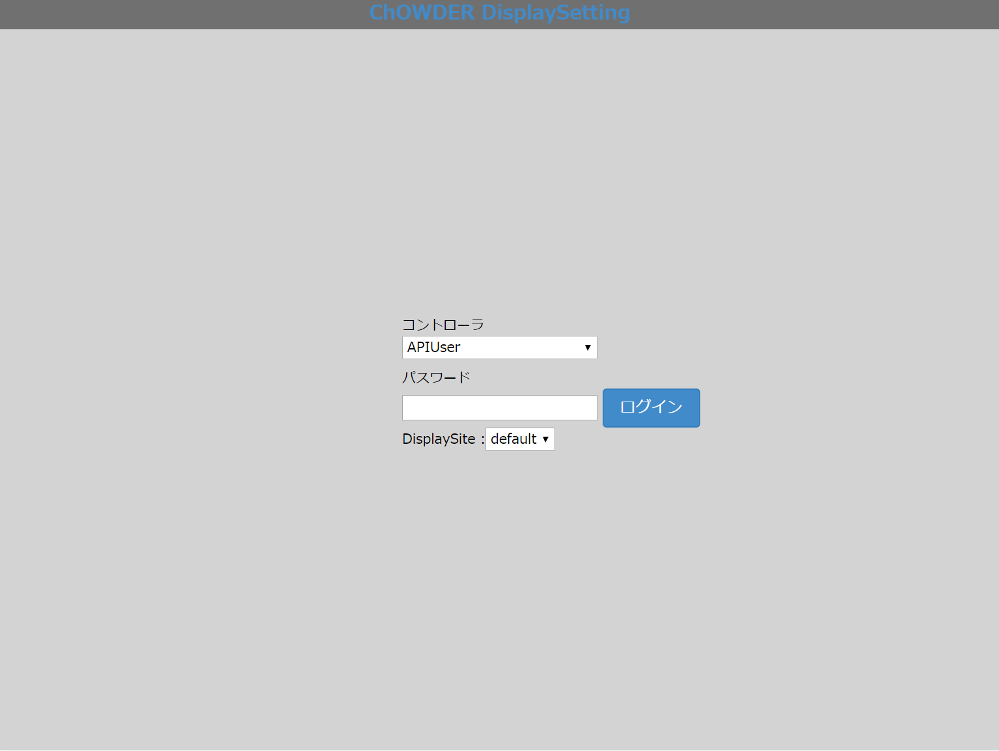

*ログイン画面*

カメラへのアクセスを許可して、APIUserのパスワード(※コントローラの管理画面で設定可能)を入力し、Display siteを選択してログインを押下することでログインできます。

パスワード設定方法
---------------------------------------------------
コントローラ画面を開きます。

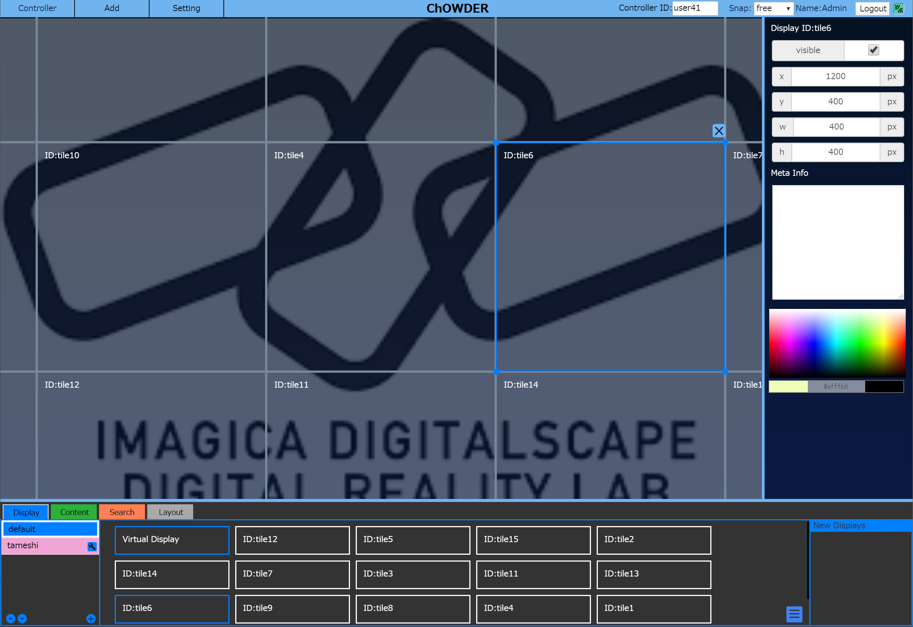

*コントローラ画面*

コントローラ画面のメインメニュー内のSettingメニューを押下します。

*Settingメニュー*

Settingメニュー内のManagementメニューを押下します。

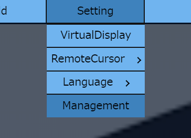

*Managementメニュー*

開いた管理画面の中でPasswordSettingsを参照します。PasswordSettings内のSetting TargetをAPIUserにした状態でNewPasswordにパスワードを入力し、Applyを押下します。

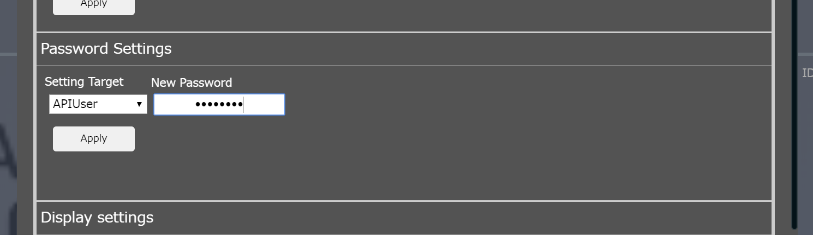

*NewPassword*

これでパスワードが設定されました。

初回起動時のポップアップ
---------------------------------------------------
初回起動時は、ログインに成功すると、ポップアップが表示されます。カメラのモーションセンサへのアクセスを求めるものですが、本システムでは使用していないので、画面をタップして消してください。

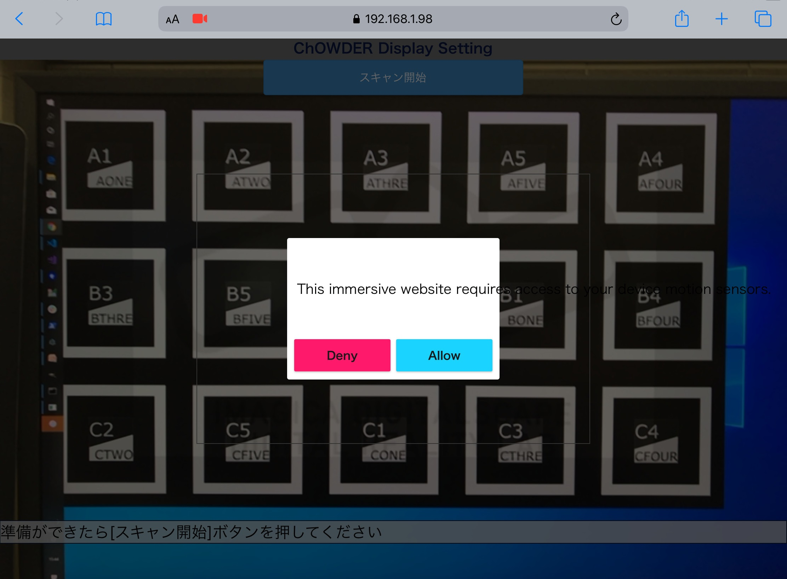

*初回起動時のポップアップ*

スキャン
========================================================================================
ログインが成功すると、カメラの映像が映し出された、スタート画面に切り替わります。スタート画面は下図の通りになります。

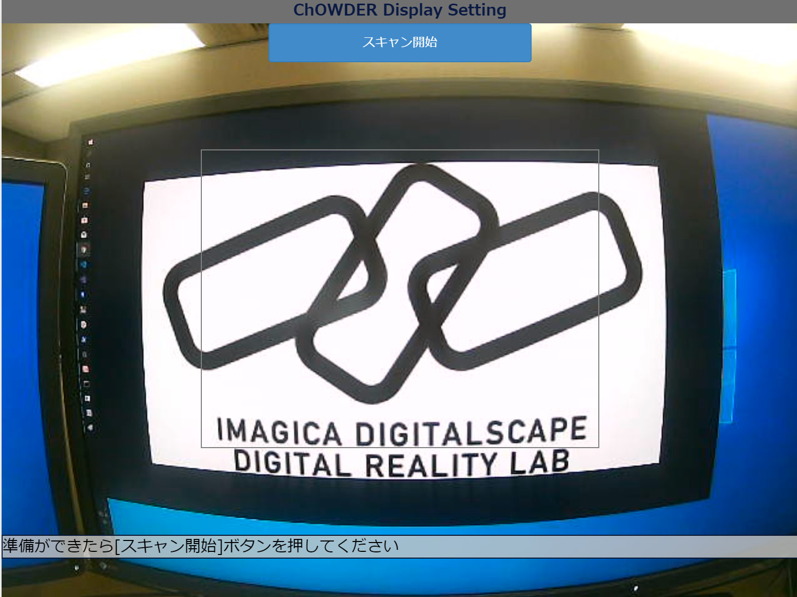

*スタート画面*

スキャン開始ボタン
---------------------------------------------------
スタート画面の真ん中上に表示されている。押下すると、マーカの認識を開始し、マーカのIDがマーカの近くに表示されます。ただし、Virtual Displayの分割数(コントローラ画面で設定)とDisplay数(コントローラに登録されているDisplay数の合計)が一致してないと、開始できません。

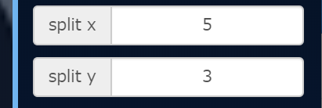

*コントローラ画面のVirtual Displayの分割数*

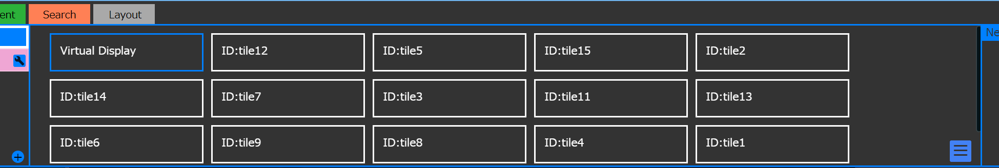

*コントローラ画面の登録されたDisplay一覧*

スキャン中
---------------------------------------------------
スキャンが開始されると、スキャン開始ボタンがスキャン完了ボタンに切り替わります。Diaplay側もマーカが表示されます。スキャン中の画面は下図の通りになります。

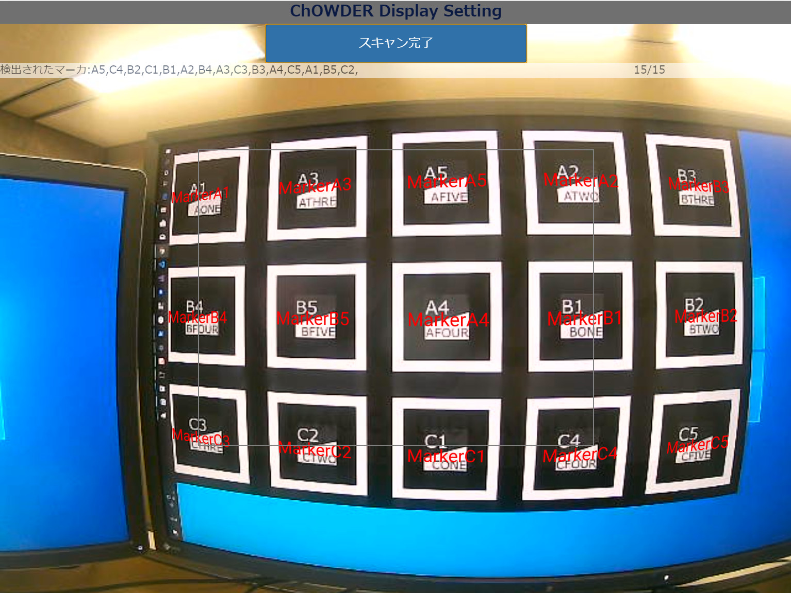

*スキャン中の画面*

スキャン完了ボタンの下に表示されている、スキャンされたマーカの種類および数が適切であった場合、完了ボタンを押下してください。

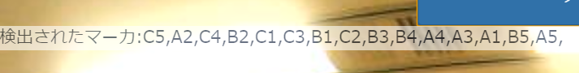

*スキャンされたマーカの種類*

*スキャンされたマーカの数*

スキャン完了画面
========================================================================================

スキャン完了ボタンを押下すると、スキャン完了画面に切り替わります。スキャン完了画面は下図の通りになります。

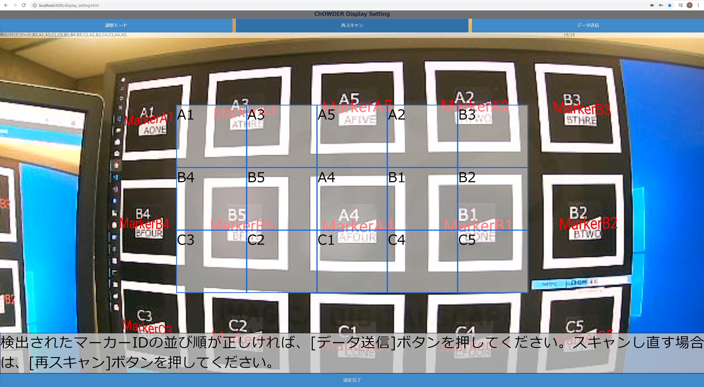

*スキャン完了画面*

スキャンされたマーカの並びがGUIに表示され、その後の操作の選択肢が表示されます。

再スキャンボタン
---------------------------------------------------
押下すると、直前のスキャン情報がリセットされて、再びスキャンが開始されます。

データ送信ボタン
---------------------------------------------------
押下すると、Displayがリロードされ、再び表示されたDisplayは再配置されています。

設定完了ボタン
---------------------------------------------------
押下すると、ポップアップが表示され、「はい」および「いいえ」の選択肢が表示され、「はい」が押下されると、Displayが終了し、ログイン画面に戻ります。「いいえ」、もしくはポップアップ外が押下されると、ポップアップが消え、スキャン完了画面に戻ります。

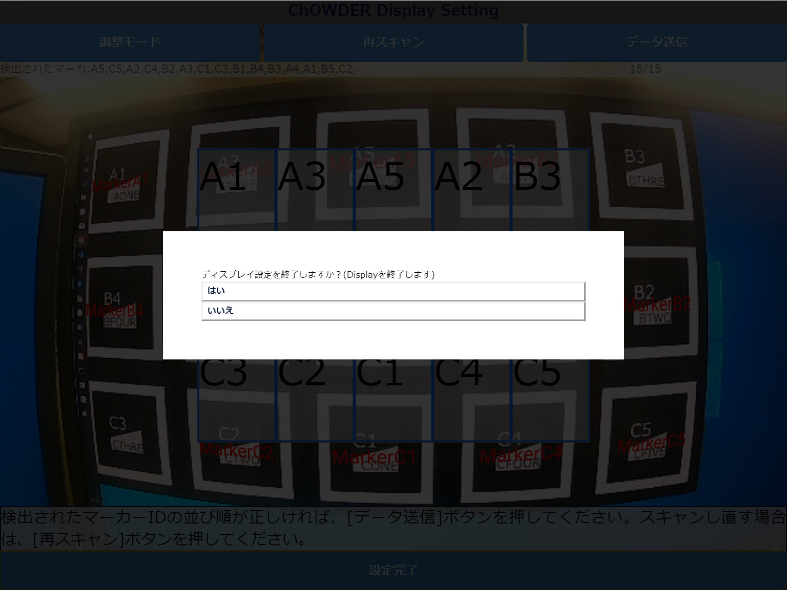

*設定完了押下時のポップアップ*

調整モードボタン
---------------------------------------------------
押下すると、ポップアップが表示され、２つのセレクトボックスにすべての選択できるマーカIDが表示されます。２つのセレクトボックスを選択し、送信を押下すると、選択されたマーカIDのマーカが表示されているDisplayの位置が入れ替わります。

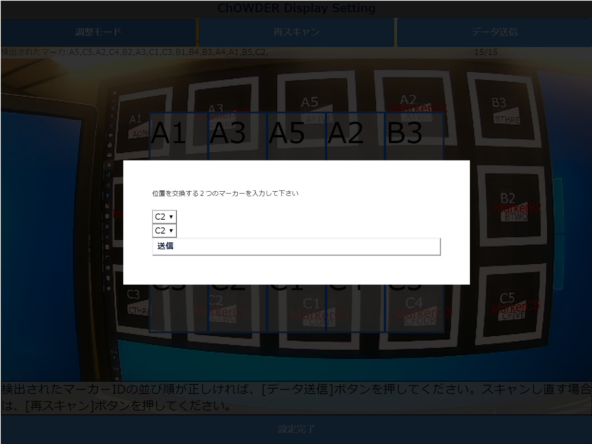

*調整モードのポップアップ*