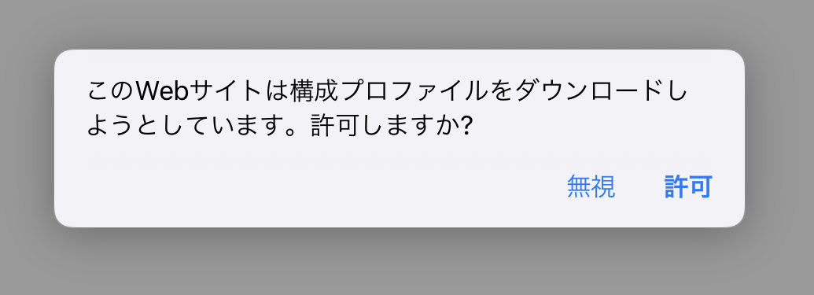
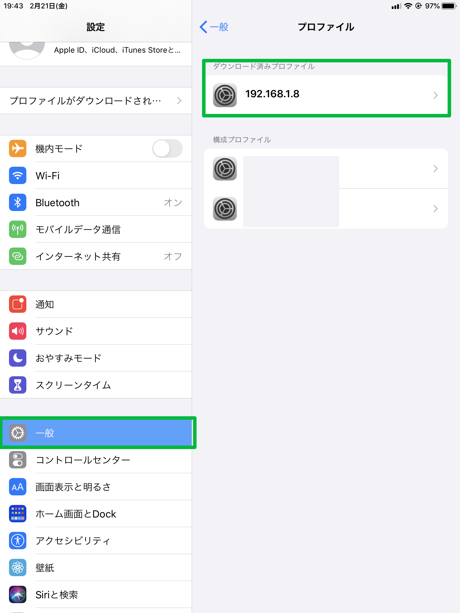
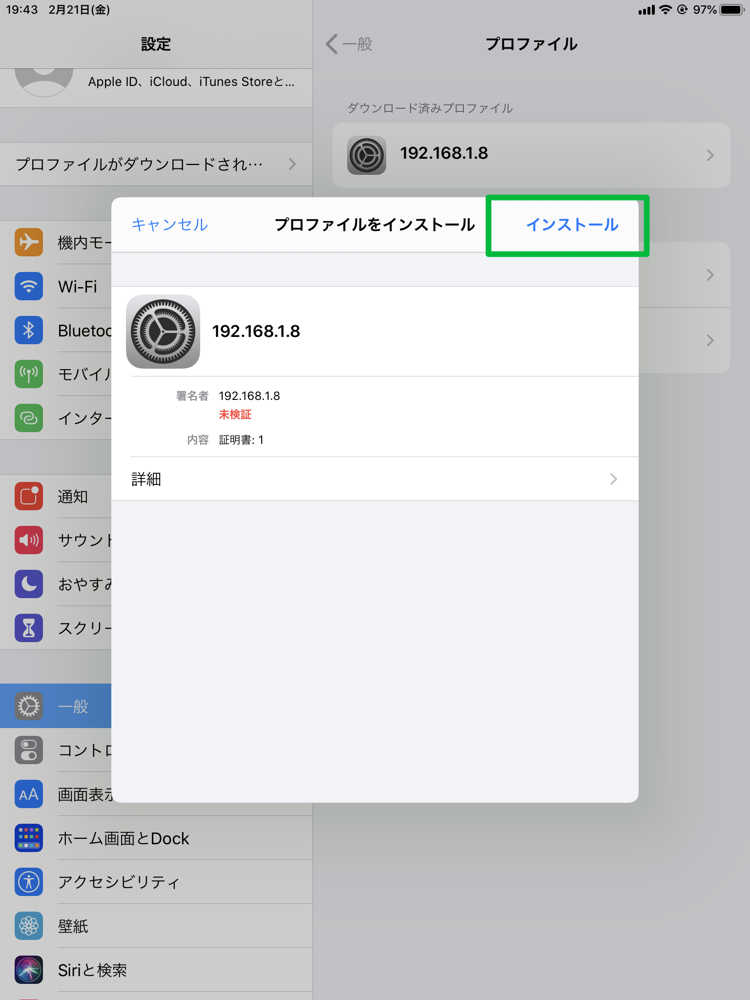
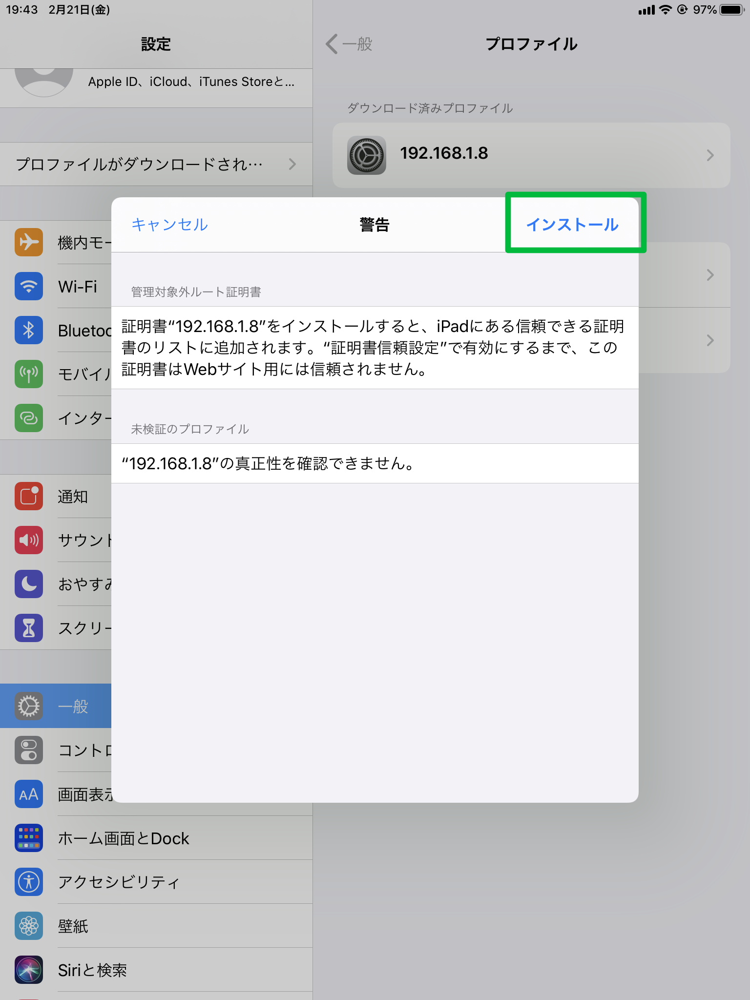
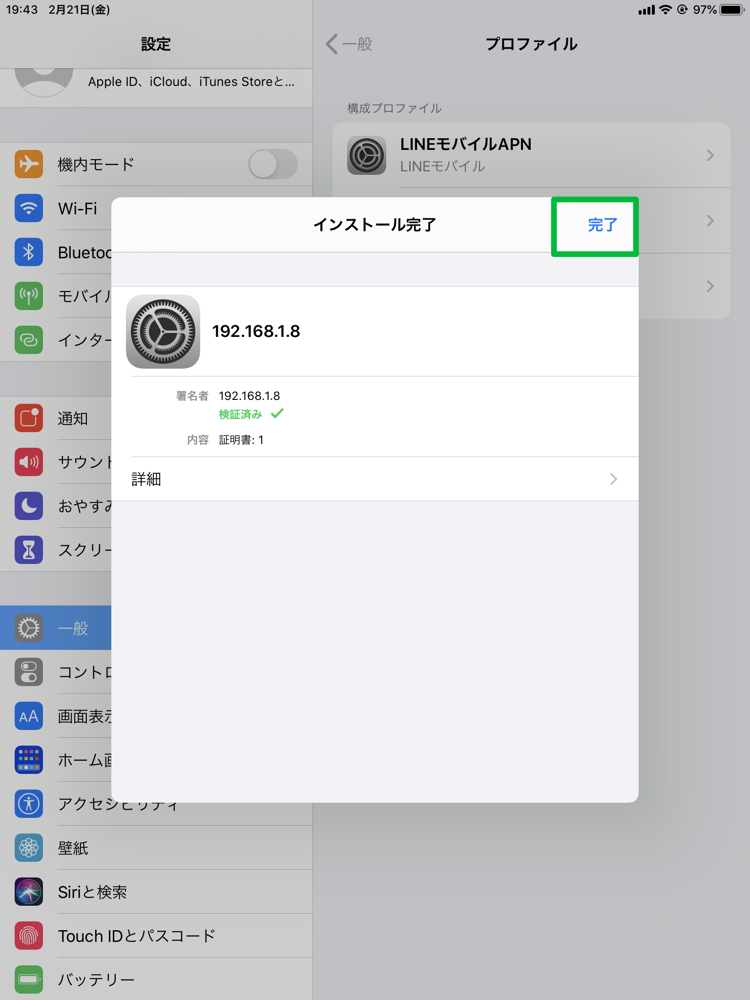
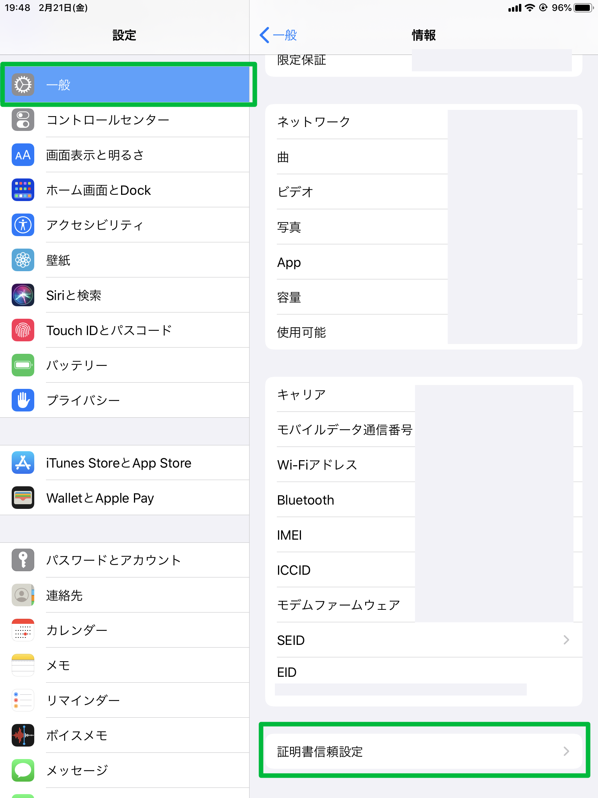
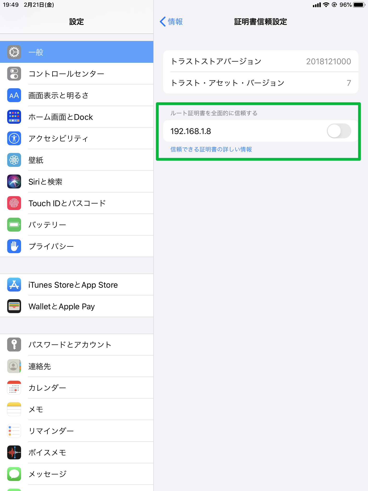

iOS用SSL自己署名設定方法
========================================================================================

自己署名証明書の作成
---------------------------------------------------

iOSで、ローカルネットワーク上で使用するための自己証明書を作成、登録する方法について記載します。

Windowsの場合
--------------------
コマンドプロンプトで、/binディレクトリに移動し、
以下のコマンドを実行します
```
./create_local_cert.bat ChOWDERServerのIPアドレス
```

Linuxの場合
--------------------


iOS側の設定
---------------------------------------------------

ChOWDER Serverにより公開されているプロファイルをダウンロードします。
iOSのSafariで「http://[ipアドレス]:8080/cert.pem」を開き、
許可します。




「設定」→「一般」の「ダウンロード済プロファイル」をタップし、ダウンロード済プロファイルをインストールします。









インストールが終わったら、「設定」→「一般」最下部に、「証明書信頼設定」という項目があるので、
タップして、先ほどインストールしたプロファイルを信頼するようチェックします。






以上で設定完了となります。

```
https://設定したIPアドレス
```

にSafariでアクセスすると、無事成功していた場合、
URLの部分が信頼されている表示となっています。
