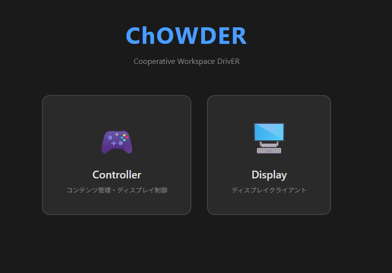

# [ChOWDER2ユーザーマニュアル](index.html)

## はじめに

本書では、ChOWDER2 を利用するすべてのユーザーを対象としています。各ユーザーの権限に応じた操作手順を説明します。
尚、本書の内容は開発中のものを基準に記載されているため、一部製品版とは異なる場合があります。

### 初期画面

Controller、またはDisplayを選択します。
Controllerでは、コンテンツの管理とディスプレイの制御を行うことが出来ます。
Displayでは、表示専用のクライアントとして接続し、ディスプレイをタイルドディスプレイの1部分として表示します。
