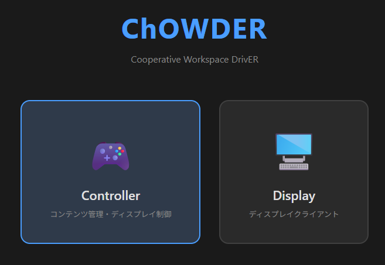
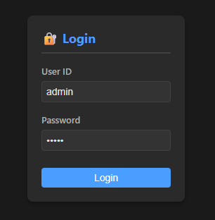
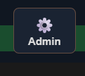
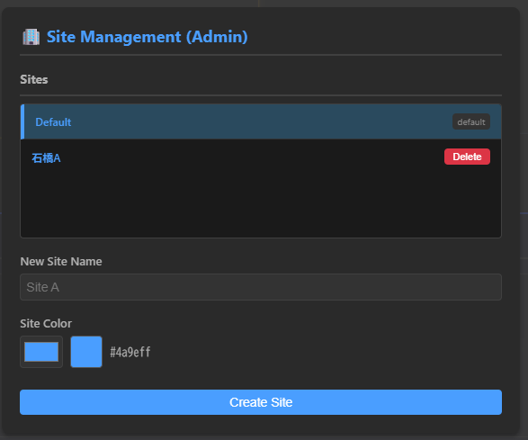
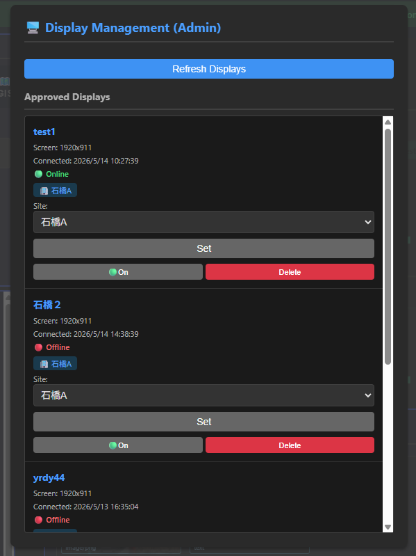
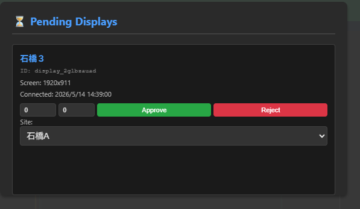
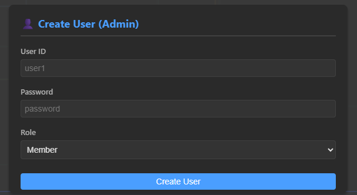

# [ChOWDER2ユーザーマニュアル](index.html)

## システム管理者：操作ガイド

システム全体の管理（ユーザー、インフラ、拠点設定）を行うための手順です。

### 初回起動時の初期ユーザー設定

初回起動時は、初期ユーザーが自動作成されます。

* Admin: ID/PW = ChOWDERAdministrator

初回ログイン後は、セキュリティのため最初に以下を実施してください。

* 運用のための Admin ユーザーを新規作成する
* 初期 Admin ユーザーのパスワードを変更する（または削除する）

通常の再起動では初期ユーザーは再作成されません。Redis データを削除した場合のみ、次回起動時に再び初期化が実行されます。

***

システム管理画面へ移行するには、まず「Controller」に接続します。

その際、あらかじめ作成された「Admin」権限を持つユーザーでログインする必要があります。 

次に、ログイン後のContoller画面の右上の  を押すことで、管理者用画面が表示されます。

***

### システム管理者：サイト登録・設定画面

サイトの登録、及び削除を行うことができます。

***

### システム管理者：ディスプレイ設定画面

これまでに接続されたディスプレイに対しての設定を行うことが出来ます。

各ディスプレイに対して、
* 表示する/しない
* サイトの再割り当て

を行うことが出来ます。

***

### システム管理者：ディスプレイ登録画面

新しく接続するディスプレイ端末のシステムへの登録を行います

ディスプレイの許可時は、同時にSiteへの登録を行うことができます。

***

### システム管理者：ユーザー管理画面

この画面では、以下の操作が可能です

* 新規ユーザーの作成
* 削除
* 権限変更（管理者/コンテンツ管理者/ディスプレイユーザー）

***
