# [ChOWDER2ユーザーマニュアル](index.html)

## コンテンツ管理者：操作ガイド

コンテンツのアップロードや、ディスプレイへの配信制御を行うための手順です。

### ログイン画面

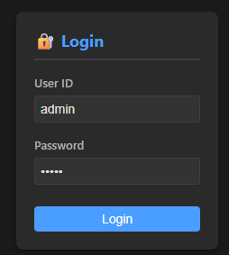

User ID、及びPasswordに管理者用のパスワードを入力し、Loginボタンを押します。
ログイン後の画面では、以下のことを行うことができます。

* コンテンツの追加、及び削除
* コンテンツの移動
* ディスプレイの表示位置の設定

***

### コントローラー画面の操作

コントローラー画面は大きく２つの機能に分かれており、左上のボタンにて機能を切り替えることが出来ます。

 コンテンツ操作画面に切り替えます。 

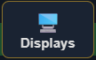 ディスプレイ操作画面に切り替えます。 

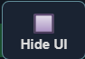選択した操作画面のまま、操作UIを非表示にします。作業エリアを大きく表示することが出来ます。 

また、コンテンツ/ディスプレイ操作画面共通で、以下の操作が可能です。

<Table>
<tr>
<tD>マウスの左ボタンクリック</td> <td>コンテンツ/ディスプレイの選択</td>
</tr><tr>
<tD>マウスの左ボタンドラッグ</td> <td>選択したコンテンツ/ディスプレイの移動</td>
</tr><tr>
<tD>マウスの右ボタンドラッグ </td> <td>画面全体の移動</td>
</tr><tr>
<tD>マウスのホイールのスクロール</td> <td>画面全体の拡大・縮小</td>
</tr>
</table>

***

### コンテンツ操作画面

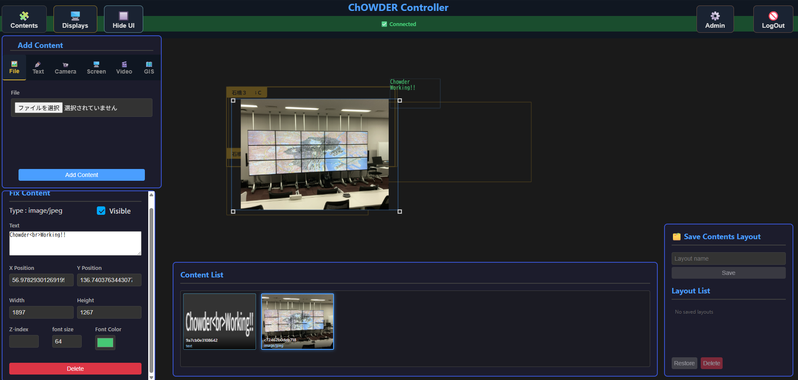

### コンテンツの追加

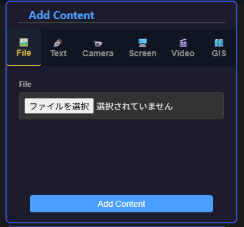

コンテンツ登録欄では、コンテンツの登録が行えます。
登録可能なコンテンツは、下記の通りです。
* 画像（Png,Jpeg）
* 動画（mp4）
* テキスト
* PDFファイル
* サイトURL
* GISコンテンツ
* 画面共有

追加するコンテンツを選択後、「Add Content」ボタンを押すことにより、コンテンツが登録され、各ディスプレイに配信されます。

***

### コンテンツの管理

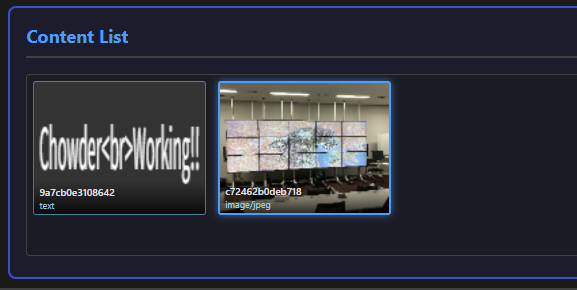

3.3.1 コンテンツの追加　による操作を行ったコンテンツは、Content Listの欄に追加されます。この欄では、下記の操作が可能です

* コンテンツの選択
* 選択したコンテンツの削除

***

### コンテンツの調整

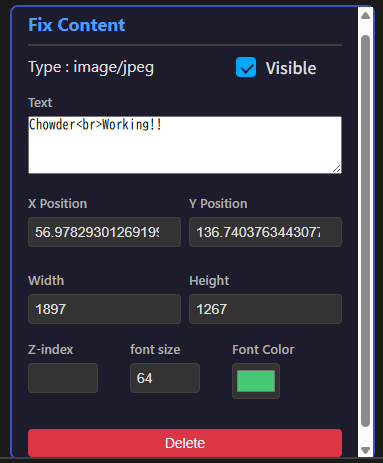

画面内、または 3.3.2のコンテンツ一覧で選択したコンテンツは、左下の調整欄にて、以下の操作が可能です。

* コンテンツの表示/非表示の切り替え
* コンテンツの大きさ・位置の調整
* コンテンツの重なり順序の調整
* 文字内容、及び大きさ、カラーの調整（テキストコンテンツのみ）
* 削除

***

### コンテンツ操作画面

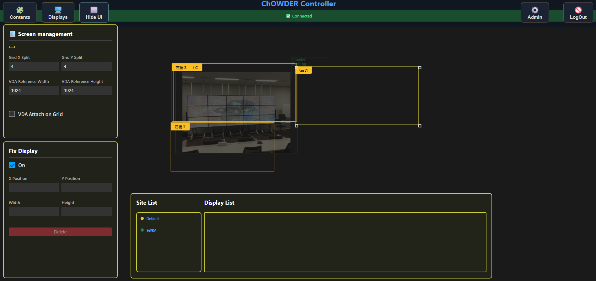

***

### ディスプレイの追加

ディスプレイの追加は、新規のディスプレイからの接続要求があった時のみに可能です。
新規ディスプレイの接続要求があると、右上に  のアイコンが表示され、クリックすると自動的に管理用画面 2.4・ディスプレイ登録画面に遷移します。そこで接続許可待ちのディスプレイに許可を与えることで、ChOWDER用ディスプレイとして登録されます。

***

### バーチャルディスプレイの管理

 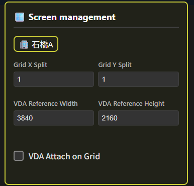

バーチャルディスプレイ管理欄では、選択したサイトに対して、下記の設定変更を行うことが出来ます。
* 縦/横のグリッドラインの設定
* バーチャルディスプレイの大きさ（縦/横）
* グリッドに対して、ディスプレイのスナップ配置を有効にするかどうか

***

### サイト内ディスプレイの管理

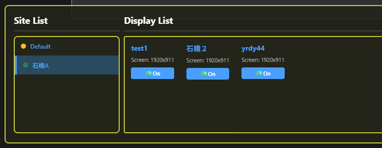

3.4.1　ディスプレイの追加　による操作を行ったコンテンツは、Display Listの欄に追加されます。この欄では、下記の操作が可能です
* ディスプレイの選択
* 選択したディスプレイの表示/非表示の切り替え

***

### ディスプレイの管理

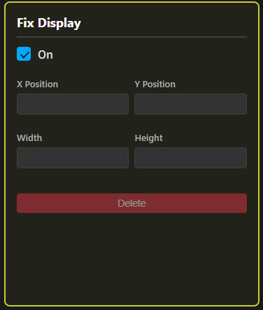

画面内、または 4.3.3のコンテンツ一覧で選択したディスプレイは、左下の調整欄にて、以下の操作が可能です。

* ディスプレイの表示/非表示の切り替え
* ディスプレイの大きさ・位置の調整
* 削除

