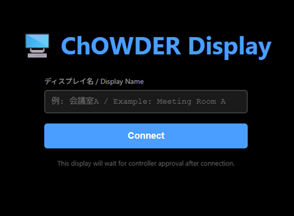
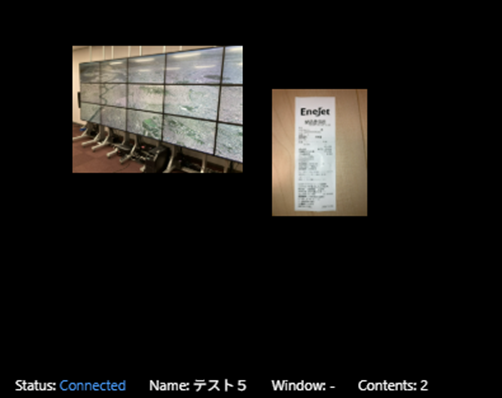

# [ChOWDER2ユーザーマニュアル](index.html)

## ディスプレイユーザー：操作ガイド

ディスプレイ端末をシステムに接続し、表示を確認するための手順です。

### ログイン画面

登録したいディスプレイ名を入力し、「Connect」ボタンを押すことで、「ディスプレイの登録待ち」状態になります。
管理者によるディスプレイの登録作業が完了すると、ディスプレイとして表示されます。

***

### ディスプレイ画面の表示

ディスプレイ画面では、以降ユーザーが行える操作はありません。
